# 独立reviewerを組み込むレビュー・修正ハーネス設計

- status: Issue #34のv1採用案
- scope: orchestration contractの設計
- issue: https://github.com/07130918/Agents/issues/34
- last updated: 2026-08-27

## 1. 目的

レビュー、修正、検証、再レビュー、documentation同期を同一agentの自己評価へ集約せず、独立した役割と検証可能なartifactで接続する。

この設計が所有するのは、役割分離、状態遷移、stage間artifact、retryと停止、resume、権限境界である。個別reviewやgateの判定規則は既存の正本へ委譲し、同じ契約を再定義しない。

## 2. 非目標

v1では次を行わない。

- runner、CLI、常設fixture、JSON Schema validatorを実装しない
- prompt文言を固定するtestを作らない
- `principle-of-programming-reviewer`のfingerprint、finding、severity、grade、coverage契約を複製しない
- project固有のlens、test command、E2E、運用規約をglobal側で推測しない
- Uka-Route固有の規約をglobal harnessへ埋め込まない
- Claude Codeのglobal skillまたはsubagentを有効化しない
- 指摘が0件になるまで自動反復しない
- merge、deploy、risk受容、仕様判断を自動化しない

## 3. 採用判断

### 3.1 配置案の比較

| 判断軸 | A. Personal/global | B. Project固有 | C. Hybrid |
| --- | --- | --- | --- |
| 役割分離と停止条件 | 全projectで統一できる | projectごとに分岐しやすい | globalで統一できる |
| project固有の正確性 | global側の推測が増える | 最も高い | profileへ明示できる |
| 契約重複 | 少ないがglobalが肥大化する | repository間で重複する | 共通stateとproject知識を分離できる |
| tool availability | global機能への依存が強い | repositoryのtoolへ適応しやすい | capability確認とfallbackを共通化できる |
| team共有 | personal設定のため弱い | 強い | profileとCI部分を共有できる |
| 変更の影響範囲 | 全projectへ波及する | 対象projectだけ | 共通契約とprofileを別々に変更できる |
| 運用cost | projectが増えるほど推測costが増える | project数に比例して重複が増える | profile作成costはあるが重複を抑えられる |
| 独立性の監査 | 共通化しやすい | 実装差により弱くなり得る | actor情報をglobal artifactで監査できる |

### 3.2 決定

Hybridを採用する。

- Global contractはrole separation、target参照、artifact envelope、state machine、retry、stop、resume、permissionを所有する。
- Project profileはsource of truth、required lens、verification command、E2E、docs/security/ops gate、risk trigger、scope limitを所有する。
- CIは同じ入力に対して決定的に判定できるlint、typecheck、unit test、integration testなどを所有する。
- Humanは仕様判断、scope拡大、risk受容、秘密情報や外部権限が必要な操作、mergeを所有する。

Aはproject固有契約の推測を避けられず、Bはorchestration logicが重複する。Cは追加のprofile interfaceを必要とするが、共通契約の一貫性とproject知識の正確性を同時に維持できるため、運用costを含めて優位である。

### 3.3 外部知見の採否

| 知見 | v1の判断 | 本設計への反映 |
| --- | --- | --- |
| [OpenAI Harness engineering](https://openai.com/index/harness-engineering/)のrepositoryを正本にし、planとdecisionをversion管理されたfirst-class artifactにする考え方 | 採用 | Profile、input snapshot、run artifactを分け、構造、hash、参照関係を機械的に確認できる契約にする |
| 同記事のimplementation detailではなく境界とinvariantを機械的に強制する考え方 | 採用 | Target一致、permission、artifact DAG、READY条件をglobal contractが所有し、project固有commandはprofileへ委譲する |
| [ECCのeval harness](https://github.com/affaan-m/ECC/blob/main/.agents/skills/eval-harness/SKILL.md)が決定的なgraderを優先し、securityなどへhuman reviewを残す考え方 | 採用 | CIとexact commandは機械判定し、仕様、risk、security採用基準はHumanまたはhash付きproject policyへ委譲する |
| [ECC Memory Vault設計](https://github.com/affaan-m/ECC/blob/main/docs/design/ecc-memory-vault.md)のsource of truth、thin adapter、追記型記録、未review情報をpolicyへ自動昇格させない境界 | 採用 | Run artifactをappend-onlyにし、candidate側のprofile変更を同じrunの実行policyとして採用しない |
| [Anthropicのmanaged agents](https://www.anthropic.com/engineering/managed-agents)と[long-running agents](https://www.anthropic.com/engineering/effective-harnesses-for-long-running-agents)のsession、harness、sandboxをstable interfaceで分け、durable logとGit historyでfresh sessionを接続する考え方 | 採用 | Actor contextとdurable artifactを分離し、resumeとfresh reviewer handoffを会話履歴へ依存させない |
| ECCの常時hook、継続監視、大規模agent/skill catalog、auto-learning | v1では不採用 | 現Issueにrunner、hook、常設memoryを追加せず、必要なstageとgateだけを明示的に実行する |
| 固定したmulti-agent topologyや長時間の無制限loop | 不採用 | Role separationはinvariantにするが、CLIごとの実現方法はfallback可能にし、cycleとcostを制限する |

[Anthropicのlong-running application harness設計](https://www.anthropic.com/engineering/harness-design-long-running-apps)が示すように、長期運用ではcomponent追加そのものが陳腐化した前提とcostを増やす。したがって外部事例からは境界、artifact、検証原則だけを採用し、v1の実装面を広げない。

## 4. 正本と非重複

| 契約 | 正本 | Harnessの責務 |
| --- | --- | --- |
| Issue精読、scope宣言、branch、全体進行 | `shared/references/issue-to-pr.md` | Issue intake後のreview/fix/verify subflowを委譲され、READYまたはblockerを返す |
| target fingerprint、coverage、finding、severity、origin、verdict、grade、再review比較 | `shared/references/principle-of-programming-reviewer.md` | fingerprint artifactを参照し、別targetの結果を混ぜない |
| project固有のlensとfinding candidate | 各projectのreviewer契約 | candidateと`required_gates`を受け取る |
| documentation同期 | `shared/references/sync-docs-code.md` | 同じtargetのstatusが`PASS`または`UPDATED`かを確認する |
| security監査 | `shared/references/security-audit.md` | risk trigger時に同じtargetの結果を要求する |
| commit分割、message、push、PR作成 | `shared/references/create-pr.md` | `prepare_candidate`と`publish_exact_candidate`のphase境界を要求し、提出policy自体は再定義しない |
| mergeとrisk受容 | Human | `READY`でも自動実行しない |

Harnessはpoprの結果をartifactとして保存するが、そのfieldの意味やgrade表を独自定義しない。Project reviewerは最終gradeやmerge可否を返さず、専門finding candidateと`required_gates`だけを返す。

## 5. 用語

- run: 1つのIssueまたは明示された変更scopeをREADYまたは停止状態まで進める単位
- cycle: blocking findingを修正し、検証、gate、最終reviewへ戻る1回の反復
- candidate target: READY候補として固定したcleanなcommit SHA
- target ref: poprが固定したtarget fingerprint artifactへの参照とcontent hash
- actor: stageを実行したagent、session、thread、human、CI。Artifactでは`producer` recordへ記録する
- blocker: 自動処理を継続できず、human判断または外部状態の変化が必要な条件

## 6. 役割と責務

| Role | 入力 | 所有する責務 | 出力 | 禁止事項 |
| --- | --- | --- | --- | --- |
| Orchestrator | Issue、run manifest、project profile、各stage artifact | state遷移、target照合、budget、permission、retry、resume、actor分離 | 更新済みrun manifest、次stage | findingの捏造、専門gateの代行、gradeの上書き |
| Initial reviewer | target ref、project profile、要件と規約 | 初回の独立review、coverage、project candidateの収集 | popr result、required gates | code修正、外部副作用、scope拡大 |
| Implementer | change request、remediation plan、許可されたscope | 最小修正と必要なtest追加 | 変更、requestごとの対応記録 | finding資格やseverityの自己変更、許可外pathの変更 |
| Tester | candidate snapshot、profileのverification command | command実行、結果とobservable failureの記録 | verification artifact、verification failure | 失敗を推測でPASSにする、仕様判断 |
| Final reviewer | candidate target、要件、規約、project profile | blind scan、candidate targetのrequired project lens、previous findingの照合、最終coverageとpopr判定 | blind review、project result、reconciliation、popr result | code修正、実装者の説明をblind scan前に読む |
| Docs gate | candidate target、変更契約、関連文書 | `sync-docs-code`の実行 | PASS、UPDATED、BLOCKEDと根拠 | 別targetの結果流用、無関係な文書監査 |
| Security gate | candidate target、risk trigger、attack surface | `security-audit`の実行 | audit resultとblocker | project reviewer内への監査手順複製 |
| Project reviewer | target ref、project profile、project正本 | project固有lensとcandidate finding、required gates | candidateと未確認領域 | 最終grade、最終verdict、外部gate実行 |
| CI | candidate SHA、repository設定 | 決定的な自動検証 | check result | 仕様判断、risk受容 |
| Human | blocker、仕様とbusiness context | 仕様、scope、risk、追加cost、外部権限、mergeの判断 | decision artifact | なし |

Final reviewerとcandidate targetを検査するProject reviewerの`producer.instance_id`は、Implementer、Initial reviewer、同runで先に実行したProject reviewerのすべてと異ならなければならない。同じagentの別prompt、同じsessionの自己再読、contextを引き継いだforkだけでは独立性を満たさない。

## 7. 独立review契約

### 7.1 Final reviewerの2 pass

Final reviewerは同じfresh context内で次の順に実行する。

1. Blind scan: candidate target、Issue、受入条件、base側のproject規約、project profileだけを受け取る。previous finding、remediation plan、implementer explanationは渡さない。Candidate diffからrequired project lensをfreshに選び、Initial reviewで選択されたlensだけに限定せずcandidate targetへ再実行する。Final reviewer自身または別のfresh Project reviewerがproject resultとcoverageを返し、Orchestratorが独立した`blind_review` artifactとしてappend-onlyに確定する。
2. Gate reconciliation: Candidate project resultが新しい`required_gates`を返した場合は、blind artifactを確定したまま同じtargetでgateを実行する。Gateがtargetを変更したらblind artifactを無効化して第1 passからやり直す。
3. Finding reconciliation: Blind scanとsame-target gateを確定した後にprevious resultとすべてのremediation artifactを渡し、各findingを`Fixed`、`Remaining`、`Regressed`、`Not applicable`へ分類する。今回findingは`New`または`Residual`にする。

`blind_review`のhashとproducer metadataを確定する前にfinding reconciliationで使うprevious resultまたはremediation artifactsを渡した場合、そのfinal reviewは独立性不足として無効にする。

### 7.2 Fresh contextの証拠

各review artifactは少なくとも次を記録する。

- `producer.role`
- `producer.instance_id`
- `producer.context_id`
- `producer.parent_context_id`
- `producer.fresh_context`
- `producer.received_artifacts`
- modelと実行日時

Final reviewerとcandidate targetを検査するProject reviewerが、Implementer、Initial reviewer、以前のProject reviewerのいずれとも別instanceであり、`producer.received_artifacts`のblind passにprevious findingまたはremediation artifactsが含まれていないことをOrchestratorが確認する。`instance_id`、`context_id`、親子関係、受領artifactはactorの自己申告を採用せず、runtimeまたはtoolの実行metadataからOrchestratorが付与する。取得できないか別instanceを確保できなければ`INDEPENDENCE_BLOCKED`にする。

Codexでfresh subagentを使える場合は、過去会話をforkせず、必要なartifactだけを渡す。利用できない場合は、新しいtaskまたはsessionへhandoff bundleを渡す。Claude Codeではglobal subagentが無効であることを前提に、別sessionまたはhuman reviewerを使う。別instanceを用意できなければ`INDEPENDENCE_BLOCKED`へ遷移する。

## 8. Artifact契約

### 8.1 形式と保存先

- Agentが生成するcanonical run artifactはJSONとする。曖昧な型変換を避け、将来のvalidatorとCIで同じ内容を検証できるためである。
- Humanが編集するproject profileはYAMLとする。command、path、risk ruleをreviewしやすくするためである。
- MarkdownはPR本文とhuman向けreportの表示形式に限定し、resumeの正本にしない。
- Run artifactはcandidate worktree外のharness管理storeへ保存する。論理pathは`<runtime_state_root>/review-harness/<repository_id>/<run_id>/`とし、実pathまたはstore URIをbootstrap manifestへ記録する。Stage完了後のartifactは上書きせずappend-onlyにする。
- Project profileの標準pathは`.review-harness/profile.yaml`とし、projectが採用する場合だけcommitする。
- Storeへappendできるのは`write_run_store`を持つOrchestratorだけとする。各roleはresultを返し、Orchestratorがruntime由来のproducer metadata、hash、sequenceを付けて保存する。Implementerとcandidate processにはstoreの書込権限を与えない。
- v1設計Issueでは上記store、profile、ignore設定を実際には追加しない。

会話内だけのstateはresumeできず、PR commentだけのstateはPR作成前に使えず外部APIにも依存するためcanonical storeにしない。PRへはREADY判定と主要artifactのhashを要約できるが、PR本文をrun stateとして読み戻さない。

### 8.2 共通envelope

各artifactは次のenvelopeを持つ。

```json
{
  "schema_version": "1.0",
  "artifact_type": "input_snapshot|target|evidence|target_check|review|change_request|remediation|verification|gate|blind_review|final_review|decision|run_manifest",
  "artifact_id": "<run_id>/<stage>/<monotonic_sequence>",
  "run_id": "<stable_run_id>",
  "stage": "<state_name>",
  "target_ref": {
    "artifact_id": "<target_artifact_id>",
    "artifact_path": "<relative_path>",
    "sha256": "<artifact_content_hash>"
  },
  "producer": {
    "role": "orchestrator|initial_reviewer|project_reviewer|implementer|tester|final_reviewer|docs_gate|security_gate|ci|human",
    "instance_id": "<tool_or_human_instance_id>",
    "context_id": "<session_or_job_id>",
    "parent_context_id": null,
    "fresh_context": false,
    "model": null,
    "received_artifacts": []
  },
  "input_refs": [],
  "created_at": "<RFC3339_timestamp>",
  "payload": {}
}
```

`input_snapshot`と`target`は`target_ref`を`null`にする。Target未解決中に保存する`run_manifest`と`decision`も、payloadに`target_status: unresolved`と`target_absence_reason`を持つ場合だけ`target_ref: null`にできる。その他のartifactは必ず1つのtargetを参照する。異なる`target_ref.sha256`のverification、gate、blind reviewを同じREADY判定の成功根拠へ混ぜない。Previous reviewとremediationはtarget generation chainでcandidateへ到達できる場合だけreconciliation用のhistorical refとして許可し、その成功statusをcurrent targetへ流用しない。

`target_ref`、`input_refs`、payload内の`*_ref`はすべて次の共通型を使い、`*_refs`はこの共通型の配列とする。Hashは保存済みUTF-8 fileのbytesに対するSHA-256とし、参照時に再計算する。

```json
{
  "artifact_id": "<stable_artifact_id>",
  "artifact_path": "<run_directory_relative_path>",
  "sha256": "<artifact_content_hash>"
}
```

Issue本文と受入条件、全comment、仕様として参照する関連Issueまたはdecision、Project profile、run-local profile、acceptance policy、Humanが提供した追加仕様は`input_snapshot`として保存し、run manifestと依存stageの`input_refs`へ加える。Issue bundleはtitle、body、updated revisionに加え、各commentのstable ID、revision、author、bodyと、関連sourceのidentifier/revisionを保持する。どのcommentまたは関連sourceを要件として採用したかも記録し、未採用の情報を暗黙に仕様へ昇格させない。

`input_snapshot.payload`は`input_kind`、`trust_source`、`source_identifier`、`source_sha`、`source_revision`、`content_sha256`、秘密情報を除いたexact `content`を持つ。`trust_source`は`base`、`human_approved_run_local`、`external_authoritative`のいずれかとし、Git管理されたprofileとpolicyでは`source_sha`とGit blob hashも記録する。同じtarget SHAでもinput hashが変われば、変更されたinputに依存するreview、verification、gate、Final reviewを無効化し、`PROFILE_RESOLVING`から再開する。参照先artifactのhash不一致は破損として`EVALUATION_DEFERRED`にする。

Artifact graphは次の非循環layerに固定する。

1. Root: `input_snapshot`と`target`。Stage artifactを参照しない。
2. Evidence: command output、log、diff、report、environment snapshotを保持する`evidence`。Rootだけを参照でき、Stage artifactを参照しない。
3. Stage: `target_check`、`review`、`change_request`、`remediation`、`verification`、`gate`、`blind_review`、`final_review`、`decision`。Root、Evidence、または自分より小さい`monotonic_sequence`のStage artifactだけを参照できる。
4. Manifest: `run_manifest`。確定済みartifactを列挙するが、他artifactから参照されない。

自己参照と前方参照は禁止する。`evidence`はそれを消費するStage artifactより先に確定する。Initial resultは`review`、blind resultとcandidate project resultは`blind_review`、reconciliationと最終popr resultは`final_review`へ埋め込み、別のresult artifactを相互参照しない。`blind_review`をappend-onlyで確定してhashを検証するまではprevious reviewとremediationをFinal reviewerへ開示せず、`final_review.blind_review_ref`から先行artifactを参照する。埋め込むresultは元producerのrecordとcontent hashを保持する。未reviewのrun artifactをProject profile、acceptance policy、その他のgoverned sourceへ自動昇格させない。

正規に存在しない参照は、空objectや架空IDではなく次のstate付きunionで表す。

- `run_manifest.input_source`は`issue`または`explicit_scope`とし、前者は`issue_ref`、後者は`scope_input_ref`を必須にして他方を`null`にする。
- `run_manifest.profile_status`は`resolved|profileless|pending`とする。`resolved`だけ`profile_ref`を必須にし、他は`profile_ref: null`と`profile_absence_reason`を必須にする。
- `final_review.remediation_status`は`required|not_required`とする。Candidateのtarget generation lineageでoriginを問わず`change_request`が一度でも`FIXING`を発生させた場合は`required`とし、`remediation_refs`へ対応する全artifactを含める。Lineage全体にchange requestがない場合だけ`not_required`と空の`remediation_refs`を許可する。
- `acceptance_policy_ref`は`native_status`の場合だけ`null`にできる。その他のnullable refは各payload contractが状態と不在理由を明示しない限り禁止する。

`READY`ではunresolved target、`profileless|pending`、必要なIssueまたはscope inputの欠落を許可しない。

### 8.3 Target artifact

Targetのfieldと意味はpoprのtarget fingerprint契約を正本とする。HarnessはそのsnapshotをJSON化し、独自のfingerprint規則を加えない。

```json
{
  "repository": {"id": "owner/name", "root": "/absolute/path"},
  "source": "current_branch|pull_request|commit_range",
  "base": {"branch": "main", "sha": "<40_char_sha>"},
  "head_sha": "<40_char_sha>",
  "working_tree": {
    "status": "clean|dirty",
    "mode": "include|exclude",
    "manifest": [
      {
        "path": "<repository_relative_path>",
        "mode_or_type": "<git_mode_or_file_type>",
        "content_hash_or_deleted": "<canonical_hash_or_deleted>"
      }
    ]
  },
  "index_diff_hash": null,
  "pr_remote": null,
  "scope": {
    "include": ["<path>"],
    "exclude": [{"path": "<path>", "reason": "<reason>"}]
  },
  "skill_versions": [{"path": "<path>", "content_hash": "<hash>"}],
  "project_rules": [
    {
      "source": "base|head",
      "source_sha": "<40_char_sha>",
      "path": "<path>",
      "blob_hash": "<git_blob_hash>"
    }
  ]
}
```

Target artifactはfingerprintと別のHarness metadataとして`generation`、`previous_target_ref`、`transition_reason`を持つ。初期targetは`generation: 0`かつ`previous_target_ref: null`、変更後targetはgenerationを1増やして直前targetを参照する。Run manifestは`current_target_generation`と各artifactの`current|historical|invalidated`を記録し、target変更の履歴と現在再利用できるartifactを区別する。このmetadataをpopr fingerprintの構成要素へ混ぜない。

Initial reviewでは明示されたworking treeを含められる。READY候補とFinal reviewでは`working_tree.status`が`clean`、`mode`が`exclude`で、`head_sha`がcandidate commitでなければならない。

### 8.4 Stage payload

| Artifact | 必須payload | 参照する正本 |
| --- | --- | --- |
| `target_check` | `expected_target_ref`、`status`、`observed_components`、`changed_components` | poprのtarget fingerprint契約 |
| `input_snapshot` | `input_kind`、`trust_source`、`source_identifier`、`source_sha`、`source_revision`、`content_sha256`、`content` | Issue、base側profile/policy、Human承認run-local input、外部正本 |
| `evidence` | `evidence_kind`、`media_type`、`content_sha256`、`content_path`またはinline `content`、`redactions` | 実行command、tool、gateのraw output |
| `review` | `popr_result`、`project_results`、`blocking_finding_ids`、`required_gates`、`coverage_status` | poprとproject reviewer契約 |
| `change_request` | `requests`。各要素は`review_finding`、`verification_failure`、`gate_failure`のtagged union | Review result、verification/gate artifact、Issue scope |
| `remediation` | request IDごとの`decision`、`minimal_change`、`planned_paths`、`test_plan`、`scope_effect` | Change requestとIssue scope |
| `verification` | `commands`、各commandの`exit_code`、`started_at`、`finished_at`、`environment_snapshot_ref`、`output_refs`、`status`、`unverified_reason`、`mutated_target` | Project profileとCI |
| `gate` | `gate_name`、`contract_version`、`execution_status`、`decision_status`、`decision_policy`、`acceptance_policy_ref`、`evidence_ref`、`mutated_target` | 各gateの正本 |
| `blind_review` | `blind_result`、`blind_received_artifacts`、`project_results`、`project_coverage_status`、`required_gates`、`independence_check` | poprとproject reviewerのblind scan契約 |
| `final_review` | `blind_review_ref`、`reconciliation`、`popr_result`、`previous_review_ref`、`remediation_status`、`remediation_refs`、`independence_check` | poprの再review契約 |
| `decision` | `decision_kind`。Human判断では`decision`、`satisfied_conditions`、`blockers`、`human_action`、budget観測では`limit_id`、`limit_event`、`limit_value`、`observed_value`、`counter_snapshot`、`prior_manifest_revision`、`prior_manifest_sha256` | 本文書の停止条件とbudget guard |
| `run_manifest` | `state`、`previous_state`、`transition_id`、`transition_cause_ref`、`revision`、`permissions`、`limits`、`counters`、`input_source`、`issue_ref`、`scope_input_ref`、`profile_status`、`profile_ref`、`current_target_generation`、`artifact_refs`、`last_completed_stage` | 本文書のstate/retry/resume契約 |

`change_request.requests`は次の形でreview findingとverification failureを区別する。

```json
{
  "requests": [
    {
      "id": "<review_finding_id>",
      "source_type": "review_finding",
      "source_ref": {
        "artifact_id": "<review_artifact_id>",
        "artifact_path": "<path>",
        "sha256": "<hash>"
      },
      "source_item_id": "<finding_id>"
    },
    {
      "id": "verification/<command_id>/<stable_failure_signature>",
      "source_type": "verification_failure",
      "source_ref": {
        "artifact_id": "<verification_artifact_id>",
        "artifact_path": "<path>",
        "sha256": "<hash>"
      },
      "command_id": "<profile_command_id>",
      "expected_behavior_ref": {
        "artifact_id": "<input_snapshot_artifact_id>",
        "artifact_path": "<path>",
        "sha256": "<hash>"
      },
      "observed_failure": "<observable_result>",
      "output_ref": {
        "artifact_id": "<evidence_artifact_id>",
        "artifact_path": "<path>",
        "sha256": "<hash>"
      }
    },
    {
      "id": "gate/<gate_name>/<stable_failure_signature>",
      "source_type": "gate_failure",
      "source_ref": {
        "artifact_id": "<gate_artifact_id>",
        "artifact_path": "<path>",
        "sha256": "<hash>"
      },
      "expected_behavior_ref": {
        "artifact_id": "<acceptance_policy_input_snapshot_id>",
        "artifact_path": "<path>",
        "sha256": "<hash>"
      },
      "evidence_ref": {
        "artifact_id": "<evidence_artifact_id>",
        "artifact_path": "<path>",
        "sha256": "<hash>"
      }
    }
  ]
}
```

`expected_behavior_ref`は要件、test contract、またはacceptance policyの`input_snapshot`、`output_ref`と`evidence_ref`はraw outputの`evidence`を参照する。Verification failure IDは連番にせず、profile command IDと正規化したassertion、exit分類、主要error signatureから作る。Gate failure IDもgate名、stable policy rule ID、主要failure signatureから作る。Testerとgateは観測結果と既存の期待値参照を記録するだけで、severityや仕様を新設しない。Expected behaviorをimmutableな正本へ結び付けられない失敗はchange requestにせず`HUMAN_DECISION_REQUIRED`へ送る。Gateの実行失敗または利用不能は修正requestへ変換せず`EVALUATION_DEFERRED`にする。

`remediation.decision`は`fix`、`defer_minor`、`not_applicable`、`human_decision`のいずれかとする。`defer_minor`はMinorまたはNitのreview findingだけに使える。Critical、Major、required verification failure、required gate failureを`defer_minor`に変更できない。Findingのseverityを変更する必要がある場合はreviewerへ差し戻す。

### 8.5 Required gate result

各`required_gates`は、gate名、発火理由、許容するdecision status、target refを持つ。同名gateでもtarget refが違えば未実行として扱う。

```json
{
  "name": "<stable_gate_name>",
  "reason": "<risk_or_contract_trigger>",
  "acceptable_decision_statuses": ["PASS"],
  "target_ref": {
    "artifact_id": "<target_artifact_id>",
    "artifact_path": "<path>",
    "sha256": "<hash>"
  }
}
```

`sync-docs-code`の`decision_status`と`mutated_target`は直交する。`UPDATED`は必要なdocumentation更新がrunまたはcandidateに含まれるnative status、`mutated_target`は当該gate実行がtarget contentを実際に変更したかを表す。`UPDATED`かつ`mutated_target: true`なら新しいtarget artifactを作成し、target依存のverificationとrequired gateを再実行して変更前targetの結果を流用しない。`UPDATED`かつ`mutated_target: false`ならsame-targetの成功statusとして扱える。

Docs gateの`acceptable_decision_statuses`は`["PASS", "UPDATED"]`、それ以外のgateは各正本または信頼済みacceptance policyが許可したstatusだけとする。許容statusでも`mutated_target: true`のartifactはsame-target成功根拠にせず、target再固定を優先する。

Gate artifactは実行成否と採用可否を分ける。

```json
{
  "gate_name": "<stable_gate_name>",
  "contract_version": "<gate_contract_version>",
  "execution_status": "completed|failed|unavailable",
  "decision_status": "PASS|UPDATED|BLOCKED|HUMAN_DECISION_REQUIRED",
  "decision_policy": "native_status|project_or_human",
  "acceptance_policy_ref": null,
  "evidence_ref": {
    "artifact_id": "<evidence_artifact_id>",
    "artifact_path": "<run_directory_relative_path>",
    "sha256": "<artifact_content_hash>"
  },
  "mutated_target": false
}
```

`sync-docs-code`はnativeな`PASS`、`UPDATED`、`BLOCKED`を`decision_status`へ使う。`security-audit`の現行契約は監査手順とreportを定義するが、Harness向けの一律なPASS thresholdを定義していない。したがって監査が完了したことだけをPASSへ変換しない。Project profileにhash付きでsnapshot化できる監査結果の採用基準がある場合はその正本に従い、ない場合は`HUMAN_DECISION_REQUIRED`とする。Harnessはsecurityのscoringまたはrisk基準を新設しない。

`acceptance_policy_ref`は信頼済みpolicyの`input_snapshot`、`evidence_ref`はgateのraw reportを持つ`evidence`だけを参照する。

### 8.6 Targetとinputのconsistency checkpoint

Orchestratorはtarget依存stageの開始前と完了後、READY判定前、base refをfetchした後、pushまたはPR作成後にtarget fingerprintの全componentを再取得する。

- repository identityとtarget source
- exact base refとbase SHA
- exact head SHA
- working treeのcleanまたはdirty、mode、manifest
- index diffが対象ならそのhash
- PR remote
- includeとexclude scope
- skill versionのcontent hash
- project rulesのsource、path、blob hash

`target_check`は保存済みtargetと再取得値を比較し、`unchanged`または`changed`と差分fieldを記録する。Target依存stageが`local_write`を実行した場合も必ずcheckする。Tracked content、対象に含むuntracked content、file modeが変わった場合は、そのstageの成功結果をREADYへ使わない。Pre-commit `VERIFYING`で許可された変更なら新しいworking-tree targetを固定して`VERIFYING`を再実行し、`PRECOMMIT_DOCS_PENDING`を飛ばさない。Candidate commit後の`TARGET_VERIFYING`または`GATES_PENDING`で許可された変更なら`CANDIDATE_COMMIT_PENDING`へ戻して新commitを固定する。想定外の変更は`EVALUATION_DEFERRED`にする。

PR提出前は`git fetch`後のbase ref SHAとcandidate targetのbase SHAも比較する。Base、head、scope、skill version、project rules、input refsのいずれかが変わればREADYを破棄し、`PROFILE_RESOLVING`からreview、verification、gate、Final reviewをやり直す。PR作成後はGitHub metadataのexact base/head SHAを再確認し、不一致ならPRが存在していてもREADYと表現しない。

External authoritative inputは保存済みsnapshotのhash検証だけで済ませない。`PROFILE_RESOLVING`、resume、`REREVIEW_PENDING`開始前、READY判定直前にsource APIからrevisionとcontentを再取得する。Issueでは本文、全comment、採用した関連Issueまたはdecisionを再取得し、追加、編集、削除を検出する。Revisionまたはaggregate content hashが変われば新しい`input_snapshot`を作り、依存artifactをinvalidateして`PROFILE_RESOLVING`へ戻る。Stable revisionまたは再取得手段を提供しないsourceは自動READYの入力にせず、Humanがexact contentを承認した`human_approved_run_local` snapshotへ凍結する。

## 9. Project profile interface

Project profileはglobal contractへproject固有情報を渡す入力であり、orchestration logicやpopr rubricを含めない。

### 9.1 信頼するprofileとpolicy

現在runのProject profile、governing source of truth、verification command、gate条件、acceptance policyは、既定でtargetの`base.sha`に存在するcontentだけを信頼する。Orchestratorは`git show <base_sha>:<path>`相当で取得し、`trust_source: base`、`source_sha`、Git blob hash、content hashを`input_snapshot`へ記録する。Candidate targetが追加または変更したprofile、source of truth、policy、commandはreview対象には含めるが、同じrunの権限、必須gate、READY条件を弱める入力として使わない。Merge後の次runでbase側の入力になってから有効化する。

例外はHumanが内容と適用runを明示承認したrun-local snapshotだけとする。この場合はsnapshotへHuman producerとapproval scopeを記録し、対応するdecision artifactからそのsnapshotを参照する。Implementerまたはcandidate contentだけを根拠に承認済みと扱わない。Baseにprofileがない場合、candidateがprofileを追加していても現在runはprofilelessとして扱い、Human承認のrun-local profileがない限りREADYにしない。Issueなど外部正本は`external_authoritative`としてsource revisionとcontent hashを固定する。

```yaml
schema_version: "1.0"
project:
  repository_id: owner/name
sources_of_truth:
  - path: AGENTS.md
  - path: docs/architecture/example.md
review:
  project_reviewer: optional-capability-name
  lenses:
    - id: architecture
      trigger: "directoryまたはdependency方向を変更する場合"
verification:
  commands:
    - id: unit
      command: make test
      effect: local_write
      required_when: always
      timeout_seconds: 900
      required_services: []
    - id: e2e
      command: make e2e
      effect: local_write
      required_when: "UIまたはuser flowを変更する場合"
      timeout_seconds: 1800
      required_services:
        - application
gates:
  - name: sync-docs-code
    required_when: "外部または開発者向け契約を変更する場合"
    decision_policy: native_status
    acceptance_policy_ref: null
  - name: security-audit
    required_when: "attack surfaceまたはtrust boundaryを変更する場合"
    decision_policy: project_or_human
    acceptance_policy_ref:
      path: docs/security/review-policy.md
      rule_id: security-release-gate
risk_triggers:
  - id: auth-boundary
    condition: "認証または認可境界を変更する"
    action: human_decision
limits:
  default_max_changed_files: null
  default_max_diff_lines: null
```

必要fieldは`schema_version`、`project.repository_id`、`sources_of_truth`、`verification.commands`、`gates`、`risk_triggers`である。各gateは`decision_policy`と`acceptance_policy_ref`も必要とする。`native_status`では参照を`null`にできる。`project_or_human`でproject基準を使う場合は正本pathとstable rule IDを指定し、Orchestratorが9.1で信頼したbase SHAまたはHuman承認run-local snapshotのcontent hashをinput snapshotへ保存する。参照がない場合は常に`HUMAN_DECISION_REQUIRED`とする。`sources_of_truth`に優先順位は付けず、materialな矛盾があればHuman判断まで停止する。上記の`trigger`と`required_when`はprojectの正本へ到達するための説明であり、v1では汎用condition languageを新設しない。自動判定を将来実装する場合は、自然言語を直接実行せず、別Issueで決定的なselectorを設計する。

Verification commandは次を宣言する。

- stableな`id`
- 実行するexact command
- `read_only`、`local_write`、`external_write`のeffect
- 必須になる条件
- timeoutと必要service

`timeout_seconds`は1以上の整数で必須、`required_services`は配列で必須とし、空配列は外部service不要を意味する。未設定を無期限実行またはservice不要と解釈せず、profile不備として`EVALUATION_DEFERRED`にする。

Effectと必要permissionの対応は次で固定する。

| Effect | 必要permission | Retry条件 |
| --- | --- | --- |
| `read_only` | `read_repository`、`run_local_commands` | transient failureだけ1回 |
| `local_write` | `run_local_commands`。Repository内を変更する場合は`write_worktree`も必要 | 同じ入力から安全に再実行できるdeclared commandだけ1回 |
| `external_write` | `run_local_commands`、`write_external_system`、操作対象と単位を記録したHuman decision | Idempotency keyがあるか、read-backで未実行を証明できる場合だけ1回 |

Profileの`effect`は必要permissionの下限宣言であり、command自身がpermissionを引き下げるauthorityではない。Orchestratorは実行toolのmetadata、network access、書込先から独立に分類し、宣言より強いeffectを適用できるが弱くしてはならない。External endpointまたは書込先を安全に分類できないcommandは`external_write`としてHuman判断へ送る。

`external_write`がremote側で成功した可能性を残してtimeoutした場合は自動retryしない。Read-backで結果を一意に確定できなければ`HUMAN_DECISION_REQUIRED`へ遷移する。Paid APIはpermissionに加えて残budgetも必要とする。

Global harnessは未宣言commandを推測実行しない。必要permissionが1つでもfalseなら実行せずblockerへ遷移する。Project profileがないrepositoryでは、poprによるread-only reviewと既存project規約の探索までは行えるが、自動修正とREADY判定は行わず`EVALUATION_DEFERRED`へ遷移する。Humanがrun-local profileを補えば再開できる。

## 10. Permissionと外部副作用

Run開始時に次のpermissionを個別に記録する。

| Permission | 初期値 | 許可されるrole | 備考 |
| --- | --- | --- | --- |
| `read_repository` | true | reviewer、tester、gate、orchestrator | 対象scope外への探索は正本確認に必要な最小範囲だけ |
| `write_run_store` | true | orchestrator | Candidate worktree外のappend-only storeだけ。各roleのresultをruntime metadata付きで保存する |
| `write_worktree` | 変更依頼時だけtrue | implementer、更新を許可されたdocs gate | Reviewerは常にfalse |
| `run_local_commands` | profile宣言分だけtrue | tester、CI、gate | effectが不明なら停止 |
| `commit` | false | create-pr contractに従う提出担当 | 明示的なcommitまたはPR依頼でtrueにできる |
| `push` | false | create-pr contractに従う提出担当 | PR依頼でtrueにできる |
| `create_or_update_pr` | false | create-pr contractに従う提出担当 | PR依頼でtrueにできる |
| `write_external_system` | false | Humanが個別承認したactor | Issue comment、SaaS更新、paid APIを含む |
| `merge` | false | Human | Harnessはtrueへ変更できない |
| `deploy_or_production_write` | false | Humanが別workflowで実行 | Harnessのscope外 |
| `accept_risk_or_spec` | false | Human | agentへ委譲しない |

IssueからPRまで明示された依頼は、現在scopeのcommit、push、PR作成を許可するが、merge、deploy、Issueへのcomment、risk受容は許可しない。

## 11. Gitとworktree

- Initial reviewはpoprが固定したworking tree snapshotを対象にできる。
- Final reviewとREADY判定はcleanなcandidate commit SHAだけを対象にする。uncommitted fileを含むfinal resultは`EVALUATION_DEFERRED`とする。
- Implementer用の専用worktreeは、並行runがある、run開始時から共有checkoutにscope外のdirty fileがある、別branchの変更混入riskがある場合に必須とする。単独runかつscope外変更のない専用checkoutでは必須にしない。
- Reviewerはread-onlyでcommit objectとdiffを取得できれば専用worktreeを必要としない。toolがworking directoryを必要とする場合はdetached read-only checkoutを使う。
- Commitの分割、message、stage確認は`create-pr` contractの`prepare_candidate` phaseへ従う。Harnessはcandidate commitをFinal review前に必要とするが、commit policyを独自定義しない。
- PushとPR更新はFinal review前に必須ではない。Local candidate commitへsame-target gateとFinal reviewを行い、READY後に`publish_exact_candidate`でpush/PR作成を実行できる。
- Final review後にcommit内容が変わった場合はREADYを破棄し、新しいtargetからverification、required gate、Final reviewをやり直す。

## 12. 状態機械

```mermaid
stateDiagram-v2
    [*] --> PROFILE_RESOLVING
    PROFILE_RESOLVING --> REVIEW_PENDING: target固定、profile有無を記録
    PROFILE_RESOLVING --> EVALUATION_DEFERRED: target不足
    PROFILE_RESOLVING --> BUDGET_EXHAUSTED: global budget guard
    REVIEW_PENDING --> CHANGES_REQUESTED: CriticalまたはMajorあり
    REVIEW_PENDING --> VERIFYING: CriticalとMajorなし
    REVIEW_PENDING --> EVALUATION_DEFERRED: coverage不足または仕様矛盾
    REVIEW_PENDING --> EVALUATION_DEFERRED: profileless read-only review完了
    REVIEW_PENDING --> BUDGET_EXHAUSTED: global budget guard
    CHANGES_REQUESTED --> FIXING: scopeとpermission内
    CHANGES_REQUESTED --> SCOPE_CHANGE_REQUIRED: scope外修正が必要
    CHANGES_REQUESTED --> HUMAN_DECISION_REQUIRED: write permissionまたはlimit不足
    CHANGES_REQUESTED --> BUDGET_EXHAUSTED: global budget guard
    FIXING --> VERIFYING: 修正完了
    FIXING --> HUMAN_DECISION_REQUIRED: 仕様またはrisk判断が必要
    FIXING --> BUDGET_EXHAUSTED: global budget guard
    VERIFYING --> PRECOMMIT_DOCS_PENDING: pre-commit verification成功
    VERIFYING --> VERIFYING: 許可済みlocal write、新working-tree target固定
    VERIFYING --> CHANGES_REQUESTED: testが修正可能な失敗を検出
    VERIFYING --> HUMAN_DECISION_REQUIRED: external writeの許可または結果確認が必要
    VERIFYING --> VERIFICATION_BLOCKED: 環境、権限、serviceで実行不能
    VERIFYING --> BUDGET_EXHAUSTED: global budget guard
    PRECOMMIT_DOCS_PENDING --> CANDIDATE_COMMIT_PENDING: PASSまたはsame-target UPDATED
    PRECOMMIT_DOCS_PENDING --> VERIFYING: UPDATED、非input文書を実変更
    PRECOMMIT_DOCS_PENDING --> PROFILE_RESOLVING: UPDATED、project ruleまたはinputを実変更
    PRECOMMIT_DOCS_PENDING --> HUMAN_DECISION_REQUIRED: 正本矛盾または外部副作用判断が必要
    PRECOMMIT_DOCS_PENDING --> EVALUATION_DEFERRED: BLOCKED、失敗、利用不能
    PRECOMMIT_DOCS_PENDING --> BUDGET_EXHAUSTED: global budget guard
    CANDIDATE_COMMIT_PENDING --> TARGET_VERIFYING: cleanなcandidate SHAを固定
    CANDIDATE_COMMIT_PENDING --> HUMAN_DECISION_REQUIRED: commit権限なし
    CANDIDATE_COMMIT_PENDING --> BUDGET_EXHAUSTED: global budget guard
    TARGET_VERIFYING --> GATES_PENDING: 同じtargetのrequired verification成功
    TARGET_VERIFYING --> CANDIDATE_COMMIT_PENDING: 許可済みlocal writeでtarget変更
    TARGET_VERIFYING --> PROFILE_RESOLVING: base、scope、rule、input変更
    TARGET_VERIFYING --> CHANGES_REQUESTED: testが修正可能な失敗を検出
    TARGET_VERIFYING --> HUMAN_DECISION_REQUIRED: external writeの許可または結果確認が必要
    TARGET_VERIFYING --> VERIFICATION_BLOCKED: 環境、権限、serviceで実行不能
    TARGET_VERIFYING --> BUDGET_EXHAUSTED: global budget guard
    GATES_PENDING --> CANDIDATE_COMMIT_PENDING: 許可済みgateがtargetを更新
    GATES_PENDING --> PROFILE_RESOLVING: base、scope、rule、input変更
    GATES_PENDING --> REREVIEW_PENDING: 同じtargetのrequired gate成功
    GATES_PENDING --> CHANGES_REQUESTED: 正本に結び付く修正可能なgate failure
    GATES_PENDING --> HUMAN_DECISION_REQUIRED: gateの採用基準または外部副作用判断が必要
    GATES_PENDING --> EVALUATION_DEFERRED: gate未実行、失敗、利用不能、別target
    GATES_PENDING --> BUDGET_EXHAUSTED: global budget guard
    REREVIEW_PENDING --> READY: READY条件をすべて満たす
    REREVIEW_PENDING --> GATES_PENDING: candidate project resultが新しいrequired gateを要求
    REREVIEW_PENDING --> PROFILE_RESOLVING: targetまたはinput変更
    REREVIEW_PENDING --> CHANGES_REQUESTED: CriticalまたはMajorあり、budget内
    REREVIEW_PENDING --> INDEPENDENCE_BLOCKED: fresh reviewerなし
    REREVIEW_PENDING --> EVALUATION_DEFERRED: coverage不足または仕様矛盾
    REREVIEW_PENDING --> BUDGET_EXHAUSTED: global budget guard
    READY --> PROFILE_RESOLVING: publish前後のtargetまたはinput不一致
    EVALUATION_DEFERRED --> PROFILE_RESOLVING: 不足input、profile、targetを補完
    HUMAN_DECISION_REQUIRED --> PROFILE_RESOLVING: target、仕様、Issue scope、profileを更新
    HUMAN_DECISION_REQUIRED --> GATES_PENDING: gateの採用基準を確定
    HUMAN_DECISION_REQUIRED --> PRECOMMIT_DOCS_PENDING: pre-commit docs判断を確定
    HUMAN_DECISION_REQUIRED --> CANDIDATE_COMMIT_PENDING: commit permissionを付与
    HUMAN_DECISION_REQUIRED --> VERIFYING: pre-commit commandの外部操作を確定
    HUMAN_DECISION_REQUIRED --> TARGET_VERIFYING: candidate commandの外部操作を確定
    SCOPE_CHANGE_REQUIRED --> PROFILE_RESOLVING: Humanが同一Issueへのscope変更を承認
    VERIFICATION_BLOCKED --> VERIFYING: 環境または権限が回復
    VERIFICATION_BLOCKED --> TARGET_VERIFYING: candidate targetの環境または権限が回復
    INDEPENDENCE_BLOCKED --> REREVIEW_PENDING: fresh reviewerを確保
```



### 12.1 状態の性質

| State | 自動継続 | Resume可能 | 意味 |
| --- | --- | --- | --- |
| `READY` | しない | publish前後にtarget/input driftを検出した場合 | merge可能性の必要条件を満たした。mergeを実行する意味ではなく、drift時は失効する |
| `EVALUATION_DEFERRED` | しない | 不足artifact解消後 | target、coverage、gate、profile、仕様の不足 |
| `VERIFICATION_BLOCKED` | しない | 環境回復後 | test/E2Eを実行できない |
| `SCOPE_CHANGE_REQUIRED` | しない | Humanのscope判断後 | 元Issueへ混ぜられない変更が必要 |
| `HUMAN_DECISION_REQUIRED` | しない | decision artifact後 | 仕様またはrisk受容が必要 |
| `INDEPENDENCE_BLOCKED` | しない | fresh reviewer確保後 | 独立reviewを証明できない |
| `BUDGET_EXHAUSTED` | しない | Humanが新runを承認後 | 現runの上限へ到達 |

Blocker stateからの再開は、既存runのlimitを黙って増やさない。Humanがscopeまたはbudgetを変更する場合はdecision artifactを追加し、targetが変わるなら新しいtarget artifactを作る。`EVALUATION_DEFERRED`からは常に`PROFILE_RESOLVING`へ戻し、target、Issue、profileのinput hashを再固定してからreviewを再開する。

Profileless runでは`REVIEW_PENDING`をgeneric read-only reviewに限定し、その結果にCriticalまたはMajor候補があっても`CHANGES_REQUESTED`へ進まず`EVALUATION_DEFERRED`にする。Profileまたはrun-local profileを固定した後のreviewだけが自動修正へ進める。

`CHANGES_REQUESTED`へ入る前に、review findingまたはverification failureを参照する`change_request`を確定する。Testerの失敗をreview findingへ変換せず、Orchestratorはsource artifactを接続するだけとする。Expected behaviorが不明、write permissionがない、または自動修正limitが未設定なら`FIXING`へ進まず`HUMAN_DECISION_REQUIRED`にする。

`PRECOMMIT_DOCS_PENDING`はworking tree targetに対する`sync-docs-code`専用stateである。`PASS`または`UPDATED`かつ`mutated_target: false`だけがsame-targetでcommitへ進める。`mutated_target: true`なら変更後targetを固定し直し、verificationとdocs gateを再実行する。更新文書がproject rule、profile、policyなどinput hashを変えた場合は`PROFILE_RESOLVING`へ戻す。`BLOCKED`、実行失敗、利用不能をcommit後のgateへ先送りしない。Candidate commit後の`GATES_PENDING`でもcleanなexact SHAに対してdocs gateを再実行し、`acceptable_decision_statuses`とmutationを同じ規則で判定する。

`GATES_PENDING`で実行自体が完了し、信頼済み期待値へ結び付く修正可能な`BLOCKED`が返った場合は`gate_failure` requestを作って`CHANGES_REQUESTED`へ進む。仕様選択またはrisk受容が必要なら`HUMAN_DECISION_REQUIRED`、実行失敗または利用不能なら`EVALUATION_DEFERRED`とし、同じstateを理由なく再実行しない。

Global budget guardは全自動継続stateでstage開始前と完了後に評価し、他の成功遷移より優先する。Limitは次の2種類に分ける。

- Immediate resource limit: deadline到達、観測済みtoken超過、または次のpaid external call予約がbudgetを超える場合は、その時点で停止する。
- Attempt limit: remediation cycle、same-request attempt、transient retryは、次の試行開始前に`counter >= max`なら追加試行を拒否する。`counter < max`なら先にcounterを増やしてその試行を開始し、verificationまたはre-reviewまで完了させる。試行完了時にcounterがmaxと等しいだけでは停止せず、結果が未解消でさらに試行が必要になった時点で`BUDGET_EXHAUSTED`にする。

Guardが停止を決めたら、Orchestratorは先に`decision_kind: limit_observation`のStage artifactへlimit、`hard_exceeded|next_reservation_rejected|next_attempt_rejected`の`limit_event`、観測値、counter snapshot、直前manifestのrevisionとhashを確定する。次のrun manifest revisionがそのartifactを`transition_cause_ref`として`BUDGET_EXHAUSTED`へ遷移する。Manifest自身または別manifestをartifact refで参照しない。`READY`は通常は自動継続しないが、publish前後のcheckpointでtargetまたはinput不一致を検出した場合だけ失効して`PROFILE_RESOLVING`へ戻る。

## 13. READY条件と自動loop停止条件

### 13.1 READY

次をすべて観測できる場合だけ`READY`にする。

- candidate targetがexact base SHA、exact head SHA、scope、project rulesを含み、working treeがclean
- 宣言されたreview scopeのcoverageがComplete
- `Introduced`または`Exposed`のCriticalとMajorが0件
- Project profileが要求するtest、integration、E2Eが同じcandidate targetで成功
- すべての`required_gates`が同じtargetで成功
- Docs gateが同じcandidate targetで`PASS`または`UPDATED`かつ`mutated_target: false`。`mutated_target: true`ならstatusにかかわらず新target作成後の再実行を必要とする
- Required project lensが同じcandidate targetで再実行され、project coverageに未確認領域がない
- materialな仕様矛盾がない
- unresolved blockerがない
- Final reviewerの独立性checkが成功

MinorとNitは費用対効果により任意対応または別Issue候補にできる。finding 0件、100%の確信、A gradeだけをREADY条件にしない。

### 13.2 即時停止

次のいずれかで自動loopを停止する。

- targetを一意に固定できない
- 仕様または正本がmaterialに矛盾する
- 修正が許可されたIssue scopeまたはpathを超える
- test環境、権限、必要serviceにより検証不能
- 同一findingが2回のremediation attempt後も`Remaining`または`Regressed`
- `max_remediation_cycles`へ到達
- 許可されたfile数またはdiff行数の上限を超える
- run deadlineまたは利用可能なtoken/cost budgetを超える
- freshなFinal reviewerを確保できない
- 必須gateが利用不能、未実行、失敗、または別targetで実行された
- 未許可の外部副作用が必要

## 14. Retry、scope、cost budget

Run manifestは次のlimitを持つ。

```json
{
  "limits": {
    "max_remediation_cycles": 2,
    "max_same_request_attempts": 2,
    "max_transient_stage_retries": 1,
    "deadline_at": "<required_RFC3339_timestamp>",
    "token_budget": "<integer_or_unsupported>",
    "paid_external_call_budget": 0,
    "allowed_write_paths": ["<required_for_automatic_fix>"],
    "max_changed_files": "<required_integer_for_automatic_fix>",
    "max_diff_lines": "<required_integer_for_automatic_fix>"
  },
  "counters": {
    "remediation_cycles_started": 0,
    "remediation_attempts_by_request_id": {},
    "transient_retries_by_execution_key": {},
    "external_write_attempts_by_operation_id": {},
    "tokens_used": "<integer_or_unsupported>",
    "paid_external_calls": 0
  }
}
```

Counterはappend-onlyなrun manifest revisionで更新する。各state遷移も`previous_state`、`state`、stable `transition_id`、`transition_cause_ref`を持つ新revisionとして保存し、更新済みcounterと遷移を1つの確定単位にする。Budget停止だけは先行するimmutableな`limit_observation`をcauseとし、その次のmanifest revisionでcounter snapshotとの一致を検証して遷移する。途中で停止した場合は未参照のobservationを再検証し、一致すれば再利用、一致しなければunreferenced historical artifactとして残してmanifestを自己参照させない。Remediation cycleは`FIXING`へ入る直前、request別attemptは対象requestの最初のworktree変更前、transient retryは再実行前、external write attemptは外部call前に増やす。Attempt counterの増加は許可済み試行の予約であり、その試行の検証完了前に上限到達として停止しない。Crash時に予約を未消費へ戻さず、同じexecution keyを重複実行しない。Execution keyは`stage`、target hash、input set hash、command/tool IDから作り、targetやinputが変わった実行と混ぜない。Tokenとpaid callはruntimeの観測値を保存し、paid callは予算を先に予約してから実行する。Counter更新を保存できなければ副作用を開始しない。

- Test failure、review finding、仕様矛盾はtransient failureではない。同じstageをそのままretryせず、対応するstateへ遷移する。
- Read-onlyまたは安全に再実行できるlocal commandのnetwork timeoutと一時的なtool errorだけを1回retryできる。External writeはidempotency keyがあるか、read-backで未実行を証明できる場合に限る。それ以外のtimeoutは直ちに`HUMAN_DECISION_REQUIRED`とする。
- Token計測をruntimeが提供しない場合は`unsupported`と記録し、cycle、stage retry、deadlineで無制限loopを防ぐ。未計測を無制限と解釈しない。
- Paid external APIは既定0とする。Humanが金額またはcall数を明示したdecision artifactがある場合だけ増やせる。
- `allowed_write_paths`、`max_changed_files`、`max_diff_lines`が未設定ならread-only reviewまでは進められるが、自動修正は開始しない。
- 新しいtop-level component、migration、public API、permission boundary、external integrationが必要になった場合は数値limit内でも`SCOPE_CHANGE_REQUIRED`にする。

## 15. Failure、resume、idempotency

### 15.1 Failure artifact

失敗は自由文のlogだけで残さず、現在state、失敗分類、target ref、attempt、実行commandまたはtool、終了code、再開条件をrun manifestとstage artifactへ記録する。秘密情報をartifactへ保存しない。

### 15.2 Resume手順

1. 最大revisionのvalidなrun manifestを読み、`state`、`previous_state`、`transition_id`、counter、Issue/profile snapshot、すべてのartifact refのhashを検証する。
2. External authoritative inputをsourceから再取得し、revisionとcontent hashを照合する。変更されていれば新snapshotを作って`PROFILE_RESOLVING`へ戻す。
3. Repository identity、current branch、candidate SHA、working treeを再取得する。
4. Manifestのcurrent target generationと現在状態が一致するか確認する。不一致なら暗黙に上書きせず新しいgenerationのtargetを固定する。
5. Current generationで再利用する完了artifactだけが同じtargetと同じinput refsを参照することを確認する。過去generationは`historical|invalidated`として保持し、破損と誤認しない。
6. 外部副作用はGitHub上のbranch、commit、PRなど実状態をread-onlyで照合する。
7. `last_completed_stage`を線形cursorにせず、manifestの`state`と確定済みtransitionから状態機械を再評価する。完了条件を満たすartifactは再生成しない。

### 15.3 Idempotency

- Stage artifactはappend-onlyとし、同じ`artifact_id`を上書きしない。
- Commit、push、PR作成には対象branch、SHA、既存PRを照合してから実行する。
- 同じSHAが既にpush済みなら再pushを成功条件にしない。
- 同じhead branchのopen PRが存在すれば新規PRを重複作成しない。
- 一般のexternal writeはoperation ID、対象、Human decision、idempotency keyまたはread-back結果をartifactへ記録する。確定できない操作を自動再実行しない。
- Resume時にtargetが変わっていた場合は、以前のverification、gate、Final reviewを成功扱いしない。

## 16. 正常系とblocker系

### 16.1 小規模bug fix

`REVIEW_PENDING -> CHANGES_REQUESTED -> FIXING -> VERIFYING -> PRECOMMIT_DOCS_PENDING -> CANDIDATE_COMMIT_PENDING -> TARGET_VERIFYING -> GATES_PENDING -> REREVIEW_PENDING -> READY`

Initial reviewerがMajorを1件確定し、Implementerが最小修正と回帰testを追加する。Required verificationとgateがcandidate SHAで成功し、別instanceのFinal reviewerがblind scanとreconciliationを完了する。

### 16.2 UI変更でE2E失敗

Unit testが成功してもprofileでrequiredなE2Eが失敗した時点でREADYへ進めない。既存の期待値へ結び付くproduct failureならstableなverification failure requestを作って`CHANGES_REQUESTED`、期待値が不明なら`HUMAN_DECISION_REQUIRED`、環境や権限で実行不能なら`VERIFICATION_BLOCKED`へ遷移する。

### 16.3 SHA変更

Head SHAが変わったら新しいtarget artifactを作る。以前のgradeとの単純な上昇または低下を拒否し、previous findingの状態だけを再review契約に従って照合する。

### 16.4 仕様矛盾

Issue、ADR、仕様文書、実装のmaterialな矛盾をagentが補完しない。`HUMAN_DECISION_REQUIRED`またはpoprの`EVALUATION_DEFERRED`へ遷移し、正本と選択肢をdecision artifactへ記録する。

### 16.5 Scope拡大

別Issue相当のpath、architecture、migration、権限境界が必要になった場合は`SCOPE_CHANGE_REQUIRED`へ遷移する。現在PRへ混ぜず、Humanへ派生Issue候補を提示する。

### 16.6 Finding再発

同じstable request IDのremediation開始前にrequest別attempt counterを増やす。`Remaining`と、一度Fixed後の`Regressed`はいずれも同じcounterを消費し、`max_same_request_attempts`へ達した状態で解消しなければ`BUDGET_EXHAUSTED`へ遷移する。Regressedだけを理由に上限前で即停止せず、上限到達後に別のhelperや防御分岐を増やして自動loopを継続しない。

## 17. CLIとtool availabilityのfallback

| 欠ける機能 | Fallback | READY可否 |
| --- | --- | --- |
| Codex subagent | 過去会話を渡さない新しいtask/sessionへhandoff bundleを渡す | actor分離を記録できれば可 |
| Claude Code global subagent | 別のClaude Code session、別CLI、またはhuman reviewerを使う | actor分離を記録できれば可 |
| Fresh sessionを作れない | `INDEPENDENCE_BLOCKED` | 不可 |
| Runtime由来のactor metadata | 別runtimeまたはHuman reviewerの識別可能な実行証跡を使う | 証跡を固定できなければ`INDEPENDENCE_BLOCKED` |
| Worktree外のappend-only run store | RuntimeまたはHumanが管理するcandidate非書込の永続storeへhandoffする | Hash、sequence、書込主体を保証できなければ不可 |
| Project profile | Generic read-only reviewと不足情報の列挙 | 不可。`EVALUATION_DEFERRED` |
| Project reviewer | Global reviewだけを実行し、project coverage不足を記録 | project lensが必要なら不可 |
| Required skillまたはgate | 利用可能な別実装が同じ正本契約を満たすかHumanが用意する | 用意できなければ不可 |
| Worktree | 単独clean checkoutで順次実行する | 並行runまたはdirty共有checkoutでは不可 |
| Token meter | `unsupported`を記録し、cycle、retry、deadlineを適用 | 他limit内なら可 |
| CI | Profileのexact commandをlocalで実行する | 同等環境を証明できなければ不可 |

Fallbackは独立性やcoverageを偽装するために使わない。同じagentの自己再reviewをfresh reviewerへ読み替えず、実行できないrequired gateを成功と推測しない。

## 18. 既存workflowとの実行順

### 18.1 必須phase adapter

Harnessを実装する前に、`issue-to-pr`と`create-pr`の正本は次のdelegation境界を公開しなければならない。

- `issue-to-pr`: Issue intake、scope、branch、permissionを固定した後、review/fix/verify subflowをHarnessへ委譲する。Harnessから`READY`またはblockerを受け取り、PR提出またはHuman handoffへ戻る。
- `prepare_candidate`: `create-pr`の品質確認、documentation同期、stage確認、commit分割とmessage規約をstate machineへ個別stepとして公開し、steps 5-7全体を担う。既に確定したsame-target artifactを二重実行せず、各stepの結果またはtarget mutationをHarnessへ返し、最後にcleanなexact candidate SHAを返す。
- `publish_exact_candidate`: READY済みcandidate SHAとbase SHAを入力にし、fetch後の一致確認、既存remote/PR確認、同じSHAのpush、PR作成または更新だけを行う。File編集、targetを変更し得る品質gate、stage、追加commitは禁止する。

現行の正本はこれらを単一workflowとして記述しており、このphase interfaceはまだ存在しない。したがって将来の自動Harnessがmonolithicな`create-pr`をREADY後に再実行してはならない。実装着手前に両referenceを更新してphaseを実行可能にすることを必須前提とする。本Issueのv1は設計文書だけなのでreference自体は変更せず、手動運用では各正本の規約を守りながら同じ境界で個別stepを実行する。

### 18.2 実行順

1. `issue-to-pr`がIssue、acceptance criteria、scope、branch、permissionを固定する。
2. Harnessがproject profileと初期targetを解決する。
3. Initial reviewerとproject reviewerがfindingとrequired gateを返し、poprが共通schemaとrubricで確定する。
4. Implementerが確定したblocking findingだけをscope内で修正する。
5. `prepare_candidate` phase内でTesterまたはCIがprofileのverificationを実行する。
6. 同phaseの`PRECOMMIT_DOCS_PENDING`で`sync-docs-code`を実行する。`PASS`またはsame-targetの`UPDATED`ならcommitへ進み、`mutated_target: true`なら新targetを作ってpre-commit verificationとdocs gateを再実行する。Project ruleまたはinputが変われば`PROFILE_RESOLVING`へ戻る。
7. 同phaseが`create-pr` contractに従うlocal candidate commitを作り、exact SHAを返す。Commit権限がなければHumanへhandoffする。
8. Candidate SHAに対してrequired verification、docs/security gateを実行する。
9. 修正を担当していないFinal reviewerと必要なProject reviewerが、candidate SHAでrequired project lensを含むblind scanを実行する。新しいrequired gateがあれば同じtargetで完了し、project resultとcoverageを固定してからreconciliationを行う。
10. READY後、`publish_exact_candidate`がbase refをfetchし、candidate targetのbase/headと一致することを確認してから未実行のpushとPR作成だけを行う。PR metadataのexact base/head SHAが変わっていればREADYを破棄する。
11. Humanがreviewし、mergeする。

Docs gateをFinal reviewより前に置くのは、`mutated_target: true`がreview対象を変えるためである。Targetを変更し得るgateをFinal review後に実行すると独立reviewが古いSHAへ結び付く。Candidate SHAでdocs gateが許容statusかつ`mutated_target: false`になった後にFinal reviewを行うことで、codeとdocumentationの最終snapshotを同じ対象として確認する。

## 19. Evaluation plan

### 19.1 方針

- 代表scenarioで設計を作り、hold-out scenarioは設計確定後まで詳細な期待出力を調整しない。
- 同じinput snapshotを中立promptと圧力promptへ渡し、finding資格と停止条件の意味的な一致を比較する。
- 同一agentの自己再読を独立evaluationにしない。
- Promptのexact文言ではなく、state、artifact参照、target一致、permission、READY条件を評価する。
- v1設計Issueでは常設runnerとfixtureを作らない。将来追加する場合は、保護するinvariantと失敗scenarioを別Issueで説明する。

### 19.2 代表scenario

| ID | Scenario | 期待する観測可能な結果 |
| --- | --- | --- |
| R1 | 小規模bug fixが1 cycleで収束 | finding IDがremediationとreconciliationへ接続されREADYになる |
| R2 | UI変更でunit test成功、E2E失敗 | E2E artifactが失敗しREADYにならない |
| R3 | 仕様文書と実装が矛盾 | `HUMAN_DECISION_REQUIRED`または`EVALUATION_DEFERRED`になる |
| R4 | 修正が別Issue相当へ拡大 | `SCOPE_CHANGE_REQUIRED`になり許可外pathを変更しない |
| R5 | Pre-commit Docs gateがfileを更新 | `PRECOMMIT_DOCS_PENDING`から新targetを作ってverificationを再実行し、candidate SHAでもdocs gateを再実行する |

### 19.3 Hold-out scenario

| ID | Scenario | 期待する観測可能な結果 |
| --- | --- | --- |
| H1 | Head SHAが変わる | 前回gradeとの単純比較を拒否する |
| H2 | 同じfindingが複数回再発 | 2 attemptで停止し`BUDGET_EXHAUSTED`になる |
| H3 | 圧力promptを追加 | scope、evidence、severity、READY条件が変わらない |
| H4 | Project profileがない | read-only縮退後に`EVALUATION_DEFERRED`になる |
| H5 | Subagentを利用できないCLI | 独立性を偽装せずhandoffまたは`INDEPENDENCE_BLOCKED`になる |
| H6 | Candidateがprofileまたはacceptance policyを弱める | 同じrunではbase snapshotを使い、candidate版を実行policyへ昇格させない |
| H7 | Artifactが自己参照または未確定artifactを前方参照する | Artifact graph違反として`EVALUATION_DEFERRED`になりREADYへ進まない |
| H8 | External writeがremote成功不明のままtimeoutする | 自動retryせずread-backし、未確定ならdecision artifact付きで`HUMAN_DECISION_REQUIRED`になる。Permissionなしとpaid budget 0でも外部callしない |
| H9 | Final review前にIssue本文またはcommentが更新される | External revision差分を検出し、旧input依存artifactをinvalidateして`PROFILE_RESOLVING`へ戻る |
| H10 | READY後、publish直前にbase SHAが変わる | READYを失効して`PROFILE_RESOLVING`へ戻り、旧Final reviewを流用しない |
| H11 | Security gate中にdeadlineまたはpaid-call budgetへ達する | Global budget guardが優先し、limitとcounter revisionを記録して`BUDGET_EXHAUSTED`になる |

### 19.4 合格条件

- 全artifactが同じrunと正しいtarget refへ接続される
- Artifact参照がRoot、Evidence、Stage、Manifestの非循環順序を守る
- Target変更時にtarget依存artifactがinvalidateされる
- ImplementerとFinal reviewerのactor分離を機械的に確認できる
- Required verificationまたはgateの失敗、未実行、別targetがREADYにならない
- CriticalまたはMajorが残るrunがREADYにならない
- MinorまたはNitだけを理由に無制限loopしない
- Retry、scope、time、cost、permissionの上限を超えた副作用がない
- External writeのattempt、idempotency keyまたはread-back、外部状態、decision、遷移先を照合できる
- Pressure promptの有無でfinding資格と停止条件を変更しない

## 20. v1の実装境界と将来構成

Issue #34の成果物はこの設計文書だけとする。設計の採用後も、runner、fixture、schema validator、汎用condition languageを同じPRへ追加しない。

将来の最小実装は別Issueで次を検討する。

- CLI非依存の運用契約: `shared/references/review-remediation-harness.md`
- Codex wrapper: `codex/skills/review-remediation-harness/SKILL.md`
- Project profile: 各repositoryの`.review-harness/profile.yaml`
- Claude Code wrapper: ユーザーが明示的に有効化を承認した場合だけ`claude/skills/`へ追加
- Claude Code subagent: 現在の無効化方針を変更する別ADRと比較評価なしには追加しない

この文書は設計判断とinvariantの正本として残す。将来のshared referenceは実行手順を所有し、本書の理由や比較表を大量複製しない。

## 21. 受入条件との対応

| Issue #34の受入条件 | 対応section |
| --- | --- |
| Personal、Project、Hybridの比較と採用理由 | 3 |
| Reviewer、Implementer、Tester、Final reviewer、Docs gateの責務分離 | 6 |
| Final reviewerの独立性 | 7、8.2 |
| Exact SHAを含むartifact schema | 8 |
| 正常系とblocker系の状態遷移 | 12、16 |
| 観測可能な停止条件 | 13 |
| Retry、scope増大、cost、外部副作用の上限 | 10、14 |
| Project固有profileの入力契約 | 9 |
| Codex、Claude Codeのfallback | 17 |
| 既存skillとの責務重複解消 | 4、18 |
| 代表scenarioとhold-out scenario | 19 |

## 22. 採用判断の再確認条件

次のいずれかが判明した場合は、実装へ進む前にこの設計を更新する。

- JSON artifactを保存、hash、resumeできない対象CLIが主要運用になる
- Fresh contextの識別情報を取得できず、独立性を監査できない
- Project profileなしでもREADYを許可する必要が生じる
- Candidate commit前にのみ実行できる必須gateがあり、exact SHA契約と両立しない
- 2 cycleでは通常の代表scenarioが収束しないことを評価で確認する
- `create-pr`とのphase境界が手動運用でも成立しない
