# 独立reviewerを組み込むレビュー・修正ハーネス設計

- status: Issue #34のv1採用案、Issue #39のpersonal Harness配置改訂
- scope: orchestration contractの設計
- issue: https://github.com/07130918/Agents/issues/34、https://github.com/07130918/Agents/issues/39、https://github.com/07130918/Agents/issues/41
- last updated: 2026-08-27

## 1. 目的

レビュー、修正、検証、再レビュー、documentation同期を同一agentの自己評価へ集約せず、独立した役割と検証可能なartifactで接続する。

この設計が所有するのは、役割分離、状態遷移、stage間artifact、retryと停止、resume、権限境界である。個別reviewやgateの判定規則は既存の正本へ委譲し、同じ契約を再定義しない。

Harnessの中核は、Agentsが管理しユーザーPCへ同期するpersonal/global contractとCodex skillである。各projectにHarness skillやcontract全文を配布しない。Project profileはproject固有情報を明示する任意の最適化とし、profileがなくても信頼済みのrepository情報から必須入力を決定的に解決できれば`READY`まで進める。

## 2. 非目標

v1では次を行わない。

- runner、CLI、常設fixture、JSON Schema validatorを実装しない
- prompt文言を固定するtestを作らない
- `principle-of-programming-reviewer`のfingerprint、finding、severity、grade、coverage契約を複製しない
- project固有のlens、test command、E2E、運用規約をpersonal Harnessが推測しない
- Uka-Route固有の規約をpersonal Harnessへ埋め込まない
- Harness skill、entrypoint、contract snapshotを各projectへ複製しない
- Claude Codeのglobal skillまたはsubagentを有効化しない
- 指摘が0件になるまで自動反復しない
- merge、deploy、risk受容、仕様判断を自動化しない

## 3. 採用判断

### 3.1 配置案の比較

| 判断軸 | A. Personal/global skillを本体にする | B. Project固有skill/profileを本体にする | C. Project-local contract snapshotを本体にする |
| --- | --- | --- | --- |
| Personal設定なし | 今回の運用対象外 | Project実装があれば可 | 可 |
| Project最適化なし | Repository情報を決定的に解決できれば可 | 起動できない | Repository情報を決定的に解決できれば可 |
| 役割分離と停止条件 | 全projectで統一できる | Projectごとに分岐しやすい | Version固定したsnapshotで統一できる |
| Project固有の正確性 | 任意profileで高め、未解決情報はfail-closed | 最も高い | 任意profileで高め、未解決情報はfail-closed |
| 契約重複 | Agentsのshared referenceだけが正本 | Repository間で独自実装が重複 | 全projectへcontract全文を複製する |
| Tool availability | Personal環境で一元確認できる | Repositoryのtoolへ適応しやすい | 各snapshotだけでは実行toolを保証できない |
| Team共有 | 今回は単一ユーザーPCが対象 | 強い | 強いが今回の要件外 |
| 変更の影響範囲 | Agents側でversionとhashを固定してrunごとに記録 | 対象projectだけ | 各projectのupgradeが必要 |
| 運用cost | Profileが必要なprojectだけ追加対応 | Project数に比例して重複 | Snapshot、manifest、hashの同期が全projectで必要 |
| 独立性の監査 | 共通化しやすい | 実装差により弱くなり得る | 共通化しやすい |

### 3.2 決定

Personal/global contractを中核にし、任意project profileとCIを組み合わせるHybridを採用する。

- Personal/global contractはrole separation、target参照、artifact envelope、state machine、retry、stop、resume、permission、保守的なproject context解決順を所有する。
- Codex skillはこのcontractを起動し、tool呼び出しとartifact保存を接続する薄いpersonal adapterとする。
- Project profileはsource of truth、required lens、verification command、E2E、docs/security/ops gate、risk trigger、scope limitを明示する任意の最適化であり、存在自体を`READY`条件にしない。
- CIは同じ入力に対して決定的に判定できるlint、typecheck、unit test、integration testなどを所有する。
- Humanは仕様判断、scope拡大、risk受容、秘密情報や外部権限が必要な操作、mergeを所有する。

Aは単一ユーザーPCという実運用に一致し、Project側へ約款全文を複製せずに全repositoryへ同じ停止条件を適用できる。Bは未最適化repositoryで起動できず、Cは今回不要なsnapshot、manifest、hash同期を各projectへ持ち込む。Project固有情報は任意profileまたはbase側情報から解決し、曖昧な必須入力だけをblockerにする。

### 3.3 Entry pointの比較と決定

| 候補 | 判断 | 理由 |
| --- | --- | --- |
| Personal skillを入口にする | 採用 | HarnessはユーザーPCで動作し、Agentsからversion管理して同期できる |
| `AGENTS.md`または`CLAUDE.md`へ全文を複製する | 不採用 | CLI依存で、instruction fileが肥大化し、複数file間でdriftする |
| Repository rootへ`REVIEW_HARNESS.md`とcontract snapshotを置く | 不採用 | Projectごとに同じcontract、manifest、hashの同期が必要になり、repositoryを不必要に肥大化させる |
| Remote URLを実行時に取得する | 不採用 | Network、upstream変更、可用性に依存し、runの入力をbase SHAへ固定できない |

Personal Codex skillは`~/.agents/references/review-remediation-harness.md`だけを参照する薄いwrapperとする。Orchestratorはrun開始時にwrapper、reference、required capabilityのpath、capability revision、content hashをartifactへ固定し、run中のdriftを検出したら既存のREADY根拠を流用しない。

Project repositoryへHarness skill、entrypoint、contract snapshotを要求しない。Project側は任意の`.review-harness/profile.yaml`だけを追加でき、candidateが同じrunで追加または変更したprofile、policy、instructionを権限縮小やgate省略へ使わない。

Personal Harnessを利用できない環境はv1の運用対象外である。Claude Codeのskill/subagentをユーザー確認なく有効化せず、必要ならCodexのpersonal HarnessまたはHumanへhandoffする。

### 3.4 外部知見の採否

| 知見 | v1の判断 | 本設計への反映 |
| --- | --- | --- |
| [OpenAI Harness engineering](https://openai.com/index/harness-engineering/)のrepositoryを正本にし、短い`AGENTS.md`をmap、version管理されたdocsをsystem of recordにする考え方 | 採用 | Agentsの`shared/references/`を正本にし、各projectへ全文を複製しない |
| 同記事のimplementation detailではなく境界とinvariantを機械的に強制する考え方 | 採用 | Target一致、permission、artifact DAG、READY条件をpersonal contractが所有し、project固有commandはprofileまたは信頼済みbase情報から解決する |
| [ECCのeval harness](https://github.com/affaan-m/ECC/blob/main/.agents/skills/eval-harness/SKILL.md)が決定的なgraderを優先し、securityなどへhuman reviewを残す考え方 | 採用 | CIとexact commandは機械判定し、仕様、risk、security採用基準はHumanまたはhash付きproject policyへ委譲する |
| [ECC Memory Vault設計](https://github.com/affaan-m/ECC/blob/main/docs/design/ecc-memory-vault.md)のsource of truth、thin adapter、追記型記録、未review情報をpolicyへ自動昇格させない境界 | 採用 | Run artifactをappend-onlyにし、candidate側のprofile変更を同じrunの実行policyとして採用しない |
| [Anthropicのmanaged agents](https://www.anthropic.com/engineering/managed-agents)と[long-running agents](https://www.anthropic.com/engineering/effective-harnesses-for-long-running-agents)のsession、harness、sandboxをstable interfaceで分け、durable logとGit historyでfresh sessionを接続する考え方 | 採用 | Actor contextとdurable artifactを分離し、resumeとfresh reviewer handoffを会話履歴へ依存させない |
| ECCの常時hook、継続監視、大規模agent/skill catalog、auto-learning | v1では不採用 | 現Issueにrunner、hook、常設memoryを追加せず、必要なstageとgateだけを明示的に実行する |
| 固定したmulti-agent topologyや長時間の無制限loop | 不採用 | Role separationはinvariantにするが、CLIごとの実現方法はfallback可能にし、cycleとcostを制限する |

[Anthropicのlong-running application harness設計](https://www.anthropic.com/engineering/harness-design-long-running-apps)が示すように、長期運用ではcomponent追加そのものが陳腐化した前提とcostを増やす。したがって外部事例からは境界、artifact、検証原則だけを採用し、v1の実装面を広げない。

## 4. 正本と非重複

| 契約 | 正本 | Harnessの責務 |
| --- | --- | --- |
| Issue精読、scope宣言、branch、全体進行 | `shared/references/issue-to-pr.md` | Issue intake後のreview/fix/verify subflowを委譲され、READYまたはblockerを返す |
| target fingerprint、coverage、finding、severity、origin、verdict、grade、再review比較 | `shared/references/principle-of-programming-reviewer.md` | fingerprint artifactを参照し、別targetの結果を混ぜない |
| Correctnessと実害riskの総合review | personal `pr-risk-reviewer`または同じsemantic contract | Initial/Final reviewでgeneric finding candidateと観点別coverageを返し、poprのschemaへ統合する |
| project固有のlensとfinding candidate | 各projectのreviewer契約 | candidateと`required_gates`を受け取る |
| documentation同期 | `shared/references/sync-docs-code.md` | 同じtargetのstatusが`PASS`または`UPDATED`かを確認する |
| security監査 | `shared/references/security-audit.md` | risk trigger時に同じtargetの結果を要求する |
| commit分割、message、push、PR作成 | `shared/references/create-pr.md` | `prepare_candidate`と`publish_exact_candidate`のphase境界を要求し、提出policy自体は再定義しない |
| mergeとrisk受容 | Human | `READY`でも自動実行しない |

Harnessはpoprの結果をartifactとして保存するが、そのfieldの意味やgrade表を独自定義しない。Project reviewerは最終gradeやmerge可否を返さず、専門finding candidateと`required_gates`だけを返す。

Harnessはpersonal/global skillとして利用し、上表のcontractはAgentsの`shared/references/`を正本とする。実際に利用したskill/referenceのpath、capability revision、content hashをrunへ固定する。Required contractまたは実行capabilityがなければ、skill名だけを別の一般reviewへ読み替えず停止する。

## 5. 用語

- run: 1つのIssueまたは明示された変更scopeをREADYまたは停止状態まで進める単位
- cycle: blocking findingを修正し、検証、gate、最終reviewへ戻る1回の反復
- candidate target: READY候補として固定したcleanなcommit SHA
- target ref: poprが固定したtarget fingerprint artifactへの参照とcontent hash
- personal Harness contract: Agentsの`shared/references/`でversion管理し、run開始時にcontent hashを固定する共通contract
- project context: source of truth、required lens、verification command、required gate、risk trigger、scope limitを解決した入力集合
- resolution mode: project contextを`profile`、`repository_baseline`、`human_approved_run_local`、またはそれらの`mixed`で解決した区分
- actor: stageを実行したagent、session、thread、human、CI。Artifactでは`producer` recordへ記録する
- blocker: 自動処理を継続できず、human判断または外部状態の変化が必要な条件

## 6. 役割と責務

| Role | 入力 | 所有する責務 | 出力 | 禁止事項 |
| --- | --- | --- | --- | --- |
| Orchestrator | Issue、run manifest、personal Harness contract、project context、各stage artifact | state遷移、target照合、budget、permission、retry、resume、actor分離 | 更新済みrun manifest、次stage | findingの捏造、専門gateの代行、gradeの上書き |
| Initial reviewer | target ref、project context、要件と規約 | Popr、generic comprehensive review、coverage、project candidateの収集 | popr互換result、generic risk result、required gates | code修正、外部副作用、scope拡大 |
| Implementer | change request、remediation plan、許可されたscope | 最小修正と必要なtest追加 | 変更、requestごとの対応記録 | finding資格やseverityの自己変更、許可外pathの変更 |
| Tester | candidate snapshot、project contextのverification command | command実行、結果とobservable failureの記録 | verification artifact、verification failure | 失敗を推測でPASSにする、仕様判断 |
| Final reviewer | candidate target、要件、規約、project context | Poprとgeneric comprehensive blind scan、candidate targetのrequired lens、previous findingの照合、最終coverageとpopr互換判定 | blind review、generic risk result、project result、reconciliation、popr互換result | code修正、実装者の説明をblind scan前に読む |
| Docs gate | candidate target、変更契約、関連文書 | `sync-docs-code` semantic contractの実行 | PASS、UPDATED、BLOCKEDと根拠 | 別targetの結果流用、無関係な文書監査 |
| Security gate | candidate target、risk trigger、attack surface | `security-audit` semantic contractの実行 | audit resultとblocker | project reviewer内への監査手順複製 |
| Project reviewer | target ref、任意project profile、project正本 | 利用可能な場合のproject固有lensとcandidate finding、required gates | candidateと未確認領域 | 最終grade、最終verdict、外部gate実行 |
| CI | candidate SHA、repository設定 | 決定的な自動検証 | check result | 仕様判断、risk受容 |
| Human | blocker、仕様とbusiness context | 仕様、scope、risk、追加cost、外部権限、mergeの判断 | decision artifact | なし |

Final reviewerとcandidate targetを検査するProject reviewerの`producer.instance_id`は、Implementer、Initial reviewer、同runで先に実行したProject reviewerのすべてと異ならなければならない。同じagentの別prompt、同じsessionの自己再読、contextを引き継いだforkだけでは独立性を満たさない。

## 7. 独立review契約

### 7.1 Final reviewerの2 pass

Final reviewerは同じfresh context内で次の順に実行する。

1. Blind scan: candidate target、Issue、受入条件、base側のproject規約、解決済みproject contextだけを受け取る。previous finding、remediation plan、implementer explanationは渡さない。Final reviewerはpoprに加えてpersonal `pr-risk-reviewer`または同じsemantic contractでgeneric comprehensive reviewを行う。Candidate diffからrequired lensをfreshに選び、Initial reviewで選択されたlensだけに限定せずcandidate targetへ再実行する。利用可能ならFinal reviewerとは別のfresh Project reviewerがproject resultとcoverageを返し、利用不能かつ専用lensがrequiredでなければproject coverageを`not_required`とする。Orchestratorは結果を独立した`blind_review` artifactとしてappend-onlyに確定する。
2. Gate reconciliation: Candidate project resultが新しい`required_gates`を返した場合は、blind artifactを確定したまま同じtargetでgateを実行する。Gateがtargetを変更したらblind artifactを無効化して第1 passからやり直す。
3. Finding reconciliation: Blind scanとsame-target gateを確定した後にprevious resultとすべてのremediation artifactを渡し、各findingを`Fixed`、`Remaining`、`Regressed`、`Not applicable`へ分類する。今回findingは`New`または`Residual`にする。

`blind_review`のhashとproducer metadataを確定する前にfinding reconciliationで使うprevious resultまたはremediation artifactsを渡した場合、そのfinal reviewは独立性不足として無効にする。

### 7.2 Fresh contextの証拠

各review artifactは少なくとも次を記録する。

- `producer.role`
- `producer.instance_id`
- `producer.context_id`
- `producer.parent_context_id`
- `producer.fresh_context`
- `producer.received_artifacts`
- modelと実行日時

Final reviewerとcandidate targetを検査するProject reviewerが、Implementer、Initial reviewer、以前のProject reviewerのいずれとも別instanceであり、`producer.received_artifacts`のblind passにprevious findingまたはremediation artifactsが含まれていないことをOrchestratorが確認する。`instance_id`、`context_id`、親子関係、受領artifactはactorの自己申告を採用せず、runtimeまたはtoolの実行metadataからOrchestratorが付与する。取得できないか別instanceを確保できなければ`INDEPENDENCE_BLOCKED`にする。

Codexでfresh subagentを使える場合は、過去会話をforkせず、必要なartifactだけを渡す。利用できない場合は、新しいtaskまたはsessionへhandoff bundleを渡す。Claude Codeではglobal subagentが無効であることを前提に、別sessionまたはhuman reviewerを使う。別instanceを用意できなければ`INDEPENDENCE_BLOCKED`へ遷移する。

## 8. Artifact契約

### 8.1 形式と保存先

- Agentが生成するcanonical run artifactはJSONとする。曖昧な型変換を避け、将来のvalidatorとCIで同じ内容を検証できるためである。
- Humanが編集する任意project profileはYAMLとする。command、path、risk ruleをreviewしやすくするためである。
- Markdownはgoverning contract、PR本文、human向けreportに使えるが、run stateとresumeの正本にしない。
- Run artifactはcandidate worktree外のharness管理storeへ保存する。論理pathは`<runtime_state_root>/review-harness/<repository_id>/<run_id>/`とし、実pathまたはstore URIをbootstrap manifestへ記録する。Stage完了後のartifactは上書きせずappend-onlyにする。
- Project profileの標準pathは`.review-harness/profile.yaml`とし、projectが採用する場合だけcommitする。
- Personal Harness wrapper/referenceはrun artifactではないが、実際に読み込んだpath、`declared_version`、`capability_revision`、content hashを`input_snapshot`へ固定する。
- Storeへappendできるのは`write_run_store`を持つOrchestratorだけとする。各roleはresultを返し、Orchestratorがruntime由来のproducer metadata、hash、sequenceを付けて保存する。Implementerとcandidate processにはstoreの書込権限を与えない。
- v1設計Issueでは上記store、profile、ignore設定を実際には追加しない。

会話内だけのstateはresumeできず、PR commentだけのstateはPR作成前に使えず外部APIにも依存するためcanonical storeにしない。PRへはREADY判定と主要artifactのhashを要約できるが、PR本文をrun stateとして読み戻さない。

### 8.2 共通envelope

各artifactは次のenvelopeを持つ。

```json
{
  "schema_version": "1.0",
  "artifact_type": "input_snapshot|target|evidence|target_check|review|change_request|remediation|verification|gate|blind_review|final_review|decision|run_manifest",
  "artifact_id": "<run_id>/<stage>/<monotonic_sequence>",
  "run_id": "<stable_run_id>",
  "stage": "<state_name>",
  "target_ref": {
    "artifact_id": "<target_artifact_id>",
    "artifact_path": "<relative_path>",
    "sha256": "<artifact_content_hash>"
  },
  "producer": {
    "role": "orchestrator|initial_reviewer|project_reviewer|implementer|tester|final_reviewer|docs_gate|security_gate|ci|human",
    "instance_id": "<tool_or_human_instance_id>",
    "context_id": "<session_or_job_id>",
    "parent_context_id": null,
    "fresh_context": false,
    "model": null,
    "received_artifacts": []
  },
  "input_refs": [],
  "created_at": "<RFC3339_timestamp>",
  "payload": {}
}
```

`input_snapshot`と`target`は`target_ref`を`null`にする。Target未解決中に保存する`run_manifest`と`decision`も、payloadに`target_status: unresolved`と`target_absence_reason`を持つ場合だけ`target_ref: null`にできる。その他のartifactは必ず1つのtargetを参照する。異なる`target_ref.sha256`のverification、gate、blind reviewを同じREADY判定の成功根拠へ混ぜない。Previous reviewとremediationはtarget generation chainでcandidateへ到達できる場合だけreconciliation用のhistorical refとして許可し、その成功statusをcurrent targetへ流用しない。

`target_ref`、`input_refs`、payload内の`*_ref`はすべて次の共通型を使い、`*_refs`はこの共通型の配列とする。Hashは保存済みUTF-8 fileのbytesに対するSHA-256とし、参照時に再計算する。

```json
{
  "artifact_id": "<stable_artifact_id>",
  "artifact_path": "<run_directory_relative_path>",
  "sha256": "<artifact_content_hash>"
}
```

Issue本文と受入条件、全comment、仕様として参照する関連Issueまたはdecision、personal Harness contract、base側instructionとproject rule、任意Project profile、run-local input、acceptance policy、Humanが提供した追加仕様は`input_snapshot`として保存し、run manifestと依存stageの`input_refs`へ加える。Issue bundleはtitle、body、updated revisionに加え、各commentのstable ID、revision、author、author role、bodyと、関連sourceのidentifier/revisionを保持する。External recordごとに`authority_status: governing|evidence_only|pending`と`authority_basis`を記録し、どのcommentまたは関連sourceを要件として採用したかを`context_resolution.authority_decisions`へ残す。未採用の情報を暗黙に仕様へ昇格させない。

`input_snapshot.payload`は`input_kind`、`trust_source`、`source_identifier`、`source_sha`、`source_revision`、`content_sha256`、秘密情報を除いたexact `content`を持つ。`trust_source`は`personal_contract`、`base`、`human_approved_run_local`、`external_authoritative`、`external_observed`のいずれかとする。`personal_contract`はwrapper/referenceのlocal path、`declared_version`、`capability_revision`、content hashを持ち、`source_sha`は`null`と不在理由を記録できる。Sourceがversionを明示する場合は`capability_revision: version:<declared_version>`、明示しない場合は`declared_version: null`と`capability_revision: sha256:<content_sha256>`を使い、versionを補作しない。この規則は関連するrequired skill/referenceにも適用する。`external_authoritative`は`authority_status: governing`のrecordだけ、`external_observed`は`evidence_only|pending`のrecordだけに使う。Git管理されたprofileとpolicyでは`source_sha`とGit blob hashも記録する。同じtarget SHAでもinput hashが変われば、変更されたinputに依存するreview、verification、gate、Final reviewを無効化し、`CONTEXT_RESOLVING`から再開する。参照先artifactのhash不一致は破損として`EVALUATION_DEFERRED`にする。

Artifact graphは次の非循環layerに固定する。

1. Root: `input_snapshot`と`target`。Stage artifactを参照しない。
2. Evidence: command output、log、diff、report、environment snapshotを保持する`evidence`。Rootだけを参照でき、Stage artifactを参照しない。
3. Stage: `target_check`、`review`、`change_request`、`remediation`、`verification`、`gate`、`blind_review`、`final_review`、`decision`。Root、Evidence、または自分より小さい`monotonic_sequence`のStage artifactだけを参照できる。
4. Manifest: `run_manifest`。確定済みRoot、Evidence、Stageを`artifact_refs`へ列挙し、2 revision目以降は専用の`previous_manifest_ref`で直前Manifestだけを参照する。他artifactからManifestは参照されない。

自己参照と前方参照は禁止する。最初のManifestだけ`previous_manifest_ref: null`とし、以後は直前revisionの共通ref型だけを許可する。Manifestを`artifact_refs`へ含めたり、revisionを飛び越えて参照したりしない。`evidence`はそれを消費するStage artifactより先に確定する。Initial resultは`review`、blind resultとcandidate project resultは`blind_review`、reconciliationと最終popr resultは`final_review`へ埋め込み、別のresult artifactを相互参照しない。`blind_review`をappend-onlyで確定してhashを検証するまではprevious reviewとremediationをFinal reviewerへ開示せず、`final_review.blind_review_ref`から先行artifactを参照する。埋め込むresultは元producerのrecordとcontent hashを保持する。未reviewのrun artifactをProject profile、acceptance policy、その他のgoverned sourceへ自動昇格させない。

正規に存在しない参照は、空objectや架空IDではなく次のstate付きunionで表す。

- `run_manifest.input_source`は`issue`または`explicit_scope`とし、前者は`issue_ref`、後者は`scope_input_ref`を必須にして他方を`null`にする。
- `run_manifest.contract_status`は`resolved|unavailable|drifted`とし、`resolved`ではpersonal contractの`contract_ref`を必須にする。`run_manifest.context_status`は`resolved|pending|conflicted`、`resolution_mode`は`profile|repository_baseline|human_approved_run_local|mixed`とする。`context_status: resolved`には`contract_status: resolved`、external authorityの確定、すべての必須field解決を要求し、`project_context_refs`と入力解決根拠を記録した`context_resolution_ref`を必須にする。
- `run_manifest.profile_status`は`resolved|absent|invalid`とする。`resolved`だけ`profile_ref`を必須にし、`absent`は`profile_ref: null`と`profile_absence_reason`を持つ。`invalid`はcontextを`resolved`にできず、profile error refを必須にする。Profileの`absent`自体はblockerではない。
- `final_review.remediation_status`は`required|not_required`とする。Candidateのtarget generation lineageでoriginを問わず`change_request`が一度でも`FIXING`を発生させた場合は`required`とし、`remediation_refs`へ対応する全artifactを含める。Lineage全体にchange requestがない場合だけ`not_required`と空の`remediation_refs`を許可する。
- `acceptance_policy_ref`は`native_status`の場合だけ`null`にできる。その他のnullable refは各payload contractが状態と不在理由を明示しない限り禁止する。

`READY`ではunresolved target、`context_status: pending|conflicted`、必要なIssueまたはscope inputの欠落を許可しない。`profile_status: absent`は、`resolution_mode: repository_baseline|human_approved_run_local|mixed`でproject contextを完全に解決できた場合に許可する。

### 8.3 Target artifact

Targetのfieldと意味はpoprのtarget fingerprint契約を正本とする。HarnessはそのsnapshotをJSON化し、独自のfingerprint規則を加えない。

```json
{
  "repository": {"id": "owner/name", "root": "/absolute/path"},
  "source": "current_branch|pull_request|commit_range",
  "base": {"branch": "main", "sha": "<40_char_sha>"},
  "head_sha": "<40_char_sha>",
  "working_tree": {
    "status": "clean|dirty",
    "mode": "include|exclude",
    "manifest": [
      {
        "path": "<repository_relative_path>",
        "mode_or_type": "<git_mode_or_file_type>",
        "content_hash_or_deleted": "<canonical_hash_or_deleted>"
      }
    ]
  },
  "index_diff_hash": null,
  "pr_remote": null,
  "scope": {
    "include": ["<path>"],
    "exclude": [{"path": "<path>", "reason": "<reason>"}]
  },
  "skill_versions": [{"path": "<path>", "content_hash": "<hash>"}],
  "project_rules": [
    {
      "source": "base|head",
      "source_sha": "<40_char_sha>",
      "path": "<path>",
      "blob_hash": "<git_blob_hash>"
    }
  ]
}
```

Target artifactはfingerprintと別のHarness metadataとして`generation`、`previous_target_ref`、`transition_reason`を持つ。初期targetは`generation: 0`かつ`previous_target_ref: null`、変更後targetはgenerationを1増やして直前targetを参照する。Run manifestは`current_target_generation`と各artifactの`current|historical|invalidated`を記録し、target変更の履歴と現在再利用できるartifactを区別する。このmetadataをpopr fingerprintの構成要素へ混ぜない。

Personal Harness wrapper/referenceは`input_snapshot`としてpath、`declared_version`、`capability_revision`、content hashを固定し、実際に使用したskillだけをpoprの既存`skill_versions`へ記録する。Profileとinstructionのhashは`project_rules`と`input_refs`でtarget/input consistencyへ含める。

Initial reviewでは明示されたworking treeを含められる。READY候補とFinal reviewでは`working_tree.status`が`clean`、`mode`が`exclude`で、`head_sha`がcandidate commitでなければならない。

### 8.4 Stage payload

| Artifact | 必須payload | 参照する正本 |
| --- | --- | --- |
| `target_check` | `expected_target_ref`、`status`、`observed_components`、`changed_components` | poprのtarget fingerprint契約 |
| `input_snapshot` | `input_kind`、`trust_source`、`source_identifier`、`source_sha`、`source_revision`、`content_sha256`、`content`。External recordは`authority_status`と`authority_basis`も必須 | Issue、personal contract、base側instruction/profile/policy、Human承認run-local input、外部source |
| `evidence` | `evidence_kind`、`media_type`、`content_sha256`、`content_path`またはinline `content`、`redactions` | 実行command、tool、gateのraw output |
| `review` | `popr_result`、`generic_risk_result`、`generic_coverage_status`、`project_results`、`project_coverage_status`、`blocking_finding_ids`、`required_gates`、`coverage_status` | popr、generic comprehensive reviewer、project reviewer契約 |
| `change_request` | `requests`。各要素は`review_finding`、`verification_failure`、`gate_failure`のtagged union | Review result、verification/gate artifact、Issue scope |
| `remediation` | request IDごとの`decision`、`minimal_change`、`planned_paths`、`test_plan`、`scope_effect` | Change requestとIssue scope |
| `verification` | `commands`、各commandの`exit_code`、`started_at`、`finished_at`、`environment_snapshot_ref`、`output_refs`、`status`、`unverified_reason`、`mutated_target` | Project contextとCI |
| `gate` | `gate_name`、`declared_version`、`capability_revision`、`content_sha256`、`execution_status`、`decision_status`、`decision_policy`、`acceptance_policy_ref`、`evidence_ref`、`mutated_target` | 各gateの正本 |
| `blind_review` | `blind_result`、`generic_risk_result`、`generic_coverage_status`、`blind_received_artifacts`、`project_results`、`project_coverage_status`、`required_gates`、`independence_check` | popr、generic comprehensive reviewer、project reviewerのblind scan契約 |
| `final_review` | `blind_review_ref`、`reconciliation`、`popr_result`、`previous_review_ref`、`remediation_status`、`remediation_refs`、`independence_check` | poprの再review契約 |
| `decision` | `decision_kind`。Context解決では`resolution_mode`、`contract_status`、`contract_ref`、`considered_sources`、`selected_sources`、`authority_decisions`、`resolved_commands`、`resolved_gates`、`unresolved_inputs`、Human判断では`decision`、`satisfied_conditions`、`blockers`、`human_action`、budget観測では`limit_id`、`limit_event`、`limit_value`、`observed_value`、`counter_snapshot`、`prior_manifest_revision`、`prior_manifest_sha256` | 本文書のcontext解決、停止条件、budget guard |
| `run_manifest` | `state`、`previous_state`、`transition_id`、`transition_cause_ref`、`revision`、`previous_manifest_ref`、`permissions`、`limits`、`counters`、`input_source`、`issue_ref`、`scope_input_ref`、`contract_status`、`contract_ref`、`context_status`、`resolution_mode`、`project_context_refs`、`context_resolution_ref`、`profile_status`、`profile_ref`、`current_target_generation`、`artifact_refs`、`last_completed_stage` | 本文書のstate/retry/resume契約 |

`change_request.requests`は次の形でreview findingとverification failureを区別する。

```json
{
  "requests": [
    {
      "id": "<review_finding_id>",
      "source_type": "review_finding",
      "source_ref": {
        "artifact_id": "<review_artifact_id>",
        "artifact_path": "<path>",
        "sha256": "<hash>"
      },
      "source_item_id": "<finding_id>"
    },
    {
      "id": "verification/<command_id>/<stable_failure_signature>",
      "source_type": "verification_failure",
      "source_ref": {
        "artifact_id": "<verification_artifact_id>",
        "artifact_path": "<path>",
        "sha256": "<hash>"
      },
      "command_id": "<resolved_command_id>",
      "expected_behavior_ref": {
        "artifact_id": "<input_snapshot_artifact_id>",
        "artifact_path": "<path>",
        "sha256": "<hash>"
      },
      "observed_failure": "<observable_result>",
      "output_ref": {
        "artifact_id": "<evidence_artifact_id>",
        "artifact_path": "<path>",
        "sha256": "<hash>"
      }
    },
    {
      "id": "gate/<gate_name>/<stable_failure_signature>",
      "source_type": "gate_failure",
      "source_ref": {
        "artifact_id": "<gate_artifact_id>",
        "artifact_path": "<path>",
        "sha256": "<hash>"
      },
      "expected_behavior_ref": {
        "artifact_id": "<acceptance_policy_input_snapshot_id>",
        "artifact_path": "<path>",
        "sha256": "<hash>"
      },
      "evidence_ref": {
        "artifact_id": "<evidence_artifact_id>",
        "artifact_path": "<path>",
        "sha256": "<hash>"
      }
    }
  ]
}
```

`expected_behavior_ref`は要件、test contract、またはacceptance policyの`input_snapshot`、`output_ref`と`evidence_ref`はraw outputの`evidence`を参照する。Verification failure IDは連番にせず、resolved command IDと正規化したassertion、exit分類、主要error signatureから作る。Gate failure IDもgate名、stable policy rule ID、主要failure signatureから作る。Testerとgateは観測結果と既存の期待値参照を記録するだけで、severityや仕様を新設しない。Expected behaviorをimmutableな正本へ結び付けられない失敗はchange requestにせず`HUMAN_DECISION_REQUIRED`へ送る。Gateの実行失敗または利用不能は修正requestへ変換せず`EVALUATION_DEFERRED`にする。

`remediation.decision`は`fix`、`defer_minor`、`not_applicable`、`human_decision`のいずれかとする。`defer_minor`はMinorまたはNitのreview findingだけに使える。Critical、Major、required verification failure、required gate failureを`defer_minor`に変更できない。Findingのseverityを変更する必要がある場合はreviewerへ差し戻す。

### 8.5 Required gate result

各`required_gates`は、gate名、発火理由、許容するdecision status、target refを持つ。同名gateでもtarget refが違えば未実行として扱う。

```json
{
  "name": "<stable_gate_name>",
  "reason": "<risk_or_contract_trigger>",
  "acceptable_decision_statuses": ["PASS"],
  "target_ref": {
    "artifact_id": "<target_artifact_id>",
    "artifact_path": "<path>",
    "sha256": "<hash>"
  }
}
```

`sync-docs-code`の`decision_status`と`mutated_target`は直交する。`UPDATED`は必要なdocumentation更新がrunまたはcandidateに含まれるnative status、`mutated_target`は当該gate実行がtarget contentを実際に変更したかを表す。`UPDATED`かつ`mutated_target: true`なら新しいtarget artifactを作成し、target依存のverificationとrequired gateを再実行して変更前targetの結果を流用しない。`UPDATED`かつ`mutated_target: false`ならsame-targetの成功statusとして扱える。

Docs gateの`acceptable_decision_statuses`は`["PASS", "UPDATED"]`、それ以外のgateは各正本または信頼済みacceptance policyが許可したstatusだけとする。許容statusでも`mutated_target: true`のartifactはsame-target成功根拠にせず、target再固定を優先する。

Gate artifactは実行成否と採用可否を分ける。

```json
{
  "gate_name": "<stable_gate_name>",
  "declared_version": null,
  "capability_revision": "sha256:<gate_contract_content_sha256>",
  "content_sha256": "<gate_contract_content_sha256>",
  "execution_status": "completed|failed|unavailable",
  "decision_status": "PASS|UPDATED|BLOCKED|HUMAN_DECISION_REQUIRED",
  "decision_policy": "native_status|project_or_human",
  "acceptance_policy_ref": null,
  "evidence_ref": {
    "artifact_id": "<evidence_artifact_id>",
    "artifact_path": "<run_directory_relative_path>",
    "sha256": "<artifact_content_hash>"
  },
  "mutated_target": false
}
```

`sync-docs-code`はnativeな`PASS`、`UPDATED`、`BLOCKED`を`decision_status`へ使う。`security-audit`の現行契約は監査手順とreportを定義するが、Harness向けの一律なPASS thresholdを定義していない。したがって監査が完了したことだけをPASSへ変換しない。Project profileにhash付きでsnapshot化できる監査結果の採用基準がある場合はその正本に従い、ない場合は`HUMAN_DECISION_REQUIRED`とする。Harnessはsecurityのscoringまたはrisk基準を新設しない。

`acceptance_policy_ref`は信頼済みpolicyの`input_snapshot`、`evidence_ref`はgateのraw reportを持つ`evidence`だけを参照する。

### 8.6 Targetとinputのconsistency checkpoint

Orchestratorはtarget依存stageの開始前と完了後、READY判定前、base refをfetchした後、pushまたはPR作成後にtarget fingerprintの全componentを再取得する。

- repository identityとtarget source
- exact base refとbase SHA
- exact head SHA
- working treeのcleanまたはdirty、mode、manifest
- index diffが対象ならそのhash
- PR remote
- includeとexclude scope
- skill/referenceのcapability revisionとcontent hash
- project rulesのsource、path、blob hash

`target_check`は保存済みtargetと再取得値を比較し、`unchanged`または`changed`と差分fieldを記録する。Target依存stageが`local_write`を実行した場合も必ずcheckする。Tracked content、対象に含むuntracked content、file modeが変わった場合は、そのstageの成功結果をREADYへ使わない。Pre-commit `VERIFYING`で許可された変更なら新しいworking-tree targetを固定して`VERIFYING`を再実行し、`PRECOMMIT_DOCS_PENDING`を飛ばさない。Candidate commit後の`TARGET_VERIFYING`または`GATES_PENDING`で許可された変更なら`CANDIDATE_COMMIT_PENDING`へ戻して新commitを固定する。想定外の変更は`EVALUATION_DEFERRED`にする。

PR提出前は`git fetch`後のbase ref SHAとcandidate targetのbase SHAも比較する。Base、head、scope、capability revision、project rules、input refsのいずれかが変わればREADYを破棄し、`CONTEXT_RESOLVING`からreview、verification、gate、Final reviewをやり直す。PR作成後はGitHub metadataのexact base/head SHAを再確認し、不一致ならPRが存在していてもREADYと表現しない。

External authoritative inputは保存済みsnapshotのhash検証だけで済ませない。`CONTEXT_RESOLVING`、resume、`REREVIEW_PENDING`開始前、READY判定直前にsource APIからrevisionとcontentを再取得する。Issueでは本文、全comment、採用した関連Issueまたはdecisionを再取得し、追加、編集、削除を検出する。Revisionまたはaggregate content hashが変われば新しい`input_snapshot`を作り、依存artifactをinvalidateして`CONTEXT_RESOLVING`へ戻る。Stable revisionまたは再取得手段を提供しないsourceは自動READYの入力にせず、Humanがexact contentを承認した`human_approved_run_local` snapshotへ凍結する。

## 9. Project context解決と任意profile interface

Project contextはpersonal Harnessが実行に必要とするproject固有入力の集合である。Project profileはこの入力を明示する最も正確な方法だが必須ではなく、orchestration logicやpopr rubricを含めない。

### 9.1 Repository baselineの解決順

Orchestratorは次の順にbase側の候補を収集し、採用、除外、矛盾を`decision_kind: context_resolution`へ記録する。後順位の情報が前順位を黙って上書きする優先順位ではない。複数の信頼済みsourceがmaterialに矛盾すれば`context_status: conflicted`とし、Human判断まで停止する。

Context解決前のrepository inspectionは`read_repository`だけを使い、filesystem readとpersonal Harness contractが許可するread-only Git inspectionに限定する。許可するGit操作はrepository identity、ref、tree、blob、diff、status、file mode、content hashを取得する`git rev-parse`、`git symbolic-ref`、`git remote get-url`、`git status`、`git diff`、`git show`、`git ls-tree`、`git cat-file`、`git hash-object`相当である。実装はoptional lockとindex refreshを無効化し、external diff、textconv、`hash-object -w`などwriteまたは外部processを起動し得るoptionを使わない。Read-onlyを証明できなければbootstrap allowlistへ入れない。Repository content、index、ref、remote、外部systemを変更するcommand、project script、package manager、task runnerはbootstrapで実行しない。Runtimeが同じ情報を専用read toolで取得できる場合はshell commandを必要としない。

Bootstrap orchestrationはこれに加えて、artifact保存用の`write_run_store`と、Issue/PRなど明示されたexternal sourceだけを読む`read_external_source`を使える。このpermissionは取得を許すだけで、取得recordを規範入力にするauthorityを与えない。External readはrun開始時に`allowed_source_identifiers`、API/host、credential scope、network availability、paid-call costを固定し、allowlist外の探索、書込API、credential拡張へ使わない。Permissionがfalse、source revisionを再取得できない、credentialがない、または次のcallがpaid budgetを超える場合はAPIを呼ばず、Humanがexact content、source identifier、revision、content hashを承認した`human_approved_run_local` snapshotを要求する。Snapshotも用意できなければ`EVALUATION_DEFERRED`にする。

Userがrun開始時に明示したIssue identifierは、そのIssueの固定されたtitle、body、acceptance criteriaだけを現在runのgoal/scopeを定める`governing` inputとして承認したものと扱う。Comment、PR本文、PR review、linked Issue、外部decisionは既定で`evidence_only`とする。これらを`governing`へ昇格できるのは、base側policyがrecord typeとsource identifier、authorまたはrole条件を定義し当該recordが一致する場合、またはHumanがstable record ID、revision、適用scopeをrun-local decisionで承認した場合だけである。資格を判定できないが現在の仕様判断に必要なrecordは`pending`として`HUMAN_DECISION_REQUIRED`へ送り、不要なrecordは`evidence_only`のままproject context、permission、gate、READY条件を変更させない。

1. Base SHAにある任意の`.review-harness/profile.yaml`。
2. 対象pathへ適用されるbase側のrepository instruction file。`AGENTS.md`、`CLAUDE.md`、`CONTRIBUTING.md`と、それらが正本として明示的に参照する文書だけを含む。
3. Base側のCI定義、Makefile、task runner設定、package manifestに存在するexact command。Trusted instructionまたはCI jobから変更scopeとの対応を一意に説明できるcommandだけを採用する。
4. Issue、PR、外部decisionなどrevisionを固定できるexternal input。上記authority判定で`governing`になったrecordだけをproject contextへ採用する。
5. Humanが現在runへの適用scopeとexact contentを明示承認したrun-local input。

Repository baselineは、少なくともrepository identity、Issueまたは明示scope、source of truth、required review lens、verification command、required gate、risk trigger、scope/cost limitを解決する。Project profileがなくても、次をすべて満たせば`context_status: resolved`かつ`resolution_mode: repository_baseline`または`mixed`にできる。

- Personal Harness contract、Issueまたは明示scope、targetをimmutableなinputとして固定できる
- Source of truthと対象pathに適用されるrepository ruleを列挙でき、materialな矛盾がない
- 変更scopeに必要なreview lensをpersonal review contractまたは信頼済みrepository ruleから決定できる
- 必須verificationをexact commandへ一意に結び付け、effect、timeout、required serviceを保守的に分類できる
- Docs、security、opsを含むrequired gateと採用基準を決定できる
- 自動修正に必要なpermission、allowed path、diff/cycle/cost limitを固定できる

Standard resolverは名前の類似だけでcommandを選ばず、README全体から任意の手順を正本へ昇格させない。複数の`test`候補、scopeとの対応不明、interactive command、dependency install、service起動、deploy、migration、外部writeを含む可能性がありeffectを分類できない場合は実行しない。解決できなかったfieldを`unresolved_inputs`へ列挙し、仕様なら`HUMAN_DECISION_REQUIRED`、verification/gate capabilityまたはrequired serviceなら`EVALUATION_DEFERRED`へ遷移する。`VERIFICATION_BLOCKED`はcontextとInitial reviewが完了し、`VERIFYING`または`TARGET_VERIFYING`で実際のverificationを開始した後にだけ使う。Profileがないこと自体をblocker理由にしない。

すべてのrunで、Initial/Final reviewerはpoprに加えてpersonal `pr-risk-reviewer`または同じsemantic contractのgeneric comprehensive reviewを実行する。最低限、correctnessと要件適合、認証・認可と情報漏えい、data integrityとmigration、並行性、後方互換性、error handlingと外部失敗、実害のあるperformance riskを変更scopeに応じて確認し、観点別のreviewed、not_applicable、unreviewedとfinding candidateの根拠を返す。Generic reviewer独自のgradeやmerge判断は採用せず、poprが共通schemaとseverityへ統合する。Security gateやproject固有lensの代替にはしない。Capability revisionを固定できない、実行不能、またはrequired観点にunreviewedが残る場合はcoverage不足として停止する。

専用Project reviewerがない場合もgeneric comprehensive reviewは省略しない。信頼済みrepository ruleが専用lensまたはreviewerを要求しなければ`project_results: []`、`project_coverage_status: not_required`にできるが、`generic_coverage_status: Complete`を要求する。信頼済みruleが専用lensまたはreviewerを要求する場合はそのcapabilityも必須とし、利用不能なら停止する。

### 9.2 Project profile

Project profileはsource of truth、review lens、command、gate、risk trigger、default limitを曖昧なく提供し、repository baseline resolverの摩擦を減らす任意の最適化である。

```yaml
schema_version: "1.0"
project:
  repository_id: owner/name
sources_of_truth:
  - path: AGENTS.md
  - path: docs/architecture/example.md
review:
  project_reviewer: optional-capability-name
  lenses:
    - id: architecture
      trigger: "directoryまたはdependency方向を変更する場合"
verification:
  commands:
    - id: unit
      command: make test
      effect: local_write
      required_when: always
      timeout_seconds: 900
      required_services: []
    - id: e2e
      command: make e2e
      effect: local_write
      required_when: "UIまたはuser flowを変更する場合"
      timeout_seconds: 1800
      required_services:
        - application
gates:
  - name: sync-docs-code
    required_when: "外部または開発者向け契約を変更する場合"
    decision_policy: native_status
    acceptance_policy_ref: null
  - name: security-audit
    required_when: "attack surfaceまたはtrust boundaryを変更する場合"
    decision_policy: project_or_human
    acceptance_policy_ref:
      path: docs/security/review-policy.md
      rule_id: security-release-gate
risk_triggers:
  - id: auth-boundary
    condition: "認証または認可境界を変更する"
    action: human_decision
limits:
  default_max_changed_files: null
  default_max_diff_lines: null
```

必要fieldは`schema_version`、`project.repository_id`、`sources_of_truth`、`verification.commands`、`gates`、`risk_triggers`である。各gateは`decision_policy`と`acceptance_policy_ref`も必要とする。`native_status`では参照を`null`にできる。`project_or_human`でproject基準を使う場合は正本pathとstable rule IDを指定し、Orchestratorが9.3で信頼したbase SHAまたはHuman承認run-local snapshotのcontent hashをinput snapshotへ保存する。参照がない場合は常に`HUMAN_DECISION_REQUIRED`とする。`sources_of_truth`に優先順位は付けず、materialな矛盾があればHuman判断まで停止する。上記の`trigger`と`required_when`はprojectの正本へ到達するための説明であり、v1では汎用condition languageを新設しない。自動判定を将来実装する場合は、自然言語を直接実行せず、別Issueで決定的なselectorを設計する。

Verification commandは次を宣言する。

- stableな`id`
- 実行するexact command
- `read_only`、`local_write`、`external_write`のeffect
- 必須になる条件
- timeoutと必要service

`timeout_seconds`は1以上の整数で必須、`required_services`は配列で必須とし、空配列は外部service不要を意味する。Profileでは未設定を無期限実行またはservice不要と解釈せず、profile不備として`EVALUATION_DEFERRED`にする。Repository baselineではHarnessがrun deadline以下のtimeoutを課せるが、required serviceまたはeffectを安全に分類できなければcommandを実行しない。

### 9.3 信頼するpersonal contract、profile、policy

Personal Harness wrapper/referenceは実際に読み込んだlocal path、contract version、content hashを`trust_source: personal_contract`の`input_snapshot`へ固定する。Project profile、governing source of truth、verification command、gate条件、acceptance policyは、既定でtargetの`base.sha`に存在するcontentだけを信頼する。Orchestratorは`git show <base_sha>:<path>`相当で取得し、`trust_source: base`、`source_sha`、Git blob hash、content hashを記録する。Candidate targetが追加または変更したprofile、source of truth、policy、commandはreview対象には含めるが、同じrunの権限、必須gate、READY条件を弱める入力として使わない。Merge後の次runでbase側の入力になってから有効化する。

Project入力の例外はHumanが内容と適用runを明示承認したrun-local snapshotだけとする。この場合はsnapshotへHuman producerとapproval scopeを記録し、対応するdecision artifactからそのsnapshotを参照する。Implementerまたはcandidate contentだけを根拠に承認済みと扱わない。Baseにprofileがなくてもrepository baselineでcontextを完全に解決できればREADYへ進める。Candidateがprofileを追加した場合、同じrunではprofileなしのbase情報またはHuman承認run-local inputを使い、candidate profileでpolicyを弱めない。External recordは9.1のauthority判定に従い、governingだけを`external_authoritative`、その他を`external_observed`としてsource revisionとcontent hashを固定する。

Effectと必要permissionの対応は次で固定する。

| Effect | 必要permission | Retry条件 |
| --- | --- | --- |
| `read_only` | `read_repository`、`run_local_commands` | transient failureだけ1回 |
| `local_write` | `run_local_commands`。Repository内を変更する場合は`write_worktree`も必要 | 同じ入力から安全に再実行できるdeclared commandだけ1回 |
| `external_write` | `run_local_commands`、`write_external_system`、操作対象と単位を記録したHuman decision | Idempotency keyがあるか、read-backで未実行を証明できる場合だけ1回 |

この表の`read_only`はcontext解決後に実行するproject-defined commandを指す。9.1の固定bootstrap inspectionはproject commandではなく、Orchestratorが`read_repository`だけで実行できる。Bootstrap allowlistへ任意のproject commandを追加せず、追加が必要ならproject contextとして解決し、`run_local_commands`とeffect分類を適用する。

Profileまたはcontext resolutionの`effect`は必要permissionの下限宣言であり、command自身がpermissionを引き下げるauthorityではない。Orchestratorは実行toolのmetadata、network access、書込先から独立に分類し、宣言より強いeffectを適用できるが弱くしてはならない。External endpointまたは書込先を安全に分類できないcommandは`external_write`としてHuman判断へ送る。

`external_write`がremote側で成功した可能性を残してtimeoutした場合は自動retryしない。Read-backで結果を一意に確定できなければ`HUMAN_DECISION_REQUIRED`へ遷移する。Paid APIはpermissionに加えて残budgetも必要とする。

Personal Harnessはcontext resolutionへ記録されていないcommandを推測実行しない。必要permissionが1つでもfalseなら実行せずblockerへ遷移する。Project profileがないrepositoryでも解決済みcontextの範囲でreview、修正、verification、gate、Final reviewを進められる。必須fieldを解決できない場合は、不足fieldだけを明示してHuman承認run-local inputまたはprofileで補完してから`CONTEXT_RESOLVING`へ戻る。

## 10. Permissionと外部副作用

Run開始時に次のpermissionを個別に記録する。

| Permission | 初期値 | 許可されるrole | 備考 |
| --- | --- | --- | --- |
| `read_repository` | true | reviewer、tester、gate、orchestrator | Orchestratorはcontext解決前に9.1の固定bootstrap inspectionを実行可。対象scope外への探索は正本確認に必要な最小範囲だけ |
| `write_run_store` | true | orchestrator | Candidate worktree外のappend-only storeだけ。各roleのresultをruntime metadata付きで保存する |
| `read_external_source` | 明示されたIssue/PR/source identifierだけtrue | orchestrator | `allowed_source_identifiers`、host、credential scope、network、paid-call costを固定。Read-only APIだけを許可し、規範authorityは与えない |
| `fetch_remote_refs` | false | orchestrator、create-pr phase担当 | CommitまたはPR依頼で明示されたrepository identity、remote、refspec、prune範囲だけtrueにできる。Network readとGit object database、fetch metadata、許可済みremote-tracking refの更新だけを許可 |
| `write_worktree` | 変更依頼時だけtrue | implementer、更新を許可されたdocs gate | Reviewerは常にfalse |
| `run_local_commands` | 解決済みproject contextの宣言分だけtrue | tester、CI、gate | effectが不明なら停止 |
| `commit` | false | create-pr contractに従う提出担当 | 明示的なcommitまたはPR依頼でtrueにできる |
| `push` | false | create-pr contractに従う提出担当 | PR依頼でtrueにできる |
| `create_or_update_pr` | false | create-pr contractに従う提出担当 | PR依頼でtrueにできる |
| `write_external_system` | false | Humanが個別承認したactor | Issue comment、SaaS更新、paid APIを含む |
| `merge` | false | Human | Harnessはtrueへ変更できない |
| `deploy_or_production_write` | false | Humanが別workflowで実行 | Harnessのscope外 |
| `accept_risk_or_spec` | false | Human | agentへ委譲しない |

IssueからPRまで明示された依頼は、現在scopeのcommit、現在repositoryの解決済みremote/refspecに限定した`fetch_remote_refs`、push、PR作成を許可するが、別remote、tag、merge、deploy、Issueへのcomment、risk受容は許可しない。

`fetch_remote_refs`は`read_repository`または`run_local_commands`へ含めない。実行前にnormalized repository identity、remote名とURL、source/destination refspec、`prune`の有無、credential scope、timeoutをrun manifestへ固定する。Fetchは`--no-tags`かつ自動maintenance無効で実行する。許可するlocal writeはGit object database、fetch中のlock/temporary metadata、`FETCH_HEAD`、宣言したremote-tracking ref namespaceだけとし、working tree、index、local branch、tag、Git configへの変更は禁止する。`prepare_candidate`ではbase refの最新化、`publish_exact_candidate`ではcreate-pr contractが要求するfetch/pruneだけに使う。Permissionがfalseまたはallowlist外なら`HUMAN_DECISION_REQUIRED`、network、credential、Git capabilityが利用不能なら`EVALUATION_DEFERRED`にする。

Fetchがtimeoutまたはtransient failureになった場合は、許可済みrefをread-backし、要求objectとref更新が完了済みなら成功として再実行しない。未完了を確認でき、同じallowlistとexecution keyを使う場合だけtransient retry budget内で1回再実行できる。Fetch後のbase/ref driftは`TARGET_MUTATED`または`READY_INVALIDATED`として扱い、旧artifactを流用しない。

## 11. Gitとworktree

- Initial reviewはpoprが固定したworking tree snapshotを対象にできる。
- Final reviewとREADY判定はcleanなcandidate commit SHAだけを対象にする。uncommitted fileを含むfinal resultは`EVALUATION_DEFERRED`とする。
- Implementer用の専用worktreeは、並行runがある、run開始時から共有checkoutにscope外のdirty fileがある、別branchの変更混入riskがある場合に必須とする。単独runかつscope外変更のない専用checkoutでは必須にしない。
- Reviewerはread-onlyでcommit objectとdiffを取得できれば専用worktreeを必要としない。toolがworking directoryを必要とする場合はdetached read-only checkoutを使う。
- Commitの分割、message、stage確認は`create-pr` contractの`prepare_candidate` phaseへ従う。Harnessはcandidate commitをFinal review前に必要とするが、commit policyを独自定義しない。
- PushとPR更新はFinal review前に必須ではない。Local candidate commitへsame-target gateとFinal reviewを行い、READY後に`publish_exact_candidate`でpush/PR作成を実行できる。
- Final review後にcommit内容が変わった場合はREADYを破棄し、新しいtargetからverification、required gate、Final reviewをやり直す。

## 12. 状態機械

```mermaid
stateDiagram-v2
    [*] --> CONTEXT_RESOLVING
    CONTEXT_RESOLVING --> REVIEW_PENDING: targetと必須project contextを固定
    CONTEXT_RESOLVING --> EVALUATION_DEFERRED: targetまたは必須capability不足
    CONTEXT_RESOLVING --> HUMAN_DECISION_REQUIRED: source矛盾または仕様input不足
    CONTEXT_RESOLVING --> BUDGET_EXHAUSTED: run-wide budget guard
    REVIEW_PENDING --> CHANGES_REQUESTED: CriticalまたはMajorあり
    REVIEW_PENDING --> VERIFYING: CriticalとMajorなし
    REVIEW_PENDING --> EVALUATION_DEFERRED: coverage不足または仕様矛盾
    REVIEW_PENDING --> BUDGET_EXHAUSTED: run-wide budget guard
    CHANGES_REQUESTED --> FIXING: scopeとpermission内
    CHANGES_REQUESTED --> SCOPE_CHANGE_REQUIRED: scope外修正が必要
    CHANGES_REQUESTED --> HUMAN_DECISION_REQUIRED: write permissionまたはlimit不足
    CHANGES_REQUESTED --> BUDGET_EXHAUSTED: run-wide budget guard
    FIXING --> VERIFYING: 修正完了
    FIXING --> HUMAN_DECISION_REQUIRED: 仕様またはrisk判断が必要
    FIXING --> BUDGET_EXHAUSTED: run-wide budget guard
    VERIFYING --> PRECOMMIT_DOCS_PENDING: pre-commit verification成功
    VERIFYING --> VERIFYING: 許可済みlocal write、新working-tree target固定
    VERIFYING --> CHANGES_REQUESTED: testが修正可能な失敗を検出
    VERIFYING --> HUMAN_DECISION_REQUIRED: external writeの許可または結果確認が必要
    VERIFYING --> VERIFICATION_BLOCKED: 環境、権限、serviceで実行不能
    VERIFYING --> BUDGET_EXHAUSTED: run-wide budget guard
    PRECOMMIT_DOCS_PENDING --> CANDIDATE_COMMIT_PENDING: PASSまたはsame-target UPDATED
    PRECOMMIT_DOCS_PENDING --> VERIFYING: UPDATED、非input文書を実変更
    PRECOMMIT_DOCS_PENDING --> CONTEXT_RESOLVING: UPDATED、project ruleまたはinputを実変更
    PRECOMMIT_DOCS_PENDING --> HUMAN_DECISION_REQUIRED: 正本矛盾または外部副作用判断が必要
    PRECOMMIT_DOCS_PENDING --> EVALUATION_DEFERRED: BLOCKED、失敗、利用不能
    PRECOMMIT_DOCS_PENDING --> BUDGET_EXHAUSTED: run-wide budget guard
    CANDIDATE_COMMIT_PENDING --> TARGET_VERIFYING: fetch後にcleanなcandidate SHAを固定
    CANDIDATE_COMMIT_PENDING --> HUMAN_DECISION_REQUIRED: fetchまたはcommit権限なし
    CANDIDATE_COMMIT_PENDING --> EVALUATION_DEFERRED: fetchのnetwork、credential、capability不足
    CANDIDATE_COMMIT_PENDING --> BUDGET_EXHAUSTED: run-wide budget guard
    TARGET_VERIFYING --> GATES_PENDING: 同じtargetのrequired verification成功
    TARGET_VERIFYING --> CANDIDATE_COMMIT_PENDING: 許可済みlocal writeでtarget変更
    TARGET_VERIFYING --> CONTEXT_RESOLVING: base、scope、rule、input変更
    TARGET_VERIFYING --> CHANGES_REQUESTED: testが修正可能な失敗を検出
    TARGET_VERIFYING --> HUMAN_DECISION_REQUIRED: external writeの許可または結果確認が必要
    TARGET_VERIFYING --> VERIFICATION_BLOCKED: 環境、権限、serviceで実行不能
    TARGET_VERIFYING --> BUDGET_EXHAUSTED: run-wide budget guard
    GATES_PENDING --> CANDIDATE_COMMIT_PENDING: 許可済みgateがtargetを更新
    GATES_PENDING --> CONTEXT_RESOLVING: base、scope、rule、input変更
    GATES_PENDING --> REREVIEW_PENDING: 同じtargetのrequired gate成功
    GATES_PENDING --> CHANGES_REQUESTED: 正本に結び付く修正可能なgate failure
    GATES_PENDING --> HUMAN_DECISION_REQUIRED: gateの採用基準または外部副作用判断が必要
    GATES_PENDING --> EVALUATION_DEFERRED: gate未実行、失敗、利用不能、別target
    GATES_PENDING --> BUDGET_EXHAUSTED: run-wide budget guard
    REREVIEW_PENDING --> READY: READY条件をすべて満たす
    REREVIEW_PENDING --> GATES_PENDING: candidate project resultが新しいrequired gateを要求
    REREVIEW_PENDING --> CONTEXT_RESOLVING: targetまたはinput変更
    REREVIEW_PENDING --> CHANGES_REQUESTED: CriticalまたはMajorあり、budget内
    REREVIEW_PENDING --> INDEPENDENCE_BLOCKED: fresh reviewerなし
    REREVIEW_PENDING --> EVALUATION_DEFERRED: coverage不足または仕様矛盾
    REREVIEW_PENDING --> BUDGET_EXHAUSTED: run-wide budget guard
    READY --> CONTEXT_RESOLVING: publish前後のtargetまたはinput不一致
    EVALUATION_DEFERRED --> CONTEXT_RESOLVING: 不足input、capability、targetを補完
    HUMAN_DECISION_REQUIRED --> CONTEXT_RESOLVING: target、仕様、Issue scope、project contextを更新
    HUMAN_DECISION_REQUIRED --> GATES_PENDING: gateの採用基準を確定
    HUMAN_DECISION_REQUIRED --> PRECOMMIT_DOCS_PENDING: pre-commit docs判断を確定
    HUMAN_DECISION_REQUIRED --> CANDIDATE_COMMIT_PENDING: commit permissionを付与
    HUMAN_DECISION_REQUIRED --> VERIFYING: pre-commit commandの外部操作を確定
    HUMAN_DECISION_REQUIRED --> TARGET_VERIFYING: candidate commandの外部操作を確定
    SCOPE_CHANGE_REQUIRED --> CONTEXT_RESOLVING: Humanが同一Issueへのscope変更を承認
    VERIFICATION_BLOCKED --> VERIFYING: 環境または権限が回復
    VERIFICATION_BLOCKED --> TARGET_VERIFYING: candidate targetの環境または権限が回復
    INDEPENDENCE_BLOCKED --> REREVIEW_PENDING: fresh reviewerを確保
```



### 12.1 状態の性質

| State | 自動継続 | Resume可能 | 意味 |
| --- | --- | --- | --- |
| `READY` | しない | publish前後にtarget/input driftを検出した場合 | merge可能性の必要条件を満たした。mergeを実行する意味ではなく、drift時は失効する |
| `EVALUATION_DEFERRED` | しない | 不足artifact解消後 | target、coverage、gate、project context、capabilityの不足 |
| `VERIFICATION_BLOCKED` | しない | 環境回復後 | test/E2Eを実行できない |
| `SCOPE_CHANGE_REQUIRED` | しない | Humanのscope判断後 | 元Issueへ混ぜられない変更が必要 |
| `HUMAN_DECISION_REQUIRED` | しない | decision artifact後 | 仕様またはrisk受容が必要 |
| `INDEPENDENCE_BLOCKED` | しない | fresh reviewer確保後 | 独立reviewを証明できない |
| `BUDGET_EXHAUSTED` | しない | Humanが新runを承認後 | 現runの上限へ到達 |

Blocker stateからの再開は、既存runのlimitを黙って増やさない。Humanがscopeまたはbudgetを変更する場合はdecision artifactを追加し、targetが変わるなら新しいtarget artifactを作る。`EVALUATION_DEFERRED`からは常に`CONTEXT_RESOLVING`へ戻し、target、Issue、personal Harness contract、project contextのinput hashを再固定してからreviewを再開する。

Profileがないrunも、9.1の必要条件を満たして`context_status: resolved`なら通常の`REVIEW_PENDING`以降へ進める。必須fieldを解決できないrunは`CONTEXT_RESOLVING`からreviewへ進めず、不足情報またはcapabilityに対応するblockerを返す。

`CHANGES_REQUESTED`へ入る前に、review findingまたはverification failureを参照する`change_request`を確定する。Testerの失敗をreview findingへ変換せず、Orchestratorはsource artifactを接続するだけとする。Expected behaviorが不明、write permissionがない、または自動修正limitが未設定なら`FIXING`へ進まず`HUMAN_DECISION_REQUIRED`にする。

`PRECOMMIT_DOCS_PENDING`はworking tree targetに対する`sync-docs-code` semantic contract専用stateである。Personal/globalの同skillまたは同じsemantic contractを実行し、`PASS`または`UPDATED`かつ`mutated_target: false`だけがsame-targetでcommitへ進める。`mutated_target: true`なら変更後targetを固定し直し、verificationとdocs gateを再実行する。更新文書がproject rule、profile、policyなどinput hashを変えた場合は`CONTEXT_RESOLVING`へ戻す。`BLOCKED`、実行失敗、利用不能をcommit後のgateへ先送りしない。Candidate commit後の`GATES_PENDING`でもcleanなexact SHAに対してdocs gateを再実行し、`acceptable_decision_statuses`とmutationを同じ規則で判定する。

`GATES_PENDING`で実行自体が完了し、信頼済み期待値へ結び付く修正可能な`BLOCKED`が返った場合は`gate_failure` requestを作って`CHANGES_REQUESTED`へ進む。仕様選択またはrisk受容が必要なら`HUMAN_DECISION_REQUIRED`、実行失敗または利用不能なら`EVALUATION_DEFERRED`とし、同じstateを理由なく再実行しない。

Run-wide budget guardは全自動継続stateでstage開始前と完了後に評価し、他の成功遷移より優先する。Limitは次の2種類に分ける。

- Immediate resource limit: deadline到達、観測済みtoken超過、または次のpaid external call予約がbudgetを超える場合は、その時点で停止する。
- Attempt limit: remediation cycle、same-request attempt、transient retryは、次の試行開始前に`counter >= max`なら追加試行を拒否する。`counter < max`なら先にcounterを増やしてその試行を開始し、verificationまたはre-reviewまで完了させる。試行完了時にcounterがmaxと等しいだけでは停止せず、結果が未解消でさらに試行が必要になった時点で`BUDGET_EXHAUSTED`にする。

Guardが停止を決めたら、Orchestratorは先に`decision_kind: limit_observation`のStage artifactへlimit、`hard_exceeded|next_reservation_rejected|next_attempt_rejected`の`limit_event`、観測値、counter snapshot、直前manifestのrevisionとhashを確定する。次のrun manifest revisionがそのartifactを`transition_cause_ref`として`BUDGET_EXHAUSTED`へ遷移する。Manifest自身または別Manifestを`artifact_refs`へ含めず、Manifest間の接続には直前revisionだけを指す`previous_manifest_ref`を使う。`READY`は通常は自動継続しないが、publish前後のcheckpointでtargetまたはinput不一致を検出した場合だけ失効して`CONTEXT_RESOLVING`へ戻る。

## 13. READY条件と自動loop停止条件

### 13.1 READY

次をすべて観測できる場合だけ`READY`にする。

- candidate targetがexact base SHA、exact head SHA、scope、project rulesを含み、working treeがclean
- Personal Harness wrapper/reference、generic comprehensive reviewer、required capabilityのpath、capability revision、content hashが固定され、`contract_status: resolved`かつ`context_status: resolved`
- External inputの`authority_decisions`に`pending`がなく、`evidence_only` recordがproject contextを変更していない
- 宣言されたreview scopeについてpoprとgeneric comprehensive reviewのcoverageがComplete
- `Introduced`または`Exposed`のCriticalとMajorが0件
- 解決済みproject contextが要求するtest、integration、E2Eが同じcandidate targetで成功
- すべての`required_gates`が同じtargetで成功
- Docs gateが同じcandidate targetで`PASS`または`UPDATED`かつ`mutated_target: false`。`mutated_target: true`ならstatusにかかわらず新target作成後の再実行を必要とする
- 解決済みrequired lensが同じcandidate targetで再実行され、`generic_coverage_status: Complete`である。専用project lensが不要なrunは`project_coverage_status: not_required`を記録する
- materialな仕様矛盾がない
- unresolved blockerがない
- Final reviewerの独立性checkが成功

MinorとNitは費用対効果により任意対応または別Issue候補にできる。finding 0件、100%の確信、A gradeだけをREADY条件にしない。

### 13.2 即時停止

次のいずれかで自動loopを停止する。

- targetを一意に固定できない
- Source of truth、required lens、verification command、required gateのいずれかを一意に解決できない
- 仕様または正本がmaterialに矛盾する
- 修正が許可されたIssue scopeまたはpathを超える
- test環境、権限、必要serviceにより検証不能
- 同一findingが2回のremediation attempt後も`Remaining`または`Regressed`
- `max_remediation_cycles`へ到達
- 許可されたfile数またはdiff行数の上限を超える
- run deadlineまたは利用可能なtoken/cost budgetを超える
- freshなFinal reviewerを確保できない
- 必須gateが利用不能、未実行、失敗、または別targetで実行された
- 未許可の外部副作用が必要

## 14. Retry、scope、cost budget

Run manifestは次のlimitを持つ。

```json
{
  "limits": {
    "max_remediation_cycles": 2,
    "max_same_request_attempts": 2,
    "max_transient_stage_retries": 1,
    "deadline_at": "<required_RFC3339_timestamp>",
    "token_budget": "<integer_or_unsupported>",
    "paid_external_call_budget": 0,
    "allowed_write_paths": ["<required_for_automatic_fix>"],
    "max_changed_files": "<required_integer_for_automatic_fix>",
    "max_diff_lines": "<required_integer_for_automatic_fix>"
  },
  "counters": {
    "remediation_cycles_started": 0,
    "remediation_attempts_by_request_id": {},
    "transient_retries_by_execution_key": {},
    "external_write_attempts_by_operation_id": {},
    "tokens_used": "<integer_or_unsupported>",
    "paid_external_calls": 0
  }
}
```

Counterはappend-onlyなrun manifest revisionで更新する。各state遷移も`previous_state`、`state`、stable `transition_id`、`transition_cause_ref`を持つ新revisionとして保存し、更新済みcounterと遷移を1つの確定単位にする。Budget停止だけは先行するimmutableな`limit_observation`をcauseとし、その次のmanifest revisionでcounter snapshotとの一致を検証して遷移する。途中で停止した場合は未参照のobservationを再検証し、一致すれば再利用、一致しなければunreferenced historical artifactとして残してmanifestを自己参照させない。Remediation cycleは`FIXING`へ入る直前、request別attemptは対象requestの最初のworktree変更前、transient retryは再実行前、external write attemptは外部call前に増やす。Attempt counterの増加は許可済み試行の予約であり、その試行の検証完了前に上限到達として停止しない。Crash時に予約を未消費へ戻さず、同じexecution keyを重複実行しない。Execution keyは`stage`、target hash、input set hash、command/tool IDから作り、targetやinputが変わった実行と混ぜない。Tokenとpaid callはruntimeの観測値を保存し、paid callは予算を先に予約してから実行する。Counter更新を保存できなければ副作用を開始しない。

- Test failure、review finding、仕様矛盾はtransient failureではない。同じstageをそのままretryせず、対応するstateへ遷移する。
- Read-onlyまたは安全に再実行できるlocal commandのnetwork timeoutと一時的なtool errorだけを1回retryできる。External writeはidempotency keyがあるか、read-backで未実行を証明できる場合に限る。それ以外のtimeoutは直ちに`HUMAN_DECISION_REQUIRED`とする。
- Token計測をruntimeが提供しない場合は`unsupported`と記録し、cycle、stage retry、deadlineで無制限loopを防ぐ。未計測を無制限と解釈しない。
- Paid external APIは既定0とする。Humanが金額またはcall数を明示したdecision artifactがある場合だけ増やせる。
- `allowed_write_paths`、`max_changed_files`、`max_diff_lines`が未設定ならread-only reviewまでは進められるが、自動修正は開始しない。
- 新しいtop-level component、migration、public API、permission boundary、external integrationが必要になった場合は数値limit内でも`SCOPE_CHANGE_REQUIRED`にする。

## 15. Failure、resume、idempotency

### 15.1 Failure artifact

失敗は自由文のlogだけで残さず、現在state、失敗分類、target ref、attempt、実行commandまたはtool、終了code、再開条件をrun manifestとstage artifactへ記録する。秘密情報をartifactへ保存しない。

### 15.2 Resume手順

1. 最大revisionのvalidなrun manifestを読み、`previous_manifest_ref`を直前revisionへ順に辿って欠落、飛越し、cycleがないことを確認し、各Manifestのhash、`state`、`previous_state`、`transition_id`、counter、Issue/personal contract/project context snapshot、すべてのartifact refのhashを検証する。`artifact_refs`へManifestが含まれていないことも確認する。
2. External authoritative inputをsourceから再取得し、revisionとcontent hashを照合する。変更されていれば新snapshotを作って`CONTEXT_RESOLVING`へ戻す。
3. Repository identity、current branch、candidate SHA、working treeを再取得する。
4. Manifestのcurrent target generationと現在状態が一致するか確認する。不一致なら暗黙に上書きせず新しいgenerationのtargetを固定する。
5. Current generationで再利用する完了artifactだけが同じtargetと同じinput refsを参照することを確認する。過去generationは`historical|invalidated`として保持し、破損と誤認しない。
6. 外部副作用はGitHub上のbranch、commit、PRなど実状態をread-onlyで照合する。
7. `last_completed_stage`を線形cursorにせず、manifestの`state`と確定済みtransitionから状態機械を再評価する。完了条件を満たすartifactは再生成しない。

### 15.3 Idempotency

- Stage artifactはappend-onlyとし、同じ`artifact_id`を上書きしない。
- Commit、push、PR作成には対象branch、SHA、既存PRを照合してから実行する。
- 同じSHAが既にpush済みなら再pushを成功条件にしない。
- 同じhead branchのopen PRが存在すれば新規PRを重複作成しない。
- 一般のexternal writeはoperation ID、対象、Human decision、idempotency keyまたはread-back結果をartifactへ記録する。確定できない操作を自動再実行しない。
- Resume時にtargetが変わっていた場合は、以前のverification、gate、Final reviewを成功扱いしない。

## 16. 正常系とblocker系

### 16.1 小規模bug fix

`REVIEW_PENDING -> CHANGES_REQUESTED -> FIXING -> VERIFYING -> PRECOMMIT_DOCS_PENDING -> CANDIDATE_COMMIT_PENDING -> TARGET_VERIFYING -> GATES_PENDING -> REREVIEW_PENDING -> READY`

Initial reviewerがMajorを1件確定し、Implementerが最小修正と回帰testを追加する。Required verificationとgateがcandidate SHAで成功し、別instanceのFinal reviewerがblind scanとreconciliationを完了する。

### 16.2 UI変更でE2E失敗

Unit testが成功してもprofileでrequiredなE2Eが失敗した時点でREADYへ進めない。既存の期待値へ結び付くproduct failureならstableなverification failure requestを作って`CHANGES_REQUESTED`、期待値が不明なら`HUMAN_DECISION_REQUIRED`、環境や権限で実行不能なら`VERIFICATION_BLOCKED`へ遷移する。

### 16.3 SHA変更

Head SHAが変わったら新しいtarget artifactを作る。以前のgradeとの単純な上昇または低下を拒否し、previous findingの状態だけを再review契約に従って照合する。

### 16.4 仕様矛盾

Issue、ADR、仕様文書、実装のmaterialな矛盾をagentが補完しない。`HUMAN_DECISION_REQUIRED`またはpoprの`EVALUATION_DEFERRED`へ遷移し、正本と選択肢をdecision artifactへ記録する。

### 16.5 Scope拡大

別Issue相当のpath、architecture、migration、権限境界が必要になった場合は`SCOPE_CHANGE_REQUIRED`へ遷移する。現在PRへ混ぜず、Humanへ派生Issue候補を提示する。

### 16.6 Finding再発

同じstable request IDのremediation開始前にrequest別attempt counterを増やす。`Remaining`と、一度Fixed後の`Regressed`はいずれも同じcounterを消費し、`max_same_request_attempts`へ達した状態で解消しなければ`BUDGET_EXHAUSTED`へ遷移する。Regressedだけを理由に上限前で即停止せず、上限到達後に別のhelperや防御分岐を増やして自動loopを継続しない。

### 16.7 Profileがないrepository

Personal Harness skillから起動する。Orchestratorは`.review-harness/profile.yaml`の不在を`profile_status: absent`として記録し、base側instruction、CI、manifest、Issueからsource of truth、required lens、exact verification、required gateを解決する。`context_status: resolved`なら通常のreview/fix/verify/final reviewへ進み、他のREADY条件をすべて満たせば`READY`にできる。Project repositoryへHarness用fileは追加しない。

### 16.8 Profileなしでcommandが曖昧

Base側に複数のtest commandがあり、変更scopeとの対応を一意に説明できない場合はどれも推測実行しない。`context_resolution.unresolved_inputs`へ候補と不足根拠を記録して`EVALUATION_DEFERRED`へ遷移し、Human承認run-local inputまたは任意profileでexact commandを固定した後に`CONTEXT_RESOLVING`から再開する。

## 17. CLIとtool availabilityのfallback

| 欠ける機能 | Fallback | READY可否 |
| --- | --- | --- |
| Codex subagent | 過去会話を渡さない新しいtask/sessionへhandoff bundleを渡す | actor分離を記録できれば可 |
| Claude Code global subagent | 別のClaude Code session、別CLI、またはhuman reviewerを使う | actor分離を記録できれば可 |
| Fresh sessionを作れない | `INDEPENDENCE_BLOCKED` | 不可 |
| Runtime由来のactor metadata | 別runtimeまたはHuman reviewerの識別可能な実行証跡を使う | 証跡を固定できなければ`INDEPENDENCE_BLOCKED` |
| Worktree外のappend-only run store | RuntimeまたはHumanが管理するcandidate非書込の永続storeへhandoffする | Hash、sequence、書込主体を保証できなければ不可 |
| Personal/global Harness skill | v1の実行前提。Agentsからlocal環境へ同期してから再開する | 利用不能なままでは不可 |
| External authoritative sourceのread permission、network、credential | Humanがsource identifier、revision、exact content、content hashをrun-local snapshotとして承認する | Snapshotを固定し、以後のdriftをHumanが再承認できれば可 |
| Project profile | 9.1のrepository baseline resolverでbase側instruction、CI、manifest、Issueからproject contextを解決する | 必須fieldをすべて解決できれば可 |
| Project reviewer | Personal `pr-risk-reviewer`または同じsemantic contractでgeneric comprehensive reviewを実行し、project coverageは`not_required`とする | 信頼済みruleが専用lensを要求せずgeneric coverageがCompleteなら可 |
| Required skill名 | Personal/globalの同じsemantic contractを直接実行する | Contractと実行capabilityがあれば可 |
| Required gate capability | 利用可能な別実装が同じsemantic contractを満たすかHumanが用意する | 用意できなければ不可 |
| Git remote fetch | 許可済みrepository identity、remote、refspecへのnetwork、credential、Git metadata writeを回復する | Base/ref一致を再検証できなければ不可 |
| Worktree | 単独clean checkoutで順次実行する | 並行runまたはdirty共有checkoutでは不可 |
| Token meter | `unsupported`を記録し、cycle、retry、deadlineを適用 | 他limit内なら可 |
| CI | Project contextで解決したexact commandをlocalで実行する | 同等環境を証明できなければ不可 |

Fallbackは独立性やcoverageを偽装するために使わない。同じagentの自己再reviewをfresh reviewerへ読み替えず、実行できないrequired gateを成功と推測しない。

## 18. 既存workflowとの実行順

### 18.1 必須phase interface

`issue-to-pr`と`create-pr`の正本は次のdelegation境界を公開する。Personal Harnessはinstalled skill名だけでなく、入力、禁止されたtarget mutation、出力artifactが一致することを要件にする。

- `issue-to-pr`: Issue intake、scope、branch、permissionを固定した後、review/fix/verify subflowをHarnessへ委譲する。Harnessから`READY`またはblockerを受け取り、PR提出またはHuman handoffへ戻る。
- `prepare_candidate`: `create-pr`の品質確認、documentation同期、stage確認、commit分割とmessage規約をstate machineへ個別stepとして公開し、steps 5-7全体を担う。入力には`fetch_remote_refs`とremote/refspec allowlistを含める。Default経路でbase未指定なら、許可済みremoteのdefault、`develop`、`main`をread-only解決してbase refとfetch前SHAを固定してからexact base refをfetchする。既に確定したsame-target artifactを二重実行せず、各stepの結果またはtarget mutationをHarnessへ返し、最後にcleanなexact candidate SHAを返す。
- `publish_exact_candidate`: READY済みcandidate SHAとbase SHA、`fetch_remote_refs`と設定済みrefspec/prune allowlistを入力にし、fetch後の一致確認、既存remote/PR確認、同じSHAのpush、PR作成または更新だけを行う。File編集、targetを変更し得る品質gate、stage、追加commitは禁止する。

両referenceはIssue #38でこのphase interfaceを実行可能なsemantic contractとして定義した。Harnessを使わない通常経路は後方互換のdefault経路を継続し、Harness経路は`READY`後にmonolithicな`create-pr`を再実行せず`publish_exact_candidate`だけを使う。Target driftは`READY_INVALIDATED`としてpublishせず、Issue/project contextへ戻って新しいtargetのverification、gate、Final reviewを完了する。

Issue #39ではproject-local distributionを不採用とし、`shared/references/review-remediation-harness.md`とpersonal Codex skillを導入する。Project repositoryはHarness entrypointやcontract snapshotを持たず、任意profileだけを追加できる。Personal contractと既存workflowが衝突する場合は、その場で都合のよい規則を選ばず`EVALUATION_DEFERRED`とする。

### 18.2 実行順

1. `issue-to-pr` skillがIssue、acceptance criteria、scope、branch、permissionを固定する。
2. Harnessがpersonal contract、任意profile、base側repository情報からproject contextと初期targetを解決する。
3. Initial reviewerと、利用可能または必須な場合のProject reviewerがfindingとrequired gateを返し、poprの共通schemaとrubricで確定する。
4. Implementerが確定したblocking findingだけをscope内で修正する。
5. `prepare_candidate` phase内でTesterまたはCIがproject contextのverificationを実行する。
6. 同phaseの`PRECOMMIT_DOCS_PENDING`で`sync-docs-code` skillを実行する。`PASS`またはsame-targetの`UPDATED`ならcommitへ進み、`mutated_target: true`なら新targetを作ってpre-commit verificationとdocs gateを再実行する。Project ruleまたはinputが変われば`CONTEXT_RESOLVING`へ戻る。
7. 同phaseが`create-pr` contractに従うlocal candidate commitを作り、exact SHAを返す。Commit権限がなければHumanへhandoffする。
8. Candidate SHAに対してrequired verification、docs/security gateを実行する。
9. 修正を担当していないFinal reviewerと必要なProject reviewerが、candidate SHAでrequired project lensを含むblind scanを実行する。新しいrequired gateがあれば同じtargetで完了し、project resultとcoverageを固定してからreconciliationを行う。
10. READY後、`publish_exact_candidate`がbase refをfetchし、candidate targetのbase/headと一致することを確認してから未実行のpushとPR作成だけを行う。PR metadataのexact base/head SHAが変わっていればREADYを破棄する。
11. Humanがreviewし、mergeする。

Docs gateをFinal reviewより前に置くのは、`mutated_target: true`がreview対象を変えるためである。Targetを変更し得るgateをFinal review後に実行すると独立reviewが古いSHAへ結び付く。Candidate SHAでdocs gateが許容statusかつ`mutated_target: false`になった後にFinal reviewを行うことで、codeとdocumentationの最終snapshotを同じ対象として確認する。

## 19. Evaluation plan

### 19.1 方針

- 代表scenarioで設計を作り、hold-out scenarioは設計確定後まで詳細な期待出力を調整しない。
- 同じinput snapshotを中立promptと圧力promptへ渡し、finding資格と停止条件の意味的な一致を比較する。
- 同一agentの自己再読を独立evaluationにしない。
- Promptのexact文言ではなく、state、artifact参照、target一致、permission、READY条件を評価する。
- 同じpersonal Harnessをprofileなし/ありのgeneric repositoryで実行し、project最適化が共通判定条件を変えないことを比較する。
- Profileなしの成功例と、必須inputが曖昧でfail-closedになる例を分け、profile不在だけを失敗理由にしない。
- v1設計Issueでは常設runnerとfixtureを作らない。将来追加する場合は、保護するinvariantと失敗scenarioを別Issueで説明する。

### 19.2 代表scenario

| ID | Scenario | 期待する観測可能な結果 |
| --- | --- | --- |
| R1 | 小規模bug fixが1 cycleで収束 | finding IDがremediationとreconciliationへ接続されREADYになる |
| R2 | UI変更でunit test成功、E2E失敗 | E2E artifactが失敗しREADYにならない |
| R3 | 仕様文書と実装が矛盾 | `HUMAN_DECISION_REQUIRED`または`EVALUATION_DEFERRED`になる |
| R4 | 修正が別Issue相当へ拡大 | `SCOPE_CHANGE_REQUIRED`になり許可外pathを変更しない |
| R5 | Pre-commit Docs gateがfileを更新 | `PRECOMMIT_DOCS_PENDING`から新targetを作ってverificationを再実行し、candidate SHAでもdocs gateを再実行する |
| R6 | Project profileと専用project reviewerがないgeneric repository | Personal Harnessから起動し、base側instructionとexact commandでcontextを解決してREADYまで同じstateを辿る |

### 19.3 Hold-out scenario

| ID | Scenario | 期待する観測可能な結果 |
| --- | --- | --- |
| H1 | Head SHAが変わる | 前回gradeとの単純比較を拒否する |
| H2 | 同じfindingが複数回再発 | 2 attemptで停止し`BUDGET_EXHAUSTED`になる |
| H3 | 圧力promptを追加 | scope、evidence、severity、READY条件が変わらない |
| H4 | Project profileがなくtest command候補が複数ある | Profile不在ではなくunresolved commandを理由に`EVALUATION_DEFERRED`となり、候補を推測実行しない |
| H5 | Subagentを利用できないCLI | 独立性を偽装せずhandoffまたは`INDEPENDENCE_BLOCKED`になる |
| H6 | Candidateがprofileまたはacceptance policyを弱める | 同じrunではbase snapshotを使い、candidate版を実行policyへ昇格させない |
| H7 | Artifactが自己参照または未確定artifactを前方参照する | Artifact graph違反として`EVALUATION_DEFERRED`になりREADYへ進まない |
| H8 | External writeがremote成功不明のままtimeoutする | 自動retryせずread-backし、未確定ならdecision artifact付きで`HUMAN_DECISION_REQUIRED`になる。Permissionなしとpaid budget 0でも外部callしない |
| H9 | Final review前にIssue本文またはcommentが更新される | External revision差分を検出し、旧input依存artifactをinvalidateして`CONTEXT_RESOLVING`へ戻る |
| H10 | READY後、publish直前にbase SHAが変わる | READYを失効して`CONTEXT_RESOLVING`へ戻り、旧Final reviewを流用しない |
| H11 | Security gate中にdeadlineまたはpaid-call budgetへ達する | Run-wide budget guardが優先し、limitとcounter revisionを記録して`BUDGET_EXHAUSTED`になる |
| H12 | Project-local Harness fileが存在しない | Personal Harnessを正本として通常起動し、projectへcontractを生成しない |
| H13 | Base側instruction間でsource of truthが矛盾する | Profileの有無にかかわらず`context_status: conflicted`として`HUMAN_DECISION_REQUIRED`になる |
| H14 | Issue URL起点だがexternal read permission、network、credentialのいずれかがない | APIを暗黙実行せず、Human承認run-local snapshotを要求し、用意できなければ`EVALUATION_DEFERRED`になる |
| H15 | Run中にpersonal Harness referenceのcontent hashが変わる | 旧artifactとREADYを無効化し、新しいcontract hashで`CONTEXT_RESOLVING`から再開する |
| H16 | Context解決中にrequired serviceまたはgate capabilityが不足 | `VERIFICATION_BLOCKED`でreviewを飛ばさず`EVALUATION_DEFERRED`になり、`CONTEXT_RESOLVING`から再開する |
| H17 | 第三者commentがscopeまたはrequired gateを変更する | Base policyまたはHuman承認がなければ`evidence_only`とし、必要な仕様なら`pending`から`HUMAN_DECISION_REQUIRED`へ遷移する |

### 19.4 合格条件

- 全artifactが同じrunと正しいtarget refへ接続される
- Artifact参照がRoot、Evidence、Stage、Manifestの非循環順序を守る
- Target変更時にtarget依存artifactがinvalidateされる
- ImplementerとFinal reviewerのactor分離を機械的に確認できる
- Required verificationまたはgateの失敗、未実行、別targetがREADYにならない
- CriticalまたはMajorが残るrunがREADYにならない
- MinorまたはNitだけを理由に無制限loopしない
- Retry、scope、time、cost、permissionの上限を超えた副作用がない
- External writeのattempt、idempotency keyまたはread-back、外部状態、decision、遷移先を照合できる
- Pressure promptの有無でfinding資格と停止条件を変更しない
- Profileの不在だけを理由にREADYを拒否せず、解決済みproject contextの内容で判定する
- Profileなし/ありで同じtarget/inputに対するartifact schemaとREADY条件が一致する

## 20. v1の実装境界と将来構成

Issue #34の成果物はこの設計文書だけとする。設計の採用後も、runner、fixture、schema validator、汎用condition languageを同じPRへ追加しない。

最小実装はIssue #39で次の構成として導入する。

- CLI非依存のpersonal/global運用契約: `shared/references/review-remediation-harness.md`
- Codex wrapper: `codex/skills/review-remediation-harness/SKILL.md`。Personal contractへの薄い起動adapterとする
- Project profile: 必要なrepositoryだけが追加する`.review-harness/profile.yaml`
- Claude Code wrapper: ユーザーが明示的に有効化を承認した場合だけ`claude/skills/`へ追加
- Claude Code subagent: 現在の無効化方針を変更する別ADRと比較評価なしには追加しない

この文書は設計判断とinvariantの正本として残す。Shared referenceは実行手順を所有し、本書の理由や比較表をwrapperやprojectへ大量複製しない。Project repositoryへHarness skill、entrypoint、contract snapshotを配布しない。Profile authoringやartifact検証を自動化する必要性はpilot後のIssue #40で判断する。

## 21. 受入条件との対応

| Issue #34 / #39の受入条件 | 対応section |
| --- | --- |
| Personal、Project、Hybridの比較と採用理由 | 3 |
| Reviewer、Implementer、Tester、Final reviewer、Docs gateの責務分離 | 6 |
| Final reviewerの独立性 | 7、8.2 |
| Exact SHAを含むartifact schema | 8 |
| 正常系とblocker系の状態遷移 | 12、16 |
| 観測可能な停止条件 | 13 |
| Retry、scope増大、cost、外部副作用の上限 | 10、14 |
| Project固有profileの入力契約 | 9 |
| Personal Harnessとprofileなしrepository baseline | 3.3、4、9.1、17、18 |
| ProfileなしでもREADYへ到達できる必要十分条件 | 8.2、9.1、13.1 |
| Project-local entrypointを不採用にする判断 | 3.3 |
| Codex、Claude Codeのfallback | 17 |
| 既存skillとの責務重複解消 | 4、18 |
| 代表scenarioとhold-out scenario | 19 |

## 22. 採用判断の再確認条件

次のいずれかが判明した場合は、実装へ進む前にこの設計を更新する。

- JSON artifactを保存、hash、resumeできない対象CLIが主要運用になる
- Fresh contextの識別情報を取得できず、独立性を監査できない
- Harnessを複数ユーザーまたはpersonal設定のない環境へ配布する要件が生じる
- Standard resolverが代表scenarioでsource of truthまたは安全なcommandを安定して解決できない
- Generic reviewerで必要coverageを満たせず、専用Project reviewerが大半のrepositoryで必須になる
- Candidate commit前にのみ実行できる必須gateがあり、exact SHA契約と両立しない
- 2 cycleでは通常の代表scenarioが収束しないことを評価で確認する
- `create-pr`とのphase境界が手動運用でも成立しない
