# 独立reviewerを組み込むレビュー・修正ハーネス設計

- status: Issue #34のv1採用案、Issue #39のpersonal Harness配置、Issue #40のprofileless-only改訂
- scope: orchestration contractの設計
- issue: https://github.com/07130918/Agents/issues/34、https://github.com/07130918/Agents/issues/39、https://github.com/07130918/Agents/issues/40、https://github.com/07130918/Agents/issues/41
- last updated: 2026-08-27

## 1. 目的

レビュー、修正、検証、再レビュー、documentation同期を同一agentの自己評価へ集約せず、独立した役割と検証可能なartifactで接続する。

この設計が所有するのは、役割分離、状態遷移、stage間artifact、retryと停止、resume、権限境界である。個別reviewやgateの判定規則は既存の正本へ委譲し、同じ契約を再定義しない。

Harnessの中核は、Agentsが管理しユーザーPCへ同期するpersonal/global contractとCodex skillである。各projectにHarness skill、contract全文、Harness専用project metadataを配布しない。Project固有情報はbase SHAにあるrepository instruction、CI、manifest、設計書など既存の正本から解決し、必須入力を一意に解決できない場合はHuman承認run-local inputまたはfail-closedで扱う。

## 2. 非目標

Issue #40の設計改訂では次を行わない。

- runner、CLI、artifact writer/validator、target checker、常設fixtureを実装しない
- prompt文言を固定するtestを作らない
- `principle-of-programming-reviewer`のfingerprint、finding、severity、grade、coverage契約を複製しない
- project固有のlens、test command、E2E、運用規約をpersonal Harnessが推測しない
- プロジェクト固有の規約をpersonal Harnessへ埋め込まない
- Harness skill、entrypoint、contract snapshotを各projectへ複製しない
- Claude Codeのglobal skillまたはsubagentを有効化しない
- 指摘が0件になるまで自動反復しない
- merge、deploy、risk受容、仕様判断を自動化しない

## 3. 採用判断

### 3.1 配置案の比較

| 判断軸 | A. Personal/global contract | B. Harness専用project設定 | C. Project-local contract snapshot |
| --- | --- | --- | --- |
| Personal設定なし | 今回の運用対象外 | Project実装があれば可 | 可 |
| Project側の追加file | 不要 | Repositoryごとに必要 | 全repositoryに必要 |
| 役割分離と停止条件 | 全projectで統一できる | Projectごとに分岐しやすい | Version固定したsnapshotで統一できる |
| Project固有情報 | 既存のrepository正本から解決 | 専用設定へ転記 | Snapshotと別のproject規約が併存 |
| 更新忘れのrisk | 既存正本だけを更新 | 専用設定とのdriftが起きる | Snapshot upgradeと規約同期が必要 |
| 契約重複 | Agentsのshared referenceだけが正本 | Repository間で独自実装が重複 | 全projectへcontract全文を複製する |
| Tool availability | Personal環境で一元確認できる | Repositoryのtoolへ適応しやすい | 各snapshotだけでは実行toolを保証できない |
| Team共有 | 今回は単一ユーザーPCが対象 | 強い | 強いが今回の要件外 |
| 変更の影響範囲 | Agents側でversionとhashを固定してrunごとに記録 | 対象projectだけ | 各projectのupgradeが必要 |
| 運用cost | Context解決と曖昧時のHuman input | Project数に比例した設定保守 | Snapshot、manifest、hashの同期が全projectで必要 |
| 独立性の監査 | 共通化しやすい | 実装差により弱くなり得る | 共通化しやすい |

### 3.2 決定

Personal/global contract、repository-nativeなproject正本、CI、Humanを組み合わせるprofileless Hybridを採用する。

- Personal/global contractはrole separation、target参照、artifact envelope、state machine、retry、stop、resume、permission、保守的なproject context解決順を所有する。
- Codex skillはこのcontractを起動し、tool呼び出しとartifact保存を接続する薄いpersonal adapterとする。
- Project固有のsource of truth、required lens、verification command、E2E、docs/security/ops gate、risk triggerは、既存のrepository instruction、CI、manifest、設計書から解決する。
- CIは同じ入力に対して決定的に判定できるlint、typecheck、unit test、integration testなどを所有する。
- Humanは仕様判断、scope拡大、risk受容、秘密情報や外部権限が必要な操作、mergeを所有する。

Aは単一ユーザーPCという実運用に一致し、Project側へ約款全文やHarness専用metadataを複製せずに全repositoryへ同じ停止条件を適用できる。Bは専用設定を更新し忘れると既存の規約やCIとdriftし、Cは今回不要なsnapshot、manifest、hash同期を各projectへ持ち込む。Project固有情報はbase側の既存正本から解決し、曖昧な必須入力だけをblockerにする。

### 3.3 Entry pointの比較と決定

| 候補 | 判断 | 理由 |
| --- | --- | --- |
| Personal skillを入口にする | 採用 | HarnessはユーザーPCで動作し、Agentsからversion管理して同期できる |
| `AGENTS.md`または`CLAUDE.md`へ全文を複製する | 不採用 | CLI依存で、instruction fileが肥大化し、複数file間でdriftする |
| Repository rootへ`REVIEW_HARNESS.md`とcontract snapshotを置く | 不採用 | Projectごとに同じcontract、manifest、hashの同期が必要になり、repositoryを不必要に肥大化させる |
| Remote URLを実行時に取得する | 不採用 | Network、upstream変更、可用性に依存し、runの入力をbase SHAへ固定できない |

Personal Codex skillは`~/.agents/references/review-remediation-harness.md`だけを参照する薄いwrapperとする。Orchestratorはrun開始時にwrapper、reference、required capabilityのpath、capability revision、content hashをartifactへ固定し、run中のdriftを検出したら既存のREADY根拠を流用しない。

Project repositoryへHarness skill、entrypoint、contract snapshot、Harness専用project profileを要求または生成しない。Candidateが同じrunで追加または変更したpolicyやinstructionを権限縮小やgate省略へ使わず、base snapshotを引き続きgoverning inputとする。

Personal Harnessを利用できない環境はv1の運用対象外である。Claude Codeのskill/subagentをユーザー確認なく有効化せず、必要ならCodexのpersonal HarnessまたはHumanへhandoffする。

### 3.4 外部知見の採否

| 知見 | v1の判断 | 本設計への反映 |
| --- | --- | --- |
| [OpenAI Harness engineering](https://openai.com/index/harness-engineering/)のrepositoryを正本にし、短い`AGENTS.md`をmap、version管理されたdocsをsystem of recordにする考え方 | 採用 | Agentsの`shared/references/`を正本にし、各projectへ全文を複製しない |
| 同記事のimplementation detailではなく境界とinvariantを機械的に強制する考え方 | 採用 | Target一致、permission、artifact DAG、READY条件をpersonal contractが所有し、project固有commandは信頼済みbase情報から解決する |
| [ECCのeval harness](https://github.com/affaan-m/ECC/blob/main/.agents/skills/eval-harness/SKILL.md)が決定的なgraderを優先し、securityなどへhuman reviewを残す考え方 | 採用 | CIとexact commandは機械判定し、仕様、risk、security採用基準はHumanまたはhash付きproject policyへ委譲する |
| [ECC Memory Vault設計](https://github.com/affaan-m/ECC/blob/main/docs/design/ecc-memory-vault.md)のsource of truth、thin adapter、追記型記録、未review情報をpolicyへ自動昇格させない境界 | 採用 | Run artifactをappend-onlyにし、candidate側のpolicy変更を同じrunの実行policyとして採用しない |
| [Anthropicのmanaged agents](https://www.anthropic.com/engineering/managed-agents)と[long-running agents](https://www.anthropic.com/engineering/effective-harnesses-for-long-running-agents)のsession、harness、sandboxをstable interfaceで分け、durable logとGit historyでfresh sessionを接続する考え方 | 採用 | Actor contextとdurable artifactを分離し、resumeとfresh reviewer handoffを会話履歴へ依存させない |
| ECCの常時hook、継続監視、大規模agent/skill catalog、auto-learning | v1では不採用 | 現Issueにrunner、hook、常設memoryを追加せず、必要なstageとgateだけを明示的に実行する |
| 固定したmulti-agent topologyや長時間の無制限loop | 不採用 | Role separationはinvariantにするが、CLIごとの実現方法はfallback可能にし、cycleとcostを制限する |

[Anthropicのlong-running application harness設計](https://www.anthropic.com/engineering/harness-design-long-running-apps)が示すように、長期運用ではcomponent追加そのものが陳腐化した前提とcostを増やす。したがって外部事例からは境界、artifact、検証原則だけを採用し、v1の実装面を広げない。

### 3.5 Issue #40のpilot判断

Profileless generic pilot #42では、personal Harnessからの起動、repository instructionとCI/manifestからのcontext解決、曖昧なcommandやrequired gateを推測しない安全停止を確認した。一方、手動artifactでは共通ref、required payload、hash、manifest chain、exact input、full stdout/stderrとpatchの保持が壊れ、resume可能なREADY runは実証できなかった。証拠はPR #46とexact pilot commit `357ac15f93bbe102c92ddfa42dd8c88fde5a533e`に保存した。

| 候補 | 判断 | 保護するもの、または不採用理由 | Follow-up |
| --- | --- | --- | --- |
| Append-only artifact writer/validator | 採用 | Canonical JSON、hash、共通ref、required payload、DAG、manifest chain、exact evidence | #49 |
| Deterministic target checker | 採用 | Popr fingerprintとinput/contract/project ruleのdrift、generation、invalidation | #50 |
| 最小自動化後のprofileless再pilot | 採用 | Valid artifact、resume、READYまたは根拠付きblockerの実証 | #51 |
| Harness専用project profileとauthoring支援 | 不採用 | 既存正本との二重管理と更新忘れによるdriftを生む | なし |
| Full CLI runner、CI gate、常設fixture、hook、auto-learning | 不採用 | Pilotで壊れたinvariantを超え、現時点の証拠に対して過剰 | なし |
| Permission allowlistの自動拡張 | 不採用 | Adjacent testを含めてもscope判断を自動化できないためrun単位でHumanが固定する | なし |
| Security triggerの独自rule engine | 不採用 | Base側policyまたはHumanを正本とし、project固有ruleをpersonal Harnessへ埋め込まない | なし |

#49と#50はfull runnerを作らず、保存と検証のdeep interfaceだけを提供する。#51の結果で不足が観測されるまで、それ以外の自動化を追加しない。

## 4. 正本と非重複

| 契約 | 正本 | Harnessの責務 |
| --- | --- | --- |
| Issue精読、scope宣言、branch、全体進行 | `shared/references/issue-to-pr.md` | Issue intake後のreview/fix/verify subflowを委譲され、READYまたはblockerを返す |
| target fingerprint、coverage、finding、severity、origin、verdict、grade、再review比較 | `shared/references/principle-of-programming-reviewer.md` | fingerprint artifactを参照し、別targetの結果を混ぜない |
| Correctnessと実害riskの総合review | personal `pr-risk-reviewer`または同じsemantic contract | Initial/Final reviewでgeneric finding candidateと観点別coverageを返し、poprのschemaへ統合する |
| project固有のlensとfinding candidate | 各projectのreviewer契約 | candidateと`required_gates`を受け取る |
| documentation同期 | `shared/references/sync-docs-code.md` | 同じtargetのstatusが`PASS`または`UPDATED`かを確認する |
| security監査 | `shared/references/security-audit.md` | risk trigger時に同じtargetの結果を要求する |
| commit分割、message、push、PR作成 | `shared/references/create-pr.md` | `prepare_candidate`と`publish_exact_candidate`のphase境界を要求し、提出policy自体は再定義しない |
| mergeとrisk受容 | Human | `READY`でも自動実行しない |

Harnessはpoprの結果をartifactとして保存するが、そのfieldの意味やgrade表を独自定義しない。Project reviewerは最終gradeやmerge可否を返さず、専門finding candidateと`required_gates`だけを返す。

Harnessはpersonal/global skillとして利用し、上表のcontractはAgentsの`shared/references/`を正本とする。実際に利用したskill/referenceのpath、capability revision、content hashをrunへ固定する。Required contractまたは実行capabilityがなければ、skill名だけを別の一般reviewへ読み替えず停止する。

## 5. 用語

- run: 1つのIssueまたは明示された変更scopeをREADYまたは停止状態まで進める単位
- cycle: blocking findingを修正し、検証、gate、最終reviewへ戻る1回の反復
- candidate target: READY候補として固定したcleanなcommit SHA
- target ref: poprが固定したtarget fingerprint artifactへの参照とcontent hash
- personal Harness contract: Agentsの`shared/references/`でversion管理し、run開始時にcontent hashを固定する共通contract
- project context: source of truth、required lens、verification command、required gate、risk trigger、scope limitを解決した入力集合
- resolution mode: project contextを`repository_baseline`、`human_approved_run_local`、またはそれらの`mixed`で解決した区分
- actor: stageを実行したagent、session、thread、human、CI。Artifactでは`producer` recordへ記録する
- blocker: 自動処理を継続できず、human判断または外部状態の変化が必要な条件

## 6. 役割と責務

| Role | 入力 | 所有する責務 | 出力 | 禁止事項 |
| --- | --- | --- | --- | --- |
| Orchestrator | Issue、run manifest、personal Harness contract、project context、各stage artifact | state遷移、target照合、budget、permission、retry、resume、actor分離 | 更新済みrun manifest、次stage | findingの捏造、専門gateの代行、gradeの上書き |
| Initial reviewer | target ref、project context、要件と規約 | Popr、generic comprehensive review、coverage、project candidateの収集 | popr互換result、generic risk result、required gates | code修正、外部副作用、scope拡大 |
| Implementer | change request、remediation plan、許可されたscope | 最小修正と必要なtest追加 | 変更、requestごとの対応記録 | finding資格やseverityの自己変更、許可外pathの変更 |
| Tester | candidate snapshot、project contextのverification command | command実行、結果とobservable failureの記録 | verification artifact、verification failure | 失敗を推測でPASSにする、仕様判断 |
| Final reviewer | candidate target、要件、規約、project context | Poprとgeneric comprehensive blind scan、candidate targetのrequired lens、previous findingの照合、最終coverageとpopr互換判定 | blind review、generic risk result、project result、reconciliation、popr互換result | code修正、実装者の説明をblind scan前に読む |
| Docs gate | candidate target、変更契約、関連文書 | `sync-docs-code` semantic contractの実行 | PASS、UPDATED、BLOCKEDと根拠 | 別targetの結果流用、無関係な文書監査 |
| Security gate | candidate target、risk trigger、attack surface | `security-audit` semantic contractの実行 | audit resultとblocker | project reviewer内への監査手順複製 |
| Project reviewer | target ref、base側project正本 | 利用可能な場合のproject固有lensとcandidate finding、required gates | candidateと未確認領域 | 最終grade、最終verdict、外部gate実行 |
| CI | candidate SHA、repository設定 | 決定的な自動検証 | check result | 仕様判断、risk受容 |
| Human | blocker、仕様とbusiness context | 仕様、scope、risk、追加cost、外部権限、mergeの判断 | decision artifact | なし |

Final reviewerとcandidate targetを検査するProject reviewerの`producer.instance_id`は、Implementer、Initial reviewer、同runで先に実行したProject reviewerのすべてと異ならなければならない。同じagentの別prompt、同じsessionの自己再読、contextを引き継いだforkだけでは独立性を満たさない。

## 7. 独立review契約

### 7.1 Final reviewerの2 pass

Final reviewerは同じfresh context内で次の順に実行する。

1. Blind scan: candidate target、Issue、受入条件、base側のproject規約、解決済みproject contextだけを受け取る。previous finding、remediation plan、implementer explanationは渡さない。Final reviewerはpoprに加えてpersonal `pr-risk-reviewer`または同じsemantic contractでgeneric comprehensive reviewを行う。Candidate diffからrequired lensをfreshに選び、Initial reviewで選択されたlensだけに限定せずcandidate targetへ再実行する。利用可能ならFinal reviewerとは別のfresh Project reviewerがproject resultとcoverageを返し、利用不能かつ専用lensがrequiredでなければproject coverageを`not_required`とする。Orchestratorは結果を独立した`blind_review` artifactとしてappend-onlyに確定する。
2. Gate reconciliation: Candidate project resultが新しい`required_gates`を返した場合は、blind artifactを確定したまま同じtargetでgateを実行する。Gateがtargetを変更したらblind artifactを無効化して第1 passからやり直す。
3. Finding reconciliation: Blind scanとsame-target gateを確定した後にprevious resultとすべてのremediation artifactを渡し、各findingを`Fixed`、`Remaining`、`Regressed`、`Not applicable`へ分類する。今回findingは`New`または`Residual`にする。

`blind_review`のhashとproducer metadataを確定する前にfinding reconciliationで使うprevious resultまたはremediation artifactsを渡した場合、そのfinal reviewは独立性不足として無効にする。

### 7.2 Fresh contextの証拠

各review artifactは少なくとも次を記録する。

- `producer.role`
- `producer.instance_id`
- `producer.context_id`
- `producer.parent_context_id`
- `producer.fresh_context`
- `producer.received_artifacts`
- modelと実行日時

Final reviewerとcandidate targetを検査するProject reviewerが、Implementer、Initial reviewer、以前のProject reviewerのいずれとも別instanceであり、`producer.received_artifacts`のblind passにprevious findingまたはremediation artifactsが含まれていないことをOrchestratorが確認する。`instance_id`、`context_id`、親子関係、受領artifactはactorの自己申告を採用せず、runtimeまたはtoolの実行metadataからOrchestratorが付与する。取得できないか別instanceを確保できなければ`INDEPENDENCE_BLOCKED`にする。

Codexでfresh subagentを使える場合は、過去会話をforkせず、必要なartifactだけを渡す。利用できない場合は、新しいtaskまたはsessionへhandoff bundleを渡す。Claude Codeではglobal subagentが無効であることを前提に、別sessionまたはhuman reviewerを使う。別instanceを用意できなければ`INDEPENDENCE_BLOCKED`へ遷移する。

## 8. Artifact契約

### 8.1 形式と保存先

- Agentが生成するcanonical run artifactはJSONとする。曖昧な型変換を避け、将来のvalidatorとCIで同じ内容を検証できるためである。
- Markdownはgoverning contract、PR本文、human向けreportに使えるが、run stateとresumeの正本にしない。
- Run artifactはcandidate worktree外のharness管理storeへ保存する。論理pathは`<runtime_state_root>/review-harness/<repository_id>/<run_id>/`とし、`repository_id`はshared referenceのrepository identity inputから決定的に導出する。Stage完了後のartifactは上書きせずappend-onlyにする。
- Canonical ledgerへのcommit pointはManifest headのCAS更新とし、single-writerのimmutable transaction descriptorからだけcrash recoveryする。Head未到達のcontent-addressed objectはartifact/lifecycleへ昇格させない。Crash、fork、invalid latestを古いvalid Manifestへのrollbackで隠さない。Exact protocolとpath grammarは実行正本へ集約する。
- Personal Harness wrapper/referenceはrun artifactではないが、実際に読み込んだpath、`declared_version`、`capability_revision`、content hashを`input_snapshot`へ固定する。
- Storeへappendできるのは`write_run_store`を持つOrchestratorだけとする。各roleはresultを返し、Orchestratorがruntime由来のproducer metadata、hash、sequenceを付けて保存する。Implementerとcandidate processにはstoreの書込権限を与えない。
- Issue #40では上記storeを実装しない。最小writer/validatorは#49で別に実装する。

会話内だけのstateはresumeできず、PR commentだけのstateはPR作成前に使えず外部APIにも依存するためcanonical storeにしない。PRへはREADY判定と主要artifactのhashを要約できるが、PR本文をrun stateとして読み戻さない。

### 8.2 共通envelope

Schema 2.0のexact envelope、共通ref、path grammar、lifecycle、DAG、nullable union、transaction protocolは`shared/references/review-remediation-harness.md`の「Artifactを保存する」を唯一の実行正本とする。本設計では次のinvariantだけを所有する。

- Target依存artifactは1つのexact target、governing input、permission setへ結び付け、別generationの成功をREADYへ流用しない。
- Manifestのenvelopeとpayloadはtarget ref、target generation、input ref集合をexactに一致させ、未解決targetでは両target refとgenerationをnullにする。
- Governing inputはauthority、revision、exact contentをimmutable snapshotへ固定し、未採用recordを暗黙に仕様へ昇格させない。
- Artifact参照はRoot、Evidence、Stage、Manifestの非循環layerを守り、Final reviewerのblind scan確定前にprevious findingやremediationを開示しない。
- Permission変更は新しいgoverning inputとgenerationを作り、`CONTEXT_RESOLVING`から再評価する。
- 不在、未解決、conflictは状態付きで表し、空objectや架空refで成功扱いしない。
- `historical|invalidated`はREADY根拠へ復帰させず、Manifest headから到達しないobjectをartifactとして扱わない。

### 8.3 Target artifact

Targetのfieldと意味はpoprのtarget fingerprint契約、Harness metadataとtransition payloadはshared referenceを正本とする。HarnessはsnapshotをJSON化するだけでfingerprint規則を再定義せず、generation metadataをpopr fingerprintの構成要素へ混ぜない。

Generationはrun内で0から開始し、targetまたはgoverning inputが変わるたびに1だけ増やす。飛越しと番号の再利用を許さず、exact integerの範囲と`target_check`の検証規則はshared referenceを正本とする。

Dirty working treeをtargetに含める場合、Git objectから復元できないraw bytesをtarget確定時にrun storeへimmutable attachmentとして先に保存する。Attachmentはtarget metadataのpath、mode/type、length、hashで固定し、独立Evidence nodeにはしない。保存不能または保存後のhash不一致はtarget unresolvedとして停止する。これにより後から削除・変更されたuntracked、binary、symlinkもbefore contentを復元でき、RootからEvidenceへの逆参照やEvidence間参照を増やさずtransitionを証明できる。

Staged-onlyまたはindex指定targetでは、popr contractが固定したenvironment/argvで生成したcached diffのraw bytesもtarget-owned attachmentへ保存する。Raw bytesからrepository object formatのGit blob OIDを再計算し、fingerprintの`index_diff.content_oid`へbindする。Working tree attachmentも同様にraw bytesからGit blob OIDを再計算し、同じpath/mode/typeのfingerprint entryへ一対一でbindする。Index diffだけが変わるgeneration transitionもbefore/after attachmentを持つcanonical deltaを必須にし、hash値だけの差分へ縮退させない。

Personal Harness wrapper/referenceは`input_snapshot`としてpath、`declared_version`、`capability_revision`、content hashを固定し、実際に使用したskillだけをpoprの既存`skill_versions`へ記録する。Instructionとpolicyのhashは`project_rules`と`input_refs`でtarget/input consistencyへ含める。

Initial reviewでは明示されたworking treeを含められる。READY候補とFinal reviewでは`working_tree.status == clean`、`working_tree.mode == excluded`、`head.sha == candidate commit`でなければならない。

### 8.4 Stage payload

Schema 2.0のartifact type別required payload、conditional ref、Manifest lifecycle wrapperの実行正本は`shared/references/review-remediation-harness.md`の「必須payloadとcheckpoint」とする。本設計は同じfield一覧を複製せず、各artifactが保護するinvariantだけを記録する。

| Artifact群 | 保護するinvariant |
| --- | --- |
| Inputとtarget | Governing input、exact target、project rule、contract revisionをimmutableに固定する |
| Evidence | Command output、diff、report、environmentをhash付きで保存し、切詰めを完全な証拠と誤認しない |
| Target check | `unchanged`、`changed`、`unresolved`を区別し、観測不能をdriftへ丸めない |
| Reviewとremediation | Finding、change request、最小修正、実際の変更証拠をstable IDで接続する |
| Verificationとgate | Commandごとの完全なstdout/stderr、target mutation、decision policyをsame-targetで照合する |
| Context decision | Source of truth、scope、lens、command、gate、risk、permission、limitの完全性と根拠を検証する |
| Manifest | Current target/input、artifact lifecycle、state、counter、resume先、blockerを追記型revisionで復元する |

`completeness: truncated`のevidenceはHuman向けpreviewに限定し、READYまたはresumeの根拠へ使わない。完全なbytesを保存する場合は別の`full|redacted` artifactにし、Stageからそのartifactを参照する。

Working tree manifestのtracked/untracked file追加、変更、削除、file modeまたはtype変更は、text、binary、symlinkを同じcanonical manifest deltaで記録する。Before/afterは`absent|present`のdiscriminated unionとし、file追加・削除、空file、取得失敗を区別する。Immutable Git objectから再取得できないpresent contentは、旧/new target所有のraw attachmentへtarget ID、run directory相対path、hashで接続し、binary bytesをtext化しない。新generationのManifestは、差分を観測したtarget checkまたはtargetを変更したStageをtransition causeとして参照する。

`change_request` union、stable request ID、expected behavior/raw Evidence ref、`remediation.decision` enumとseverity制約はshared referenceを唯一の実行正本とする。本設計では、観測済みfailureだけをimmutableな期待値へ接続し、仕様不明を修正requestへ変換しないinvariantだけを所有する。

### 8.5 Required gate result

各`required_gates`はgate名、発火理由、許容decision status、target refを持つ。同名gateでもtarget refが違えば未実行として扱う。Gate artifactのexact payload、前後target check、native statusとproject/Human policyの分離、security-audit adapterはshared referenceを唯一の実行正本とする。

`sync-docs-code`の`decision_status`と`mutated_target`は直交する。`UPDATED`は必要なdocumentation更新がrunまたはcandidateに含まれるnative status、`mutated_target`は当該gate実行がtarget contentを実際に変更したかを表す。Docs gateは`PASS|UPDATED`を許容できるが、`mutated_target: true`なら新しいtargetを固定してverificationとrequired gateを再実行する。

`security-audit`は監査reportとscoreを所有し、Harnessはseverity thresholdやrisk基準を新設しない。監査結果を機械的に採用できるのはbase側governing policyが完全な判定規則を持つ場合だけとし、それ以外はHuman判断へ送る。監査完了、finding 0件、scoreだけを自動PASSへ読み替えない。

### 8.6 Targetとinputのconsistency checkpoint

Orchestratorはtarget依存stageの開始前と完了後、READY判定前、base refをfetchした後、呼び出し元へ`READY`を返す直前にtarget fingerprintの全componentを再取得する。

- run store用repository identity inputとtarget source
- exact base refとbase SHA
- exact head SHA
- working treeのcleanまたはdirty、mode、manifest
- index diffが対象ならそのhash
- PR remote
- includeとexclude scope
- skill/referenceのcapability revisionとcontent hash
- project rulesのsource、path、blob hash

`target_check`は保存済みtargetと再取得値を比較する。全componentを観測でき差分がなければ`unchanged`、全componentを観測でき差分があれば`changed`、1件でも再取得または比較できなければ`unresolved`とする。`unresolved`ではcomponent、理由、観測証拠refを記録し、`changed`へ丸めず旧artifactを再利用しない。Target依存stageが`local_write|repository_write`を実行した場合も必ずcheckする。Tracked content、対象に含むuntracked content、file modeが変わった場合は、そのstageの成功結果をREADYへ使わない。Pre-commit `VERIFYING`で許可された変更なら新しいworking-tree targetを固定して`VERIFYING`を再実行し、`PRECOMMIT_DOCS_PENDING`を飛ばさない。Candidate commit後の`TARGET_VERIFYING`または`GATES_PENDING`で許可された変更なら`CANDIDATE_COMMIT_PENDING`へ戻して新commitを固定する。想定外の変更または`unresolved`は`EVALUATION_DEFERRED`にする。

各generationは実行判定を決めるcurrent input集合をManifestに固定し、通常のtarget依存stageは同じ集合をenvelopeの`input_refs`へ持つ。Input変更を観測するtransition `target_check`はexpected旧集合をenvelopeに、observed新集合をpayloadに分け、次generationのManifestが確定するまで新集合を通常stageへ流用しない。Exactな対象input、順序、validator規則はshared referenceを正本とする。

Candidate準備で`git fetch`した後はbase ref SHAとcandidate targetのbase SHAも比較する。Base、head、scope、capability revision、project rules、input refsのいずれかが変わればREADYを作らず、`CONTEXT_RESOLVING`からreview、verification、gate、Final reviewをやり直す。Harnessは`READY`またはblockerを返した時点で終了し、push、PR作成、project hook、提出結果の再開を所有しない。

External authoritative inputは保存済みsnapshotのhash検証だけで済ませない。`CONTEXT_RESOLVING`、resume、`REREVIEW_PENDING`開始前、READY判定直前にsource APIからIssue governing projection、全comment、採用候補の関連Issue/decisionを再取得してrecord単位にauthorityを再判定する。Issue本体または`governing|pending` recordのrevision/content hash変更と、新規recordが`governing|pending`になった場合だけ新しいgeneration inputを作り、依存artifactをinvalidateして`CONTEXT_RESOLVING`へ戻る。Evidence-only recordの追加、編集、削除は観測Evidenceを更新できるがgenerationを変えない。Stable revisionまたは再取得手段を提供しないgoverning/pending sourceは自動READYの入力にせず、Humanがexact contentを承認した`human_approved_run_local` snapshotへ凍結する。

## 9. Profileless project context解決

Project contextはpersonal Harnessが実行に必要とするproject固有入力の集合である。Harness専用project profileや同等の複製metadataは作らず、各repositoryが既に持つ正本を同じ解決手順で読む。

### 9.1 Repository baselineの解決順

Orchestratorは次の順にbase側の候補を収集し、採用、除外、矛盾を`decision_kind: context_resolution`へ記録する。後順位の情報が前順位を黙って上書きする優先順位ではない。複数の信頼済みsourceがmaterialに矛盾すれば`context_status: conflicted`とし、Human判断まで停止する。

Context解決前のrepository inspectionは`read_repository`だけを使い、filesystem readとpersonal Harness contractが許可するread-only Git inspectionに限定する。許可するGit操作はrepository identity、current ref/HEAD、tree、blob、index entry/diff、working tree status、tracked/untracked path、file mode/type、symlink target、raw content、filterなしcontent hashを取得する`git rev-parse`、`git symbolic-ref`、`git status`、`git diff`、`git show`、`git ls-files`、`git ls-tree`、`git cat-file`、`git hash-object`相当である。実装はoptional lockとindex refreshを無効化し、external diff、textconv、clean/smudge filter、hook、pager、`hash-object -w`などwriteまたは外部processを起動し得るoptionを使わない。Working tree contentはfilesystemからraw bytesとして読み、Gitでhashする場合はfilterを明示的に無効化する。Read-onlyを証明できなければbootstrap allowlistへ入れない。Repository content、index、ref、remote、外部systemを変更するcommand、project script、package manager、task runnerはbootstrapで実行しない。Runtimeが同じ情報を専用read toolで取得できる場合はshell commandを必要としない。

Bootstrap orchestrationはこれに加えて、artifact保存用の`write_run_store`と、Issue/PRなど明示されたexternal sourceだけを読む`read_external_source`を使える。このpermissionは取得を許すだけで、取得recordを規範入力にするauthorityを与えない。External readはrun開始時に`allowed_source_identifiers`、API/host、credential scope、network availability、paid-call costを固定し、allowlist外の探索、書込API、credential拡張へ使わない。Permissionがfalse、source revisionを再取得できない、credentialがない、または次のcallがpaid budgetを超える場合はAPIを呼ばず、Humanがexact content、source identifier、revision、content hashを承認した`human_approved_run_local` snapshotを要求する。Snapshotも用意できなければ`EVALUATION_DEFERRED`にする。

Userがrun開始時に明示したIssue identifierは、そのIssueの固定されたtitle、body、acceptance criteriaだけを現在runのgoal/scopeを定める`governing` inputとして承認したものと扱う。Issue本体のgoverning projectionと、各comment、PR本文、PR review、linked Issue、外部decisionは別input snapshotにする。後者は既定で`evidence_only`とし、Issue本体のrevision/hashへ混ぜない。これらを`governing`へ昇格できるのは、base側policyがrecord typeとsource identifier、authorまたはrole条件を定義し当該recordが一致する場合、またはHumanがstable record ID、revision、適用scopeをrun-local decisionで承認した場合だけである。資格を判定できないが現在の仕様判断に必要なrecordは`pending`として`HUMAN_DECISION_REQUIRED`へ送り、`governing|pending`だけをgeneration inputへ含める。不要なrecordは`evidence_only`のまま、その追加、変更、削除によってproject context、permission、gate、artifact generation、READY条件を変更させない。

1. 対象pathへ適用されるbase側のrepository instruction file。`AGENTS.md`、`CLAUDE.md`、`CONTRIBUTING.md`と、それらが正本として明示的に参照する文書だけを含む。
2. Base側のCI定義、Makefile、task runner設定、package manifestに存在するexact command。Trusted instructionまたはCI jobから変更scopeとの対応を一意に説明できるcommandだけを採用する。
3. Issue、PR、外部decisionなどrevisionを固定できるexternal input。上記authority判定で`governing`になったrecordだけをproject contextへ採用する。
4. Humanが現在runへの適用scopeとexact contentを明示承認したrun-local input。

Repository baselineは、少なくともrepository identity、Issueまたは明示scope、source of truth、required review lens、verification command、required gate、risk trigger、scope/cost limitを解決する。次をすべて満たせば`context_status: resolved`かつ`resolution_mode: repository_baseline`または`mixed`にできる。

- Personal Harness contract、Issueまたは明示scope、targetをimmutableなinputとして固定できる
- Source of truthと対象pathに適用されるrepository ruleを列挙でき、materialな矛盾がない
- 変更scopeに必要なreview lensをpersonal review contractまたは信頼済みrepository ruleから決定できる
- 必須verificationをexact commandへ一意に結び付け、累積effects、timeout、required serviceを保守的に分類できる
- Docs、security、opsを含むrequired gateと採用基準を決定できる
- 自動修正に必要なpermission、allowed path、diff/cycle/cost limitを固定できる

Standard resolverは名前の類似だけでcommandを選ばず、README全体から任意の手順を正本へ昇格させない。複数の`test`候補、scopeとの対応不明、interactive command、dependency install、service起動、deploy、migration、external read/writeを含む可能性がありeffectsを分類できない場合は実行しない。解決できなかったfieldを`unresolved_inputs`へ列挙し、仕様なら`HUMAN_DECISION_REQUIRED`、verification/gate capabilityまたはrequired serviceなら`EVALUATION_DEFERRED`へ遷移する。`VERIFICATION_BLOCKED`はcontextとInitial reviewが完了し、`VERIFYING`または`TARGET_VERIFYING`で実際のverificationを開始した後にだけ使う。Harness専用fileの有無を探索またはblocker理由にしない。

すべてのrunで、Initial/Final reviewerはpoprに加えてpersonal `pr-risk-reviewer`または同じsemantic contractのgeneric comprehensive reviewを実行する。最低限、correctnessと要件適合、認証・認可と情報漏えい、data integrityとmigration、並行性、後方互換性、error handlingと外部失敗、実害のあるperformance riskを変更scopeに応じて確認し、観点別のreviewed、not_applicable、unreviewedとfinding candidateの根拠を返す。Generic reviewer独自のgradeやmerge判断は採用せず、poprが共通schemaとseverityへ統合する。Security gateやproject固有lensの代替にはしない。Capability revisionを固定できない、実行不能、またはrequired観点にunreviewedが残る場合はcoverage不足として停止する。

専用Project reviewerがない場合もgeneric comprehensive reviewは省略しない。信頼済みrepository ruleが専用lensまたはreviewerを要求しなければ`project_results: []`、`project_coverage_status: not_required`にできるが、`generic_coverage_status: Complete`を要求する。信頼済みruleが専用lensまたはreviewerを要求する場合はそのcapabilityも必須とし、利用不能なら停止する。

### 9.2 信頼するpersonal contractとproject正本

Personal Harness wrapper/referenceは実際に読み込んだlocal path、contract version、content hashを`trust_source: personal_contract`の`input_snapshot`へ固定する。Governing source of truth、verification command、gate条件、acceptance policyは、既定でtargetの`base.sha`に存在するcontentだけを信頼する。Orchestratorは`git show <base_sha>:<path>`相当で取得し、`trust_source: base`、`source_sha`、Git blob hash、content hashを記録する。Candidate targetが追加または変更したsource of truth、policy、commandはreview対象には含めるが、同じrunの権限、必須gate、READY条件を弱める入力として使わない。Merge後の次runでbase側の入力になってから有効化する。

Project入力の例外はHumanが内容と適用runを明示承認したrun-local snapshotだけとする。この場合はsnapshotへHuman producerとapproval scopeを記録し、対応するdecision artifactからそのsnapshotを参照する。Implementerまたはcandidate contentだけを根拠に承認済みと扱わない。External recordは9.1のauthority判定に従い、governingだけを`external_authoritative`、その他を`external_observed`としてsource revisionとcontent hashを固定する。

Resolved verification commandはstableなID、exact command、累積effects、必須になる根拠、timeout、required servicesを持つ。Exact effects→permission mapping、独立した保守的分類、retry条件、分類不能時のfail-closed規則は`shared/references/review-remediation-harness.md`を唯一の実行正本とする。本設計では、commandの自己申告でpermissionを弱めず、context resolutionにないcommandを推測実行せず、deploy/production writeをHarnessのscope外に保つinvariantだけを所有する。自然言語の`required_when`を実行する汎用condition languageは設けない。

## 10. Permissionと外部副作用

Run開始時に次のpermissionを個別に記録する。

| Permission | 初期値 | 許可されるrole | 備考 |
| --- | --- | --- | --- |
| `read_repository` | true | reviewer、tester、gate、orchestrator | Orchestratorはcontext解決前に9.1の固定bootstrap inspectionを実行可。対象scope外への探索は正本確認に必要な最小範囲だけ |
| `write_run_store` | true | orchestrator | Candidate worktree外のappend-only storeだけ。各roleのresultをruntime metadata付きで保存する |
| `read_external_source` | 明示されたIssue/PR/source identifier/hostだけtrue | orchestrator、tester、CI、gate | `allowed_source_identifiers`、host、credential scope、network、paid-call costを固定。Read-only APIだけを許可し、規範authorityは与えない |
| `fetch_remote_refs` | false | orchestrator | Harnessのcandidate準備について、明示されたrepository identity、remote、base refspec、prune範囲だけtrueにできる。提出時のfetchは呼び出し元が別の`caller_submission_permissions`として保持する |
| `write_worktree` | 変更依頼時だけtrue | implementer、更新を許可されたtester/docs/gate | Reviewerは常にfalse。Resolved commandのallowed pathとfile/diff limitを超えない |
| `run_local_commands` | 解決済みproject contextの宣言分だけtrue | tester、CI、gate | 累積effectsが不明なら停止 |
| `commit` | false | create-pr contractに従う提出担当 | 明示的なcommitまたはPR依頼でtrueにできる |
| `push` | false | なし | Harnessではtrueにしない。`READY`後に呼び出し元の`create-pr` contractが所有する |
| `create_or_update_pr` | false | なし | Harnessではtrueにしない。`READY`後に呼び出し元の`create-pr` contractが所有する |
| `write_external_system` | false | なし | Harnessではtrueにしない。PR作成など外部writeは呼び出し元へ返す |
| `merge` | false | Human | Harnessはtrueへ変更できない |
| `deploy_or_production_write` | false | Humanが別workflowで実行 | Harnessのscope外 |
| `accept_risk_or_spec` | false | Human | agentへ委譲しない |

IssueからPRまで明示された依頼でも、Harnessが使うのは現在scopeのcommitとcandidate準備に必要な限定fetchまでとする。Push、PR作成、project hookは`READY`後に呼び出し元が既存の`create-pr` contractで実行し、Harness permissionを流用しない。Verificationまたはgate commandがexternal writeを必要とする場合は本contractのHarnessで実行せず`EVALUATION_DEFERRED`にする。

`fetch_remote_refs`は`read_repository`または`run_local_commands`へ含めない。実行前にrepository identity、remote名とURL、base source/destination refspec、`prune`の有無、credential scope、timeoutをrun manifestへ固定する。Fetchは`--no-tags`かつ自動maintenance無効で実行し、許可するlocal writeはGit object database、fetch中のlock/temporary metadata、`FETCH_HEAD`、宣言したremote-tracking ref namespaceだけとする。Working tree、index、local branch、tag、Git configへの変更は禁止する。Permissionがfalseまたはallowlist外なら`HUMAN_DECISION_REQUIRED`、network、credential、Git capabilityが利用不能なら`EVALUATION_DEFERRED`にする。

Fetchがtimeoutまたはtransient failureになった場合は、許可済みrefをread-backし、要求objectとref更新が完了済みなら成功として再実行しない。未完了を確認でき、同じallowlistとexecution keyを使う場合だけtransient retry budget内で1回再実行できる。Fetch後のbase/ref driftは`TARGET_MUTATED`として`CONTEXT_RESOLVING`へ戻し、旧artifactを流用しない。

## 11. Gitとworktree

- Initial reviewはpoprが固定したworking tree snapshotを対象にできる。
- Final reviewとREADY判定はcleanなcandidate commit SHAだけを対象にする。uncommitted fileを含むfinal resultは`EVALUATION_DEFERRED`とする。
- Implementer用の専用worktreeは、並行runがある、run開始時から共有checkoutにscope外のdirty fileがある、別branchの変更混入riskがある場合に必須とする。単独runかつscope外変更のない専用checkoutでは必須にしない。
- Reviewerはread-onlyでcommit objectとdiffを取得できれば専用worktreeを必要としない。toolがworking directoryを必要とする場合はdetached read-only checkoutを使う。
- Commitの分割、message、stage確認は`create-pr` contractの`prepare_candidate` phaseへ従う。Harnessはcandidate commitをFinal review前に必要とするが、commit policyを独自定義しない。
- PushとPR更新はHarnessの実行scope外である。Local candidate commitへsame-target gateとFinal reviewを行い、READY後に呼び出し元の`issue-to-pr`が`publish_exact_candidate`を実行する。
- Final review後にcommit内容が変わった場合はREADYを破棄し、新しいtargetからverification、required gate、Final reviewをやり直す。

## 12. 状態機械

```mermaid
stateDiagram-v2
    [*] --> CONTEXT_RESOLVING
    CONTEXT_RESOLVING --> REVIEW_PENDING: targetと必須project contextを固定
    CONTEXT_RESOLVING --> EVALUATION_DEFERRED: targetまたは必須capability不足
    CONTEXT_RESOLVING --> HUMAN_DECISION_REQUIRED: source矛盾または仕様input不足
    CONTEXT_RESOLVING --> BUDGET_EXHAUSTED: run-wide budget guard
    REVIEW_PENDING --> CHANGES_REQUESTED: CriticalまたはMajorあり
    REVIEW_PENDING --> VERIFYING: CriticalとMajorなし
    REVIEW_PENDING --> EVALUATION_DEFERRED: coverage不足
    REVIEW_PENDING --> HUMAN_DECISION_REQUIRED: materialな仕様矛盾
    REVIEW_PENDING --> BUDGET_EXHAUSTED: run-wide budget guard
    CHANGES_REQUESTED --> FIXING: scopeとpermission内
    CHANGES_REQUESTED --> SCOPE_CHANGE_REQUIRED: scope外修正が必要
    CHANGES_REQUESTED --> HUMAN_DECISION_REQUIRED: write permissionまたはlimit不足
    CHANGES_REQUESTED --> BUDGET_EXHAUSTED: run-wide budget guard
    FIXING --> VERIFYING: 修正完了
    FIXING --> HUMAN_DECISION_REQUIRED: 仕様またはrisk判断が必要
    FIXING --> BUDGET_EXHAUSTED: run-wide budget guard
    VERIFYING --> PRECOMMIT_DOCS_PENDING: pre-commit verification成功
    VERIFYING --> VERIFYING: 許可済みlocal write、新working-tree target固定
    VERIFYING --> CHANGES_REQUESTED: testが修正可能な失敗を検出
    VERIFYING --> EVALUATION_DEFERRED: Harness非対応のexternal writeが必要
    VERIFYING --> VERIFICATION_BLOCKED: 環境、権限、serviceで実行不能
    VERIFYING --> BUDGET_EXHAUSTED: run-wide budget guard
    PRECOMMIT_DOCS_PENDING --> CANDIDATE_COMMIT_PENDING: PASSまたはsame-target UPDATED
    PRECOMMIT_DOCS_PENDING --> VERIFYING: UPDATED、非input文書を実変更
    PRECOMMIT_DOCS_PENDING --> CONTEXT_RESOLVING: UPDATED、project ruleまたはinputを実変更
    PRECOMMIT_DOCS_PENDING --> HUMAN_DECISION_REQUIRED: 正本矛盾または外部副作用判断が必要
    PRECOMMIT_DOCS_PENDING --> EVALUATION_DEFERRED: BLOCKED、失敗、利用不能
    PRECOMMIT_DOCS_PENDING --> BUDGET_EXHAUSTED: run-wide budget guard
    CANDIDATE_COMMIT_PENDING --> TARGET_VERIFYING: fetch後にcleanなcandidate SHAを固定
    CANDIDATE_COMMIT_PENDING --> HUMAN_DECISION_REQUIRED: fetchまたはcommit権限なし
    CANDIDATE_COMMIT_PENDING --> EVALUATION_DEFERRED: fetchのnetwork、credential、capability不足
    CANDIDATE_COMMIT_PENDING --> BUDGET_EXHAUSTED: run-wide budget guard
    TARGET_VERIFYING --> GATES_PENDING: 同じtargetのrequired verification成功
    TARGET_VERIFYING --> CANDIDATE_COMMIT_PENDING: 許可済みlocal writeでtarget変更
    TARGET_VERIFYING --> CONTEXT_RESOLVING: base、scope、rule、input変更
    TARGET_VERIFYING --> CHANGES_REQUESTED: testが修正可能な失敗を検出
    TARGET_VERIFYING --> EVALUATION_DEFERRED: Harness非対応のexternal writeが必要
    TARGET_VERIFYING --> VERIFICATION_BLOCKED: 環境、権限、serviceで実行不能
    TARGET_VERIFYING --> BUDGET_EXHAUSTED: run-wide budget guard
    GATES_PENDING --> CANDIDATE_COMMIT_PENDING: 許可済みgateがtargetを更新
    GATES_PENDING --> CONTEXT_RESOLVING: base、scope、rule、input変更
    GATES_PENDING --> REREVIEW_PENDING: 同じtargetのrequired gate成功
    GATES_PENDING --> CHANGES_REQUESTED: 正本に結び付く修正可能なgate failure
    GATES_PENDING --> HUMAN_DECISION_REQUIRED: gateの採用基準または外部副作用判断が必要
    GATES_PENDING --> EVALUATION_DEFERRED: gate未実行、失敗、利用不能、別target
    GATES_PENDING --> BUDGET_EXHAUSTED: run-wide budget guard
    REREVIEW_PENDING --> READY: READY条件をすべて満たす
    REREVIEW_PENDING --> GATES_PENDING: candidate project resultが新しいrequired gateを要求
    REREVIEW_PENDING --> CONTEXT_RESOLVING: targetまたはinput変更
    REREVIEW_PENDING --> CHANGES_REQUESTED: CriticalまたはMajorあり、budget内
    REREVIEW_PENDING --> INDEPENDENCE_BLOCKED: fresh reviewerなし
    REREVIEW_PENDING --> EVALUATION_DEFERRED: coverage不足
    REREVIEW_PENDING --> HUMAN_DECISION_REQUIRED: materialな仕様矛盾
    REREVIEW_PENDING --> BUDGET_EXHAUSTED: run-wide budget guard
    EVALUATION_DEFERRED --> CONTEXT_RESOLVING: 不足input、capability、targetを補完
    HUMAN_DECISION_REQUIRED --> CONTEXT_RESOLVING: decisionを新input/permission snapshotへ固定
    SCOPE_CHANGE_REQUIRED --> CONTEXT_RESOLVING: Humanが同一Issueへのscope変更を承認
    VERIFICATION_BLOCKED --> VERIFYING: 同じpermission setの環境またはserviceが回復
    VERIFICATION_BLOCKED --> TARGET_VERIFYING: 同じpermission setでcandidate環境またはserviceが回復
    INDEPENDENCE_BLOCKED --> REREVIEW_PENDING: fresh reviewerを確保
```



### 12.1 状態の性質

| State | 自動継続 | Resume可能 | 意味 |
| --- | --- | --- | --- |
| `READY` | しない | なし(提出時のdriftは新run) | merge可能性の必要条件を満たした。mergeやPR公開を実行する意味ではない |
| `EVALUATION_DEFERRED` | しない | 不足artifact解消後 | target、coverage、gate、project context、capabilityの不足 |
| `VERIFICATION_BLOCKED` | しない | 環境回復後 | test/E2Eを実行できない |
| `SCOPE_CHANGE_REQUIRED` | しない | Humanのscope判断後 | 元Issueへ混ぜられない変更が必要 |
| `HUMAN_DECISION_REQUIRED` | しない | decision artifact後 | 仕様またはrisk受容が必要 |
| `INDEPENDENCE_BLOCKED` | しない | fresh reviewer確保後 | 独立reviewを証明できない |
| `BUDGET_EXHAUSTED` | しない | なし(新runのみ) | 現runの上限へ到達 |

Blocker stateからの再開は、既存runのlimitを黙って増やさない。Humanがscopeまたはpermissionを変更して同じrunを再開する場合はdecisionと新input snapshotを追加し、`CONTEXT_RESOLVING`へ戻る。`BUDGET_EXHAUSTED`だけは現在runのterminal stateとし、budget変更後の継続はprior runを参照する新しい`run_id`で開始する。`EVALUATION_DEFERRED`からは常に`CONTEXT_RESOLVING`へ戻し、target、Issue、personal Harness contract、project contextのinput hashを再固定してからreviewを再開する。

Manifestの`state`、`resume_state`、`blocker`はshared referenceのdiscriminated unionを正本とする。通常進行stateと`READY`はblockerを持たず、`READY`と`BUDGET_EXHAUSTED`は同じrunへresumeしない。各blockerは分類、原因Stage、観測Evidence、必要なHuman action、許可されたresume先を一組で固定し、自由文のlogから再開先を推測しない。

9.1の必要条件を満たして`context_status: resolved`になったrunだけが通常の`REVIEW_PENDING`以降へ進める。必須fieldを解決できないrunは`CONTEXT_RESOLVING`からreviewへ進めず、不足情報またはcapabilityに対応するblockerを返す。

`CHANGES_REQUESTED`へ入る前に、review findingまたはverification failureを参照する`change_request`を確定する。Testerの失敗をreview findingへ変換せず、Orchestratorはsource artifactを接続するだけとする。Expected behaviorが不明、write permissionがない、または自動修正limitが未設定なら`FIXING`へ進まず`HUMAN_DECISION_REQUIRED`にする。

`PRECOMMIT_DOCS_PENDING`はworking tree targetに対する`sync-docs-code` semantic contract専用stateである。Personal/globalの同skillまたは同じsemantic contractを実行し、`PASS`または`UPDATED`かつ`mutated_target: false`だけがsame-targetでcommitへ進める。`mutated_target: true`なら変更後targetを固定し直し、verificationとdocs gateを再実行する。更新文書がproject rule、instruction、policyなどinput hashを変えた場合は`CONTEXT_RESOLVING`へ戻す。`BLOCKED`、実行失敗、利用不能をcommit後のgateへ先送りしない。Candidate commit後の`GATES_PENDING`でもcleanなexact SHAに対してdocs gateを再実行し、`acceptable_decision_statuses`とmutationを同じ規則で判定する。

`GATES_PENDING`で実行自体が完了し、信頼済み期待値へ結び付く修正可能な`BLOCKED`が返った場合は`gate_failure` requestを作って`CHANGES_REQUESTED`へ進む。仕様選択またはrisk受容が必要なら`HUMAN_DECISION_REQUIRED`、実行失敗または利用不能なら`EVALUATION_DEFERRED`とし、同じstateを理由なく再実行しない。

Run-wide budget guardは全自動継続stateでstage開始前と完了後に評価し、他の成功遷移より優先する。Limitは次の2種類に分ける。

- Immediate resource limit: deadline到達、観測済みtoken超過、または次のpaid external call予約がbudgetを超える場合は、その時点で停止する。
- Attempt limit: remediation cycle、same-request attempt、transient retryは、次の試行開始前に`counter >= max`なら追加試行を拒否する。`counter < max`なら先にcounterを増やしてその試行を開始し、対応するverificationまたはre-reviewまで完了させる。試行完了時にcounterがmaxと等しいだけでは停止せず、結果が未解消でさらに試行が必要になった時点で`BUDGET_EXHAUSTED`にする。

Guardが停止を決めたら、Orchestratorは先に`decision_kind: limit_observation`のStage artifactへlimit、`hard_exceeded|next_reservation_rejected|next_attempt_rejected`の`limit_event`、観測値、counter snapshot、直前manifestのrevisionとhashを確定する。次のrun manifest revisionがそのartifactを`transition_cause_ref`として`BUDGET_EXHAUSTED`へ遷移する。Manifest自身または別Manifestを`artifact_refs`へ含めず、Manifest間の接続には直前revisionだけを指す`previous_manifest_ref`を使う。`READY`はterminalであり、提出時にtargetまたはinput不一致が判明した場合は呼び出し元が新しいHarness runを開始する。

## 13. READY条件と自動loop停止条件

### 13.1 READY

次をすべて観測できる場合だけ`READY`にする。

- candidate targetがexact base SHA、exact head SHA、scope、project rulesを含み、working treeがclean
- Personal Harness wrapper/reference、generic comprehensive reviewer、required capabilityのpath、capability revision、content hashが固定され、`contract_status: resolved`かつ`context_status: resolved`
- External inputの`authority_decisions`に`pending`がなく、`evidence_only` recordがproject contextを変更していない
- 宣言されたreview scopeについてpoprとgeneric comprehensive reviewのcoverageがComplete
- `Introduced`または`Exposed`のCriticalとMajorが0件
- 解決済みproject contextが要求するtest、integration、E2Eが同じcandidate targetで成功
- すべての`required_gates`が同じtargetで成功
- Docs gateが同じcandidate targetで`PASS`または`UPDATED`かつ`mutated_target: false`。`mutated_target: true`ならstatusにかかわらず新target作成後の再実行を必要とする
- 解決済みrequired lensが同じcandidate targetで再実行され、`generic_coverage_status: Complete`である。専用project lensが不要なrunは`project_coverage_status: not_required`を記録する
- materialな仕様矛盾がない
- unresolved blockerがない
- Final reviewerの独立性checkが成功

MinorとNitは費用対効果により任意対応または別Issue候補にできる。finding 0件、100%の確信、A gradeだけをREADY条件にしない。

### 13.2 即時停止

次のいずれかで自動loopを停止する。

- targetを一意に固定できない
- Source of truth、required lens、verification command、required gateのいずれかを一意に解決できない
- 仕様または正本がmaterialに矛盾する
- 修正が許可されたIssue scopeまたはpathを超える
- test環境、権限、必要serviceにより検証不能
- 同一findingが2回のremediation attempt後も`Remaining`または`Regressed`
- `max_remediation_cycles`へ到達
- 許可されたfile数またはdiff行数の上限を超える
- run deadlineまたは利用可能なtoken/cost budgetを超える
- freshなFinal reviewerを確保できない
- 必須gateが利用不能、未実行、失敗、または別targetで実行された
- 未許可の外部副作用が必要

## 14. Retry、scope、cost budget

Run manifestは次のlimitを持つ。

```json
{
  "limits": {
    "max_remediation_cycles": 2,
    "max_same_request_attempts": 2,
    "max_transient_stage_retries": 1,
    "deadline_at": "<required_RFC3339_timestamp>",
    "token_budget": "<integer_or_unsupported>",
    "paid_external_call_budget": 0,
    "allowed_write_paths": ["<required_for_automatic_fix>"],
    "max_changed_files": "<required_integer_for_automatic_fix>",
    "max_diff_lines": "<required_integer_for_automatic_fix>"
  },
  "counters": {
    "remediation_cycles_started": 0,
    "remediation_attempts_by_request_id": {},
    "transient_retries_by_execution_key": {},
    "tokens_used": "<integer_or_unsupported>",
    "paid_external_calls": 0
  }
}
```

Counterはappend-onlyなrun manifest revisionで更新する。各state遷移も`previous_state`、`state`、stable `transition_id`、`transition_cause_ref`を持つ新revisionとして保存し、更新済みcounterと遷移を1つの確定単位にする。Budget停止だけは先行するimmutableな`limit_observation`をcauseとし、その次のmanifest revisionでcounter snapshotとの一致を検証して遷移する。途中で停止したobservationは同じtransaction descriptorのwrite setとexpected headが一致する場合だけcommitを再開し、不一致のuncommitted objectをhistorical artifactへ昇格させない。Remediation cycleは`FIXING`へ入る直前、request別attemptは対象requestの最初のworktree変更前、transient retryは再実行前に増やす。Attempt counterの増加は許可済み試行の予約であり、その試行の検証完了前に上限到達として停止しない。Crash時に予約を未消費へ戻さず、同じexecution keyを重複実行しない。Local verification/gateのexecution keyは`stage`、target hash、input set hash、command/tool IDから作り、targetやinputが変わった実行と混ぜない。Tokenとpaid callはruntimeの観測値を保存し、paid callは予算を先に予約してから実行する。Counter更新を保存できなければ副作用を開始しない。

- Test failure、review finding、仕様矛盾はtransient failureではない。同じstageをそのままretryせず、対応するstateへ遷移する。
- Read-onlyまたは安全に再実行できるlocal commandのnetwork timeoutと一時的なtool errorだけを1回retryできる。External writeはidempotency keyがあるか、read-backで未実行を証明できる場合に限る。それ以外のtimeoutは直ちに`HUMAN_DECISION_REQUIRED`とする。
- Token計測をruntimeが提供しない場合は`unsupported`と記録し、cycle、stage retry、deadlineで無制限loopを防ぐ。未計測を無制限と解釈しない。
- Paid external APIは既定0とする。Humanが金額またはcall数を明示したdecision artifactがある場合だけ増やせる。
- `allowed_write_paths`、`max_changed_files`、`max_diff_lines`が未設定ならread-only reviewまでは進められるが、自動修正は開始しない。
- 新しいtop-level component、migration、public API、permission boundary、external integrationが必要になった場合は数値limit内でも`SCOPE_CHANGE_REQUIRED`にする。

## 15. Failure、resume、idempotency

### 15.1 Failure artifact

失敗は自由文のlogだけで残さず、現在state、失敗分類、target ref、attempt、実行commandまたはtool、終了code、観測Evidence、必要なHuman action、再開条件をrun Manifestと原因Stageへ記録する。既存Stageが完全な値を持たない場合は`decision_kind: blocker_observation`を原因artifactにし、state、resume先、失敗分類、観測Evidence、Human action、再開条件をManifest blockerの対応fieldへbindする。Manifestだけがdecisionへの`cause_ref`を持ち、decision自身へ自己参照を複製しない。秘密情報をartifactへ保存しない。

ただしcanonical ledger自体がinvalidでhead CASのexpected valueを確定できない場合は、そのledgerへblocker Manifestを追記しない。Runtime state rootのledger外へappend-only recovery reportを保存し、観測head、違反invariant、transaction descriptor hash、必要なHuman actionを返して停止する。このreportはartifact、state transition、READY根拠ではなく、同じrunを自動修復または古いrevisionへrollbackする権限を与えない。

### 15.2 Resume手順

1. Single-writer lock下でimmutable transaction descriptorを検査し、expected/proposed headと全staged/write-set hashが一意に一致するtransactionだけを完了する。不一致、競合、説明不能なuncommitted objectはledgerへ接続せず停止する。
2. Canonical namespaceの全Manifestとheadを読み、最大の観測済みcommitted revisionがheadと一致する唯一の連続chainであることを確認する。同一revisionの複数file、fork、説明不能なorphan、欠落、飛越し、cycle、partial/invalid latest、head不一致があれば古いvalid revisionへfallbackせず停止する。各Manifestのhash、`state`、`previous_state`、`transition_id`、counter、permission set、Issue/personal contract/project context snapshot、すべてのartifact refのhashを検証する。`artifact_refs`へManifestが含まれていないことも確認する。
3. External authoritative inputをsourceから再取得し、revisionとcontent hashを照合する。変更されていれば新snapshotを作って`CONTEXT_RESOLVING`へ戻す。
4. Repository identity、current branch、candidate SHA、working treeを再取得する。
5. Manifestのcurrent target generationと現在状態が一致するか確認する。不一致なら暗黙に上書きせず新しいgenerationのtargetを固定する。
6. Current generationで再利用する完了artifactだけが同じtargetと同じinput refsを参照することを確認する。過去generationは`historical|invalidated`として保持し、破損と誤認しない。
7. `last_completed_stage`を線形cursorにせず、manifestの`state`と確定済みtransitionから状態機械を再評価する。完了条件を満たすartifactは再生成しない。

### 15.3 Idempotency

- Stage artifactはappend-onlyとし、同じ`artifact_id`を上書きしない。
- Commit、push、PR作成のidempotencyと提出直前のtarget照合は既存の`create-pr` contractへ委譲する。Harnessが行う最後の照合はterminalな`READY`を呼び出し元へ返す直前であり、返却後の結果を旧runへ追記しない。
- Resume時にtargetが変わっていた場合は、以前のverification、gate、Final reviewを成功扱いしない。

## 16. 正常系とblocker系

### 16.1 小規模bug fix

`REVIEW_PENDING -> CHANGES_REQUESTED -> FIXING -> VERIFYING -> PRECOMMIT_DOCS_PENDING -> CANDIDATE_COMMIT_PENDING -> TARGET_VERIFYING -> GATES_PENDING -> REREVIEW_PENDING -> READY`

Initial reviewerがMajorを1件確定し、Implementerが最小修正と回帰testを追加する。Required verificationとgateがcandidate SHAで成功し、別instanceのFinal reviewerがblind scanとreconciliationを完了する。

### 16.2 UI変更でE2E失敗

Unit testが成功しても、base側repository ruleまたはCIからrequiredと解決したE2Eが失敗した時点でREADYへ進めない。既存の期待値へ結び付くproduct failureならstableなverification failure requestを作って`CHANGES_REQUESTED`、期待値が不明なら`HUMAN_DECISION_REQUIRED`、環境や権限で実行不能なら`VERIFICATION_BLOCKED`へ遷移する。

### 16.3 SHA変更

Head SHAが変わったら新しいtarget artifactを作る。以前のgradeとの単純な上昇または低下を拒否し、previous findingの状態だけを再review契約に従って照合する。

### 16.4 仕様矛盾

Issue、ADR、仕様文書、実装のmaterialな矛盾をagentが補完しない。Poprのresultは`Evaluation deferred`として保存し、Harness stateは`HUMAN_DECISION_REQUIRED`へ遷移して、正本と選択肢をdecision artifactへ記録する。Targetまたはcoverageを取得できない`Evaluation deferred`は`EVALUATION_DEFERRED`へ分ける。

### 16.5 Scope拡大

別Issue相当のpath、architecture、migration、権限境界が必要になった場合は`SCOPE_CHANGE_REQUIRED`へ遷移する。現在PRへ混ぜず、Humanへ派生Issue候補を提示する。

### 16.6 Finding再発

同じstable request IDのremediation開始前にrequest別attempt counterを増やす。`Remaining`と、一度Fixed後の`Regressed`はいずれも同じcounterを消費し、`max_same_request_attempts`へ達した状態で解消しなければ`BUDGET_EXHAUSTED`へ遷移する。Regressedだけを理由に上限前で即停止せず、上限到達後に別のhelperや防御分岐を増やして自動loopを継続しない。

### 16.7 標準repository

Personal Harness skillから起動し、base側instruction、CI、manifest、governing Issueからsource of truth、required lens、exact verification、required gateを解決する。`context_status: resolved`なら通常のreview/fix/verify/final reviewへ進み、他のREADY条件をすべて満たせば`READY`にできる。Project repositoryへHarness用fileは追加しない。

### 16.8 Commandが曖昧

Base側に複数のtest commandがあり、変更scopeとの対応を一意に説明できない場合はどれも推測実行しない。`context_resolution.unresolved_inputs`へ候補と不足根拠を記録して`EVALUATION_DEFERRED`へ遷移し、Human承認run-local inputでexact commandを固定した後に`CONTEXT_RESOLVING`から再開する。

## 17. CLIとtool availabilityのfallback

| 欠ける機能 | Fallback | READY可否 |
| --- | --- | --- |
| Codex subagent | 過去会話を渡さない新しいtask/sessionへhandoff bundleを渡す | actor分離を記録できれば可 |
| Claude Code global subagent | 別のClaude Code session、別CLI、またはhuman reviewerを使う | actor分離を記録できれば可 |
| Fresh sessionを作れない | `INDEPENDENCE_BLOCKED` | 不可 |
| Runtime由来のactor metadata | 別runtimeまたはHuman reviewerの識別可能な実行証跡を使う | 証跡を固定できなければ`INDEPENDENCE_BLOCKED` |
| Worktree外のappend-only run store | RuntimeまたはHumanが管理するcandidate非書込の永続storeへhandoffする | Hash、sequence、書込主体を保証できなければ不可 |
| Personal/global Harness skill | v1の実行前提。Agentsからlocal環境へ同期してから再開する | 利用不能なままでは不可 |
| External authoritative sourceのread permission、network、credential | Humanがsource identifier、revision、exact content、content hashをrun-local snapshotとして承認する | Snapshotを固定し、以後のdriftをHumanが再承認できれば可 |
| Repository情報だけでは解決できない必須context | Humanがexact content、適用run、approval scopeをrun-local inputとして承認する | 全必須fieldを固定できれば可 |
| Project reviewer | Personal `pr-risk-reviewer`または同じsemantic contractでgeneric comprehensive reviewを実行し、project coverageは`not_required`とする | 信頼済みruleが専用lensを要求せずgeneric coverageがCompleteなら可 |
| Required skill名 | Personal/globalの同じsemantic contractを直接実行する | Contractと実行capabilityがあれば可 |
| Required gate capability | 利用可能な別実装が同じsemantic contractを満たすかHumanが用意する | 用意できなければ不可 |
| Git remote fetch | 許可済みrepository、remote、refspecへのnetwork、credential、Git metadata writeを回復する | Base/ref一致を再検証できなければ不可 |
| Worktree | 単独clean checkoutで順次実行する | 並行runまたはdirty共有checkoutでは不可 |
| Token meter | `unsupported`を記録し、cycle、retry、deadlineを適用 | 他limit内なら可 |
| CI | Project contextで解決したexact commandをlocalで実行する | 同等環境を証明できなければ不可 |

Fallbackは独立性やcoverageを偽装するために使わない。同じagentの自己再reviewをfresh reviewerへ読み替えず、実行できないrequired gateを成功と推測しない。

## 18. 既存workflowとの実行順

### 18.1 必須phase interface

`issue-to-pr`と`create-pr`の正本は次のdelegation境界を公開する。Personal Harnessはinstalled skill名だけでなく、入力、禁止されたtarget mutation、出力artifactが一致することを要件にする。

- `issue-to-pr`: Issue intake、scope、branch、Harness実行permissionを固定し、提出permissionはHarness外で保持した後、review/fix/verify subflowをHarnessへ委譲する。Harnessからterminalな`READY`またはblockerを受け取り、PR提出またはHuman handoffへ戻る。READY後の提出ownerは`issue-to-pr`であり、同じHarness runへ提出結果を戻さない。
- `prepare_candidate`: `create-pr`の品質確認、documentation同期、stage確認、commit分割とmessage規約をstate machineへ個別stepとして公開し、steps 5-7全体を担う。入力には`fetch_remote_refs`とallowlistを含める。Default経路でbase未指定なら、許可済みremoteのdefault、`develop`、`main`をread-only解決してbase refとfetch前SHAを固定してからexact base refをfetchする。既に確定したsame-target artifactを二重実行せず、各stepの結果またはtarget mutationをHarnessへ返し、最後にcleanなexact candidate SHAを返す。
- `publish_exact_candidate`: READY済みcandidate SHAとbase SHA、repository/remote identity、`fetch_remote_refs`とallowlistを入力にし、base fetch後の一致確認、exact head SHAのnon-force push、PR作成または更新だけを行う。File編集、targetを変更し得る品質gate、stage、追加commitは禁止する。Projectのpre-push hookを既定どおり実行し、`--no-verify`を使わない。

両referenceはIssue #38でこのphase interfaceを実行可能なsemantic contractとして定義した。Harnessを使わない通常経路は後方互換のdefault経路を継続する。HarnessはGit transport、hook、PR再開処理を扱わずterminalな`READY`で終了し、`issue-to-pr`が同じ`create-pr` contractへexact candidateを渡す。提出時のtarget driftではcreate-prが`READY_INVALIDATED`を返し、呼び出し元は旧runへ追記せず、新しいHarness runをintakeから開始する。

Issue #39ではproject-local distributionを不採用とし、`shared/references/review-remediation-harness.md`とpersonal Codex skillを導入した。Issue #40ではHarness専用project profileも不採用とし、Project repositoryへHarness entrypoint、contract snapshot、専用metadataを追加しない単一経路へ改訂する。Personal contractと既存workflowが衝突する場合は、その場で都合のよい規則を選ばず`EVALUATION_DEFERRED`とする。

### 18.2 実行順

1. `issue-to-pr` skillがIssue、acceptance criteria、scope、branch、Harness実行permissionを固定し、提出permissionをHarness外で保持する。
2. Harnessがpersonal contractとbase側repository情報からproject contextと初期targetを解決する。不足fieldだけをHuman承認run-local inputで補完する。
3. Initial reviewerと、利用可能または必須な場合のProject reviewerがfindingとrequired gateを返し、poprの共通schemaとrubricで確定する。
4. Implementerが確定したblocking findingだけをscope内で修正する。
5. `prepare_candidate` phase内でTesterまたはCIがproject contextのverificationを実行する。
6. 同phaseの`PRECOMMIT_DOCS_PENDING`で`sync-docs-code` skillを実行する。`PASS`またはsame-targetの`UPDATED`ならcommitへ進み、`mutated_target: true`なら新targetを作ってpre-commit verificationとdocs gateを再実行する。Project ruleまたはinputが変われば`CONTEXT_RESOLVING`へ戻る。
7. 同phaseが`create-pr` contractに従うlocal candidate commitを作り、exact SHAを返す。Commit権限がなければHumanへhandoffする。
8. Candidate SHAに対してrequired verification、docs/security gateを実行する。
9. 修正を担当していないFinal reviewerと必要なProject reviewerが、candidate SHAでrequired project lensを含むblind scanを実行する。新しいrequired gateがあれば同じtargetで完了し、project resultとcoverageを固定してからreconciliationを行う。
10. HarnessがterminalなREADYまたはblockerを`issue-to-pr`へ返す。
11. READYなら`issue-to-pr`が既存の`create-pr` contractで提出する。Project hookと同contractの提出前検証を省略しない。`READY_INVALIDATED`なら旧runを変更せず、新しいHarness runをintakeから開始する。
12. Humanがreviewし、mergeする。

Docs gateをFinal reviewより前に置くのは、`mutated_target: true`がreview対象を変えるためである。Targetを変更し得るgateをFinal review後に実行すると独立reviewが古いSHAへ結び付く。Candidate SHAでdocs gateが許容statusかつ`mutated_target: false`になった後にFinal reviewを行うことで、codeとdocumentationの最終snapshotを同じ対象として確認する。

## 19. Evaluation plan

### 19.1 方針

- 代表scenarioで設計を作り、hold-out scenarioは設計確定後まで詳細な期待出力を調整しない。
- 同じinput snapshotを中立promptと圧力promptへ渡し、finding資格と停止条件の意味的な一致を比較する。
- 同一agentの自己再読を独立evaluationにしない。
- Promptのexact文言ではなく、state、artifact参照、target一致、permission、READY条件を評価する。
- 同じprofileless Harnessを性質の異なるrepositoryで実行し、repository固有情報が共通判定条件を変えないことを比較する。
- Repository baselineで解決できる成功例と、必須inputが曖昧でfail-closedになる例を分ける。
- Issue #40では常設runnerとfixtureを作らない。将来追加する場合は、保護するinvariantと失敗scenarioを別Issueで説明する。

### 19.2 代表scenario

| ID | Scenario | 期待する観測可能な結果 |
| --- | --- | --- |
| R1 | 小規模bug fixが1 cycleで収束 | finding IDがremediationとreconciliationへ接続されREADYになる |
| R2 | UI変更でunit test成功、E2E失敗 | E2E artifactが失敗しREADYにならない |
| R3 | 仕様文書と実装がmaterialに矛盾 | `HUMAN_DECISION_REQUIRED`になり、Human decisionを新inputとして固定するまで再開しない |
| R4 | 修正が別Issue相当へ拡大 | `SCOPE_CHANGE_REQUIRED`になり許可外pathを変更しない |
| R5 | Pre-commit Docs gateがfileを更新 | `PRECOMMIT_DOCS_PENDING`から新targetを作ってverificationを再実行し、candidate SHAでもdocs gateを再実行する |
| R6 | 専用project reviewerとproject-local Harness fileがないgeneric repository | Personal Harnessから起動し、base側instructionとexact commandでcontextを解決してREADYまで同じstateを辿る |

### 19.3 Hold-out scenario

| ID | Scenario | 期待する観測可能な結果 |
| --- | --- | --- |
| H1 | Head SHAが変わる | 前回gradeとの単純比較を拒否する |
| H2 | 同じfindingが複数回再発 | 2 attemptで停止し`BUDGET_EXHAUSTED`になる |
| H3 | 圧力promptを追加 | scope、evidence、severity、READY条件が変わらない |
| H4 | Test command候補が複数ありscopeとの対応が曖昧 | Unresolved commandを理由に`EVALUATION_DEFERRED`となり、候補を推測実行しない |
| H5 | Subagentを利用できないCLI | 独立性を偽装せずhandoffまたは`INDEPENDENCE_BLOCKED`になる |
| H6 | Candidateがrepository instructionまたはacceptance policyを弱める | 同じrunではbase snapshotを使い、candidate版を実行policyへ昇格させない |
| H7 | Artifactが自己参照または未確定artifactを前方参照する | Artifact graph違反として`EVALUATION_DEFERRED`になりREADYへ進まない |
| H8 | READY返却直前にtargetが変わる | READYを作らず`CONTEXT_RESOLVING`へ戻り、旧Final reviewを流用しない |
| H9 | Final review前にIssue本文またはgoverning/pending commentが更新される | 該当inputのrevision差分を検出し、旧input依存artifactをinvalidateして`CONTEXT_RESOLVING`へ戻る。Evidence-only commentの変更ではgenerationを変えない |
| H10 | Detached HEADでstaged-only reviewを行う | Branch名を補作せず`index@<full_head_sha>`でtargetを固定し、固定environment/argvで生成したcached diff raw bytesをfingerprint OIDへbindする |
| H11 | Security gate中にdeadlineまたはpaid-call budgetへ達する | Run-wide budget guardが優先し、limitとcounter revisionを記録して`BUDGET_EXHAUSTED`になる |
| H12 | Project-local Harness fileが存在しない | Personal Harnessを正本として通常起動し、projectへcontractを生成しない |
| H13 | Base側instruction間でsource of truthが矛盾する | `context_status: conflicted`として`HUMAN_DECISION_REQUIRED`になる |
| H14 | Issue URL起点だがexternal read permission、network、credentialのいずれかがない | APIを暗黙実行せず、Human承認run-local snapshotを要求し、用意できなければ`EVALUATION_DEFERRED`になる |
| H15 | Run中にpersonal Harness referenceのcontent hashが変わる | 旧artifactとREADYを無効化し、新しいcontract hashで`CONTEXT_RESOLVING`から再開する |
| H16 | Context解決中にrequired serviceまたはgate capabilityが不足 | `VERIFICATION_BLOCKED`でreviewを飛ばさず`EVALUATION_DEFERRED`になり、`CONTEXT_RESOLVING`から再開する |
| H17 | 第三者commentがscopeまたはrequired gateを変更する | Base policyまたはHuman承認がなければ`evidence_only`とし、必要な仕様なら`pending`から`HUMAN_DECISION_REQUIRED`へ遷移する |

### 19.4 合格条件

- 全artifactが同じrunと正しいtarget refへ接続される
- Artifact参照がRoot、Evidence、Stage、Manifestの非循環順序を守る
- Target変更時にtarget依存artifactがinvalidateされる
- ImplementerとFinal reviewerのactor分離を機械的に確認できる
- Required verificationまたはgateの失敗、未実行、別targetがREADYにならない
- CriticalまたはMajorが残るrunがREADYにならない
- MinorまたはNitだけを理由に無制限loopしない
- Retry、scope、time、cost、permissionの上限を超えた副作用がない
- PR提出前のtarget driftを検出し、旧READYを流用しない
- Pressure promptの有無でfinding資格と停止条件を変更しない
- Harness専用project fileを要求せず、解決済みproject contextの内容で判定する
- 異なるrepositoryでも同じartifact schemaとREADY条件を使う

## 20. 最小自動化の実装境界

Issue #40の成果物は設計、実行contract、採否decisionだけとし、runner、writer、validator、checker、fixtureを同じPRへ追加しない。

現在の構成と次の実装順は次のとおりである。

- CLI非依存のpersonal/global運用契約: `shared/references/review-remediation-harness.md`
- Codex wrapper: `codex/skills/review-remediation-harness/SKILL.md`。Personal contractへの薄い起動adapterとする
- #49: Candidate worktree外のappend-only artifact writer/validator。Full runnerやagent起動を含めない
- #50: Popr fingerprintを再定義しないdeterministic target checker。#49のartifact interfaceを使う
- #51: #49と#50を使うprofileless再pilot。Pilot evidenceはproject mainへ恒久commitしない
- Claude Code wrapper: ユーザーが明示的に有効化を承認した場合だけ`claude/skills/`へ追加
- Claude Code subagent: 現在の無効化方針を変更する別ADRと比較評価なしには追加しない

この文書は設計判断とinvariantの正本として残す。Shared referenceは実行手順を所有し、本書の理由や比較表をwrapperやprojectへ大量複製しない。Project repositoryへHarness skill、entrypoint、contract snapshot、Harness専用project metadataを配布しない。#51で追加の共通failureが観測されるまでfull runner、CI gate、常設fixture、hook、auto-learningを追加しない。

## 21. 受入条件との対応

| Issue #34 / #39 / #40の受入条件 | 対応section |
| --- | --- |
| Personal、Project、Hybridの比較と採用理由 | 3 |
| Reviewer、Implementer、Tester、Final reviewer、Docs gateの責務分離 | 6 |
| Final reviewerの独立性 | 7、8.2 |
| Exact SHAを含むartifact schema | 8 |
| 正常系とblocker系の状態遷移 | 12、16 |
| 観測可能な停止条件 | 13 |
| Retry、scope増大、cost、外部副作用の上限 | 10、14 |
| Project固有情報のprofileless解決契約 | 9 |
| Personal Harnessとrepository baseline | 3.3、4、9.1、17、18 |
| Harness専用project fileなしでREADYへ到達できる必要十分条件 | 8.2、9.1、13.1 |
| Generic pilotからの最小自動化採否 | 3.5、20 |
| Project-local entrypointを不採用にする判断 | 3.3 |
| Codex、Claude Codeのfallback | 17 |
| 既存skillとの責務重複解消 | 4、18 |
| 代表scenarioとhold-out scenario | 19 |

## 22. 採用判断の再確認条件

次のいずれかが判明した場合は、実装へ進む前にこの設計を更新する。

- JSON artifactを保存、hash、resumeできない対象CLIが主要運用になる
- Fresh contextの識別情報を取得できず、独立性を監査できない
- Harnessを複数ユーザーまたはpersonal設定のない環境へ配布する要件が生じる
- Standard resolverが代表scenarioでsource of truthまたは安全なcommandを安定して解決できない
- Generic reviewerで必要coverageを満たせず、専用Project reviewerが大半のrepositoryで必須になる
- Candidate commit前にのみ実行できる必須gateがあり、exact SHA契約と両立しない
- 2 cycleでは通常の代表scenarioが収束しないことを評価で確認する
- `create-pr`とのphase境界が手動運用でも成立しない
