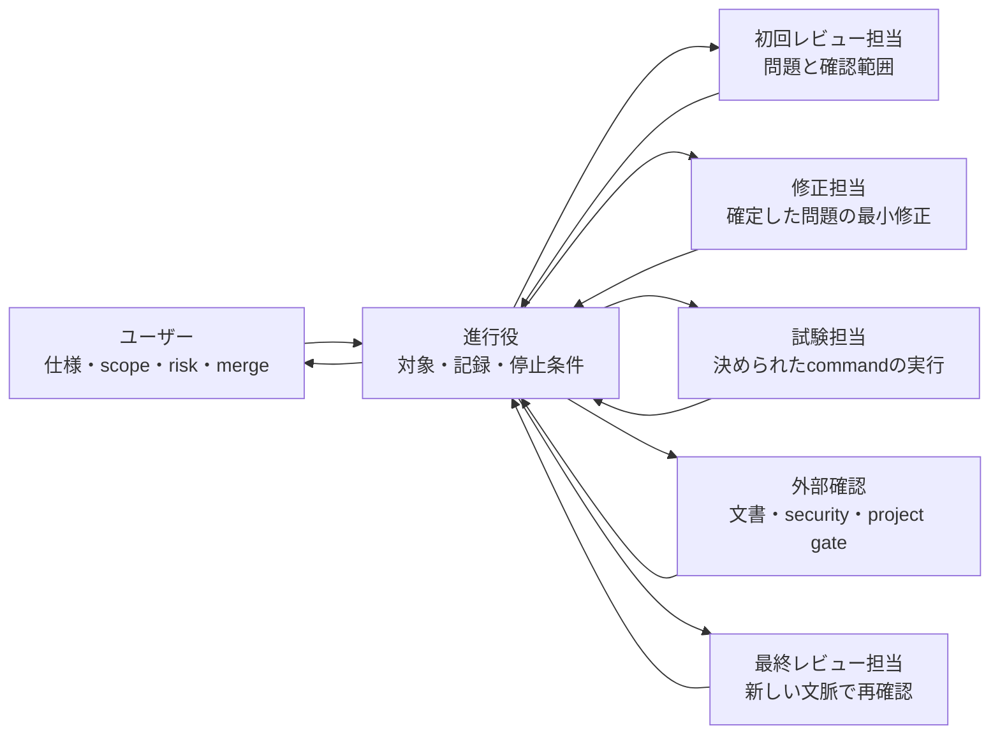
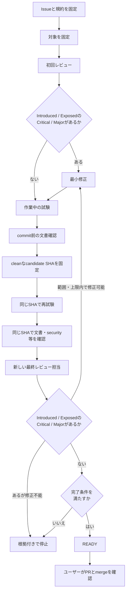
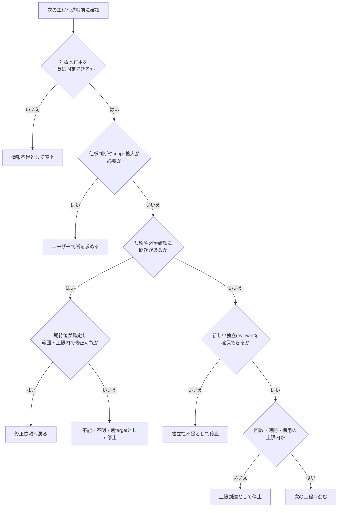
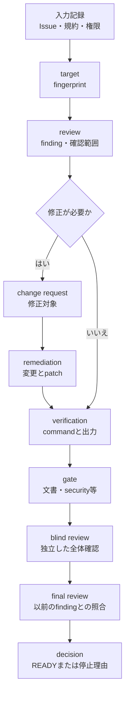

# レビュー・修正ハーネスの全体像

このハーネスは、レビュー、修正、試験、最終レビューを別の担当へ分け、古いレビュー結果や未確認の試験結果を誤って再利用しないための個人向けワークフローです。

ハーネスはユーザーのPCにある共通skillとして動きます。対象プロジェクトへ専用skillや設定ファイルを追加する必要はありません。プロジェクト固有の規則や試験方法は、base SHAにある`AGENTS.md`、`CLAUDE.md`、CI、構成ファイルと、適用対象として確定した設計書・Issueから読み取ります。一意に決められない場合は推測せず停止します。

## ハーネスとは何か

ここでいうハーネスは、コードを考えるAIモデルそのものではありません。複数の担当へ「何を渡すか」「どの順番で進めるか」「どの結果なら止めるか」を決める進行役です。テストコードを実行するtest harnessが入力と結果を揃えるように、このハーネスはAI agentの作業条件と証拠を揃えます。

たとえば、1つのagentが次をすべて担当するとします。

1. 問題を見つける
2. 自分で修正する
3. 自分の修正を再評価する
4. 問題がないと判断する

この流れでは、最初の判断への思い込みや、自分の修正を正当化する偏りが入りやすくなります。ハーネスは担当を分け、同じ対象と同じ完了条件を使わせることで、この問題を小さくします。

ハーネスが管理するものと、他へ任せるものは次のとおりです。

| ハーネスが管理する | 別の正本や担当へ任せる |
| --- | --- |
| 作業の順番、対象の同一性、担当の分離、記録、停止、再開 | コードレビューの評価基準 |
| どの試験と外部確認が完了したか | プロジェクト固有の規則と試験command |
| 完了条件をすべて満たしたか | securityや文書確認の専門的な判定 |
| 不明な場合に安全側へ停止すること | 仕様、risk、mergeの最終判断 |

## 最初に覚える用語

| 用語 | このREADMEでの意味 | たとえ |
| --- | --- | --- |
| target | 今回レビューするコードの状態 | 採点する答案 |
| target fingerprint | SHA、作業ツリー、規約fileなどをまとめたtargetの識別情報 | 答案の受験番号と内容hash |
| finding | 根拠と影響を確認できた問題 | 添削で確定した指摘 |
| `Introduced` / `Exposed` | 今回の変更が新しく作った問題 / 既存の原因を到達可能、悪化、依存などによって今回の問題として表面化させたもの | 今回の答案で生じた、または今回の答案に影響する問題 |
| gate | 試験、文書、securityなどの独立した確認 | 合格前の必須科目 |
| record | 工程ごとの入力、結果、根拠を残す追記型の作業記録 | 変更できない作業日誌 |
| `READY` | すべての完了条件を満たし、PR提出へ進める状態 | merge済みではなく提出可能 |
| fail-closed | 情報不足や確認不能を成功とみなさず停止すること | 採点不能を満点にしない |

## まず知っておくこと

- 初回レビュー担当と、修正後の最終レビュー担当を分ける
- レビュー対象はexact SHAと作業ツリーを含むtarget fingerprintで固定する
- 修正後は新しいtargetとして扱い、古い評価との単純なgrade比較をしない
- `Introduced`または`Exposed`のCritical/Major、必須試験の失敗、仕様矛盾、独立性不足があれば完了扱いにしない
- 今回の変更が影響を変えていない既存問題や範囲外の提案は別枠で報告し、現在の修正を不必要に広げない
- 「findingが0件」や「100%自信」を停止条件にしない
- merge、仕様判断、risk受容、外部権限が必要な操作はユーザーが決める

## 誰が何を担当するか

| 担当 | 主な責任 | 行わないこと |
| --- | --- | --- |
| ユーザー | 仕様、scope拡大、risk、外部権限、mergeの判断 | ハーネスへmerge判断を委ねない |
| 進行役 | target、作業記録、権限、上限、再開位置の照合 | findingや試験結果を作らない |
| 初回レビュー担当 | 問題、重要度、根拠、確認範囲、必要な外部確認の提示 | コードを修正しない |
| 修正担当 | 確定した問題だけを最小変更で直す | 重要度や問題の採否を自己変更しない |
| 試験担当 | exact commandと結果を記録する | 失敗を推測で成功にしない |
| 外部確認 | 文書、security、プロジェクト固有の必須条件を確認する | 別targetの結果を流用しない |
| 最終レビュー担当 | 修正を担当せず、新しい文脈でcandidate全体を確認する | 先に修正説明を読んでblind reviewを汚さない |

## 通常の流れ

通常は次の順で進みます。

1. Issue、受入条件、対象範囲、プロジェクトの正本を固定する
2. target fingerprintを保存し、初回レビューを行う
3. `Introduced`または`Exposed`のCritical/Majorがあれば、必須の修正対象として確定する
4. 修正担当が最小変更と必要なテストを追加し、作業中の試験とcommit前の文書確認を行う
5. cleanなcandidate SHAを固定する
6. 同じcandidate SHAで試験と、文書・securityなどの必須確認を行う
7. 修正を担当していない新しい担当が最終レビューする
8. 修正可能な`Introduced`または`Exposed`のCritical/Majorが見つかった場合は、範囲と上限内で修正へ戻る
9. 完了条件を満たした場合だけ`READY`を返し、ユーザーがmergeを判断する

### 小さなbug修正の例

画面に古い値が表示されるbugを直す場合を考えます。

1. target Aを保存し、初回レビュー担当が「更新後も古いcacheを読む」というfindingを確定する
2. 修正担当がcache更新だけを最小修正し、回帰テストを追加する
3. 修正後はtarget Bとして保存する。target Aの評価をtarget Bへそのまま流用しない
4. 試験担当がtarget Bでunit testを実行し、文書などの必須確認も同じtarget Bへ結び付ける
5. 新しい最終レビュー担当がtarget B全体を確認し、元のfindingが直ったかと新しい問題がないかを分けて判断する
6. `Introduced`または`Exposed`のCritical/Majorがなければ完了条件を照合し、すべて満たした場合だけ`READY`にする

この例で重要なのは、修正前後を同じ答案として扱わないことと、修正した担当が最終合格を自己判定しないことです。

## いつ停止するか

主な停止条件は次のとおりです。

- target、試験command、必須確認を一意に決められない
- Issue、設計書、実装の重要な仕様が矛盾している
- 修正が元Issueのscopeを超える
- 試験環境、権限、外部serviceの不足で確認できない
- 同じ問題が規定回数再発する、または差分が上限を超えて増える
- 再試行回数、全体の反復回数、期限、token、費用の上限へ達する
- 新しい独立reviewerを用意できない
- 必須確認が未実行、利用不能、別target、または修正可能な失敗へ分類できない

試験や必須確認が失敗しても、信頼できる期待値があり、範囲と上限内で修正できる場合は停止せず、根拠を持つ修正依頼を作って修正へ戻ります。仕様が不明、実行不能、別targetの結果など、安全に修正へつなげられない場合だけ停止します。

不足情報は既存の正本から解決します。それでも決められない項目だけを、適用するrunを限定したユーザー入力で補います。プロジェクト用profileを新設して不明点を隠しません。

## 工程間で何を渡すか

作業記録は対象プロジェクトの外にある`~/.agents/state/review-harness/`へ追記形式で保存します。各recordは過去recordのIDとhashを参照し、試験出力やpatchなどの根拠bytesも別objectとして保存します。会話履歴、PR本文、対象プロジェクト内のfileは実行状態の正本にしません。

| 記録 | 次の工程へ渡す内容 |
| --- | --- |
| `input_snapshot` | Issue、規約、権限、上限 |
| `target` | exact SHA、作業ツリー、適用規約を含む識別情報 |
| `review` | finding、重要度、根拠、確認範囲 |
| `change_request` | 修正が必要なfindingと許可された範囲 |
| `remediation` | 変更箇所、patch、追加したテスト |
| `verification` | 実行したcommand、成否、出力の根拠 |
| `gate` | 同じcandidateに対する文書・securityなどの確認結果 |
| `blind_review` | 以前のfindingを先に見ない独立した全体確認 |
| `final_review` | 以前のfindingとの照合と新しいfinding |
| `decision` | 次の状態、`READY`、または停止理由と再開候補 |

修正が不要なrunでは`change_request`と`remediation`を作らないなど、不要な記録は省きます。ただし、後の記録は必ず同じrunで確定済みの過去記録を参照します。

詳しいrecord形式、状態遷移、retry、resume、権限境界は[詳しい設計](detailed-design.md)と[実行手順の共通契約](../../../shared/references/review-remediation-harness.md)を参照してください。

## READYに必要な条件

次をすべて満たした場合だけ`READY`にできます。

- exact base/head SHAとcleanなcandidateが固定されている
- 宣言したレビュー範囲の確認が完了している
- `Introduced`または`Exposed`のCriticalとMajorが0件
- 必須試験と外部確認が同じcandidate SHAで成功している
- 文書確認が`PASS`または`UPDATED`で、確認後にtargetが変わっていない
- 重要な仕様矛盾と未解決blockerがない
- 修正担当とは別の最終レビュー担当による確認が完了している

## 初期toolが自動確認する範囲

初期版のtoolが自動確認するのは、次の2点だけです。

1. 作業記録の連番、参照、hash、根拠fileが壊れていないこと
2. 保存済みtarget fingerprintと現在のHEAD、作業ツリー、personal skill、project ruleが一致すること

状態遷移、`READY`、権限、予算、完全復旧、新しいtargetの採用は自動判定しません。これらは進行役またはユーザーが共通契約に従って記録します。Toolの成功だけを、レビュー完了やmerge可能の証明として扱わないでください。

### 初めて実装するときの最小構成

最初から巨大なrunnerを作る必要はありません。このrepositoryの初期版は、実際の試験運用で手作業の失敗が起きた次の2点だけをtool化しています。

1. `append / validate`: 作業記録と根拠を上書きせず保存し、改変や参照切れを検出する
2. `check-target`: 保存したtarget fingerprintと現在のコードや規約が同じか確認する

担当の起動、次の状態の選択、`READY`判定はまだ共通契約に従う手動進行です。実運用で繰り返し起きる失敗を観測してから、小さく決定的に防げる処理だけを追加します。状態機械、権限管理、完全復旧、あらゆるCLIへの対応を最初から実装しないことが、初期版を理解しやすく保つポイントです。

## CodexとClaude Codeで機能が異なる場合

- Codexで新しいreviewerを起動できる場合は、修正担当と異なるinstanceを使う
- Claude Codeでsubagentが無効な場合は、別session、別CLI、または人間のreviewerへ引き継ぐ
- 新しい文脈を用意できない場合は`INDEPENDENCE_BLOCKED`として停止する
- 同じagentへの別promptや自己再読を、独立レビューとして扱わない

## 文書の正本

| 知りたいこと | 正本 |
| --- | --- |
| 目的、役割、通常の流れ、停止条件 | このREADME |
| 判断理由、全状態、record、retry、権限、fallback | [詳しい設計](detailed-design.md) |
| 現在実行する具体的な手順 | [共通契約](../../../shared/references/review-remediation-harness.md) |

このREADMEは入口となる要約です。新しい状態、record形式、完了条件をここだけへ追加しません。内容が矛盾する場合は、要約へ都合よく合わせず設計変更として判断します。
