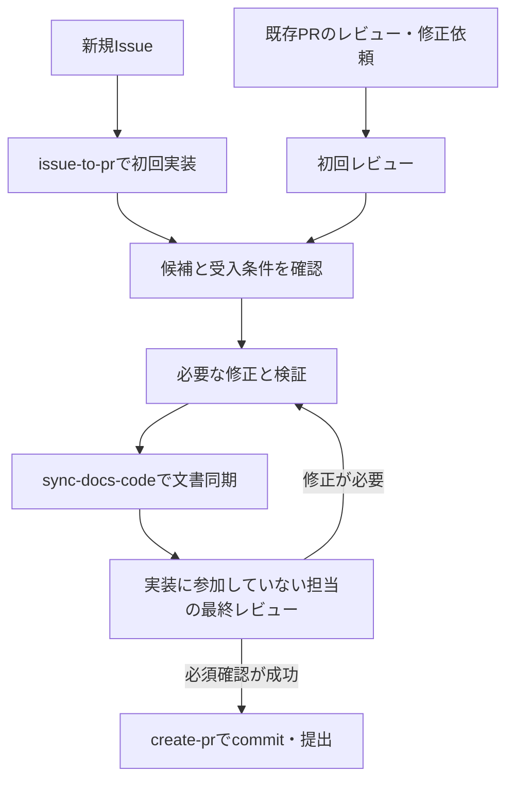

# レビュー・修正ハーネス

個人環境のskillで、必要なレビュー・修正・検証・独立した最終確認をつなぎます。契約3.0.0では進行手順を軽量化し、初回実装・文書同期・提出は既存workflowが担当します。

「このIssueをハーネスでPRまで進めて」「このPRを独立レビューと修正まで進めて」のように明示して使います。レビュー結果の報告だけや、通常のIssue実装では自動起動しません。

## 作業の流れ

```mermaid
flowchart TD
    I[新規Issue] --> W[issue-to-prで初回実装]
    W --> H[候補と受入条件を確認]
    P[既存PRのレビュー・修正依頼] --> R[初回レビュー]
    R --> H
    H --> F[必要な修正と検証]
    F --> D[sync-docs-codeで文書同期]
    D --> V[実装に参加していない担当の最終レビュー]
    V -->|修正が必要| F
    V -->|必須確認が成功| C[create-prでcommit・提出]
```

進行役は許可済みの範囲で修正・関連文書更新を続けます。根拠のある次の確認や修正があれば、工程のたびに再承認を求めません。仕様判断、追加権限、明示上限、進展の根拠がなくなった場合は相談します。

ユーザーが指定していない期限・回数・差分上限は作りません。変更に影響しない試験・レビュー結果は、対象との対応を確認して再利用します。

## 記録と旧版

確認結果は案件ごとのMarkdownへ保存します。成功だけでなく失敗・未検証と必要な証跡も残します。形式と私有の保存先は[確認記録](../../../shared/references/review-harness-records.md)を参照してください。

旧JSON台帳は新規利用を終了します。旧台帳と評価報告は切替時に `~/.agents/state/archives/review-harness/2026-09-28/` へ移し、READMEから探索できるようにします。移動日や内容照合の実績はローカルREADMEに残します。

`review-harness-artifacts`は旧記録の読取検証専用です。ハーネスを自動実行するコマンドではなく、軽量版の通常作業では不要です。[旧記録の参照方法](../../../shared/references/review-harness-archive.md)に検証範囲と限界を記載しています。

## 読む場所

| 知りたいこと | 文書 |
| --- | --- |
| 実際の進行・停止・再開 | [共通手順](../../../shared/references/review-remediation-harness.md) |
| 確認結果と証跡の残し方 | [確認記録](../../../shared/references/review-harness-records.md) |
| 旧台帳の探索・読取検証・移行 | [旧記録の参照](../../../shared/references/review-harness-archive.md) |
| 採用理由・失う保証・Issueの分担 | [詳細設計](detailed-design.md) |

軽量版の運用上の効果は未評価です。更新後の再評価#64の実施時期は、完成後にユーザーと決めます。
